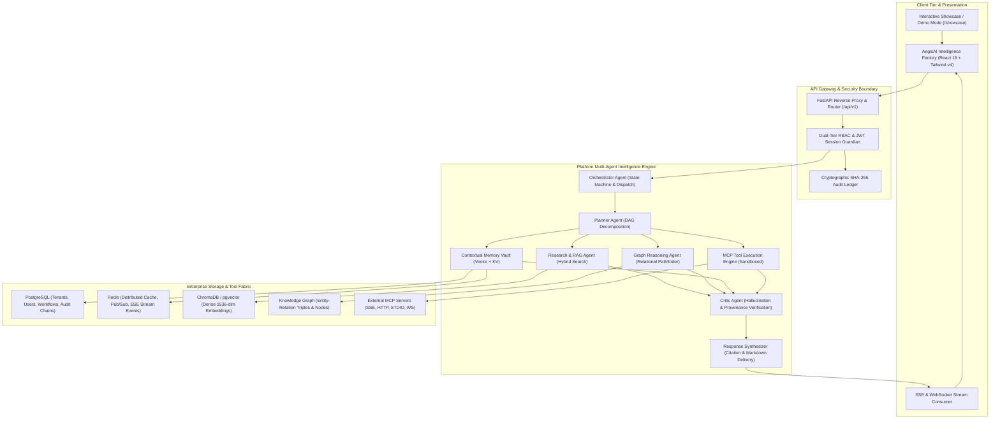

# AegisAI — Enterprise Autonomous Multi-Agent AI Operating System

[-success)](file:///D:/CP/AegisAI/docs/TESTING.md)
[-success)](file:///D:/CP/AegisAI/docs/TESTING.md)
[](file:///D:/CP/AegisAI/docs/TESTING.md)
[](file:///D:/CP/AegisAI/LICENSE)
[](file:///D:/CP/AegisAI/docs/ARCHITECTURE.md)
[](file:///D:/CP/AegisAI/docs/SECURITY-ARCHITECTURE.md)

**AegisAI** is a production-grade, multi-agent AI Operating System designed for enterprise intelligence automation, hybrid RAG knowledge discovery, contextual long-term memory synthesis, Model Context Protocol (MCP) tool execution, visual DAG workflow orchestration, and cryptographic governance.

---

## 🏛️ System Architecture Overview



---

## 🌟 Core Platform Pillars

| Pillar | Subsystem | Description | Primary Docs |
| :--- | :--- | :--- | :--- |
| **Multi-Agent Orchestration** | 9 Canonical Agents | Stateful DAG planning, task decomposition, agent delegation, cyclic verification, and fault-tolerant retry loops. | [Agent Architecture](file:///D:/CP/AegisAI/docs/AGENT-ARCHITECTURE.md) |
| **Contextual Memory** | Memory Vault | Ephemeral working memory, session context, and dense vector long-term semantic memory with cosine similarity recall. | [Memory Architecture](file:///D:/CP/AegisAI/docs/MEMORY-ARCHITECTURE.md) |
| **Enterprise RAG** | Document Knowledge Center | Multi-format parser (PDF, DOCX, TXT, MD), semantic chunking, dense vector retrieval, and verbatim citation provenance. | [RAG Architecture](file:///D:/CP/AegisAI/docs/RAG-ARCHITECTURE.md) |
| **Graph Intelligence** | Knowledge Graph | Relational triple extraction (`subject`, `predicate`, `object`), entity normalization, shortest-path BFS traversal, and memory synchronization. | [Graph Architecture](file:///D:/CP/AegisAI/docs/KNOWLEDGE-GRAPH-ARCHITECTURE.md) |
| **Tool Extensibility** | MCP Tool Center | Unified client for Model Context Protocol supporting 4 transports (SSE, HTTP, STDIO, WebSocket) with human-in-the-loop approvals. | [MCP Architecture](file:///D:/CP/AegisAI/docs/MCP-ARCHITECTURE.md) |
| **Visual Automation** | Workflow Studio | Drag-and-drop DAG workflow canvas, custom node topologies, conditional branching, cron scheduling, and step execution. | [Workflow Architecture](file:///D:/CP/AegisAI/docs/WORKFLOW-ARCHITECTURE.md) |
| **Enterprise Governance** | Admin & Security Center | Workspace tenant isolation, team-level RBAC, SHA-256 tamper-evident audit chains, secret redaction, and compliance export. | [Governance Architecture](file:///D:/CP/AegisAI/docs/GOVERNANCE-ARCHITECTURE.md) |
| **Presentation & Polish** | Showcase & Design System | Dark/light theme engine, WCAG 2.1 AA accessible keyboard navigation, responsive layouts, bundle-optimized chunks, and zero-mock showcase. | [UI/UX & Showcase](file:///D:/CP/AegisAI/frontend/docs/PHASE-12-FINAL-PRODUCT-POLISH.md) |

---

## 🚀 Quickstart Guide

### Prerequisites
- **Python**: 3.11+ (Tested on 3.11, 3.12, 3.13)
- **Node.js**: 20+ & npm 10+
- **Database / Cache**: PostgreSQL 16+, Redis 7+ (or Docker)

### 1. Repository Setup
```bash
git clone https://github.com/KrishPatel/AegisAI.git
cd AegisAI
```

### 2. Backend Initialization
```bash
cd backend
python -m venv venv
# Windows:
.\venv\Scripts\activate
# Linux/macOS:
source venv/bin/activate

pip install -r requirements.txt
cp ../.env.example .env

# Run database migrations and seed initial tenant/admin
alembic upgrade head
python -m app.scripts.seed_db

# Start backend server
uvicorn app.main:app --host 0.0.0.0 --port 8000 --reload
```

### 3. Frontend Initialization
```bash
cd ../frontend
npm install
cp .env.example .env

# Start frontend development server
npm run dev
```

Visit `http://localhost:5173` to access the AegisAI workspace or navigate directly to `http://localhost:5173/showcase` for the guided scenario tour.

---

## 🧪 Comprehensive Verification Baseline

AegisAI is verified by a strict, local automated test suite covering unit, integration, security, and rendering layers:

```
============================= 955 passed in backend ==============================
============================= 223 passed in frontend =============================
==================== 1,178 TOTAL VERIFIED LOCAL AUTOMATED TESTS ====================
```

To execute the test suites locally:
```bash
# Backend Verification (955 tests)
cd backend
pytest -q

# Frontend Verification (223 tests)
cd frontend
npm test -- --run

# Frontend Production Build (Zero errors, code-split bundles)
npm run build
```

---

## 📚 Complete Engineering Documentation

The complete technical knowledge package is categorized below:

### Architecture & Engine Deep Dives
- [System Architecture](file:///D:/CP/AegisAI/docs/ARCHITECTURE.md) — Platform foundations, data boundaries, and macro topology.
- [Multi-Agent Architecture](file:///D:/CP/AegisAI/docs/AGENT-ARCHITECTURE.md) — 9 canonical agents, state transitions, and coordination loops.
- [Memory Architecture](file:///D:/CP/AegisAI/docs/MEMORY-ARCHITECTURE.md) — Ephemeral working memory, long-term vector storage, and eviction policies.
- [Enterprise RAG Architecture](file:///D:/CP/AegisAI/docs/RAG-ARCHITECTURE.md) — Document parsing, semantic chunking, and citation tracking.
- [Knowledge Graph Architecture](file:///D:/CP/AegisAI/docs/KNOWLEDGE-GRAPH-ARCHITECTURE.md) — Triple stores, graph traversal, and memory-graph synchronization.
- [MCP Architecture](file:///D:/CP/AegisAI/docs/MCP-ARCHITECTURE.md) — Multi-transport protocol integration and security sandboxing.
- [Workflow Automation Architecture](file:///D:/CP/AegisAI/docs/WORKFLOW-ARCHITECTURE.md) — DAG graph execution, condition routing, and approval gates.
- [Governance & Control Architecture](file:///D:/CP/AegisAI/docs/GOVERNANCE-ARCHITECTURE.md) — RBAC, tenant isolation, and cryptographic audit chains.
- [End-to-End Data Flows](file:///D:/CP/AegisAI/docs/DATA-FLOWS.md) — Step-by-step sequence diagrams of complex platform workflows.

### Security, Quality & Operations
- [Security Architecture](file:///D:/CP/AegisAI/docs/SECURITY-ARCHITECTURE.md) — Zero-trust authentication, JWT rotation, SSRF guardrails, and sandboxing.
- [STRIDE Threat Model](file:///D:/CP/AegisAI/docs/THREAT-MODEL.md) — Threat analysis, vulnerability mitigations, and security boundaries.
- [Testing Strategy & Inventory](file:///D:/CP/AegisAI/docs/TESTING.md) — Breakdown of all 1,178 unit, integration, and E2E test suites.
- [Performance & Accessibility](file:///D:/CP/AegisAI/docs/PERFORMANCE.md) — Bundle splitting, async I/O, cache tiers, and WCAG AA verification.
- [Production Deployment](file:///D:/CP/AegisAI/docs/DEPLOYMENT.md) — Docker Compose environments, health probes, and disaster recovery.
- [Observability & Telemetry](file:///D:/CP/AegisAI/docs/OBSERVABILITY.md) — SSE event streaming, Prometheus metrics, structured logs, and traces.
- [API Reference](file:///D:/CP/AegisAI/docs/API.md) — REST & SSE schema definitions, request payloads, and status codes.
- [Configuration Reference](file:///D:/CP/AegisAI/docs/CONFIGURATION.md) — Environment variables, default thresholds, and secret rotation.
- [Local Development Guide](file:///D:/CP/AegisAI/docs/DEVELOPMENT.md) — Contributor developer setup, tooling, and debugging procedures.
- [Capability Matrix](file:///D:/CP/AegisAI/docs/CAPABILITY-MATRIX.md) — Strict accounting of implemented vs planned features.
- [Platform Limitations & Boundary Constraints](file:///D:/CP/AegisAI/docs/LIMITATIONS.md) — Explicit throughput, payload, and concurrency bounds.
- [Frontend UI Module Map](file:///D:/CP/AegisAI/docs/UI-MODULE-MAP.md) — Complete routing, component, and design token inventory.

---

## 🔒 Security & Vulnerability Reporting

Security is central to AegisAI. For vulnerability disclosures and security policies, please consult [SECURITY.md](file:///D:/CP/AegisAI/SECURITY.md).

---

## 🤝 Contributing

We welcome contributions! Please read [CONTRIBUTING.md](file:///D:/CP/AegisAI/CONTRIBUTING.md) before submitting pull requests.

---

## 📄 License

AegisAI is licensed under the [MIT License](file:///D:/CP/AegisAI/LICENSE).
