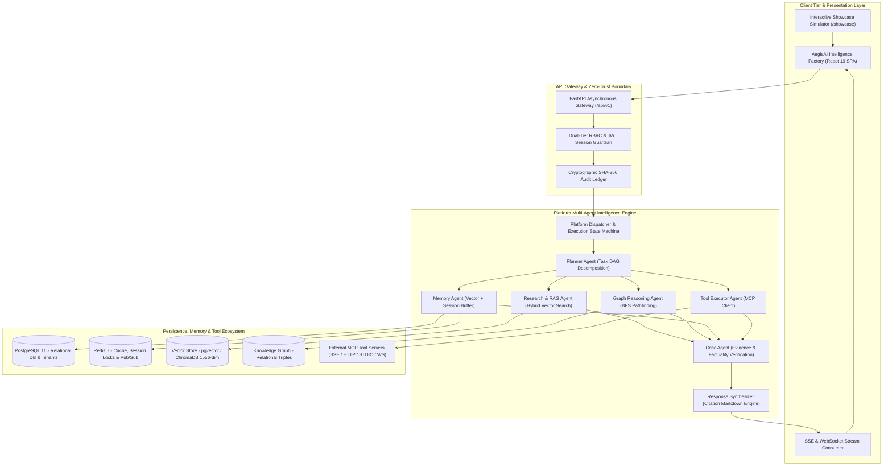

# AegisAI

### Autonomous Multi-Agent Enterprise AI Operating System

[](file:///D:/CP/AegisAI/docs/FINAL-RELEASE.md)
[-success.svg)](file:///D:/CP/AegisAI/docs/TESTING.md)
[](file:///D:/CP/AegisAI/docs/TESTING.md)
[](file:///D:/CP/AegisAI/docs/TESTING.md)
[](file:///D:/CP/AegisAI/backend/pyproject.toml)
[](file:///D:/CP/AegisAI/frontend/package.json)
[](file:///D:/CP/AegisAI/LICENSE)
[](https://github.com/Krish1216-web/AegisAI)

> **Release Status**: **v1.0.0-rc.1 (Final Release Candidate)** — The platform is fully implemented, feature-complete, and verified locally by 1,178 automated tests. Controlled enterprise production deployment requires external cloud infrastructure prerequisites (e.g., managed AWS S3 / Kubernetes).

**AegisAI** is an enterprise-grade autonomous AI Operating System designed to coordinate specialized multi-agent workforces, maintain persistent contextual memory, query relational knowledge graphs, execute external tools via the Model Context Protocol (MCP), and automate complex visual DAG workflows under strict cryptographic governance and tenant isolation.

Unlike standard conversational wrappers, AegisAI treats artificial intelligence as an auditable, multi-agent execution pipeline with cyclic evidence verification, human-in-the-loop approval gates, and tamper-evident SHA-256 audit ledgers.

---

## 💡 Why AegisAI?

Traditional AI applications typically combine a single LLM API call with a basic chat interface and uncoordinated tool scripts. This approach breaks down in enterprise environments due to:
- **Context Amnesia**: Lost session facts and inability to recall long-term user preferences across conversations.
- **Hallucinations & Ungrounded Claims**: Generated responses lacking verbatim source attribution and automated critic verification.
- **Security Vulnerabilities**: Exposure to Server-Side Request Forgery (SSRF), prompt injection, and cross-tenant data leakage.
- **Uncontrolled Tool Execution**: High-risk destructive mutations occurring without cryptographic approval workflows.
- **Operational Blindness**: Lack of structured audit logging, deterministic state machines, and real-time execution telemetry.

**AegisAI solves this by providing a unified execution platform** that integrates reasoning, memory, knowledge, tools, workflows, verification, governance, and telemetry into a single cohesive architecture.

---

## 🏛️ System Architecture



---

## ⚡ How It Works: The 8-Stage Execution Pipeline

1. **User Request & Ingress**: The client submits a structured prompt or workflow trigger via REST/SSE with an authenticated JWT session claim.
2. **Tenant & RBAC Resolution**: The gateway validates the user's system role (`super_admin`, `admin`, `user`) and team permissions (`owner`, `maintainer`, `editor`, `viewer`), scoping the execution boundary to the active `workspace_id`.
3. **Intent & Strategy Analysis**: The platform dispatcher determines execution mode (direct answer, deep multi-agent deliberation, RAG search, graph pathfinding, or MCP tool invocation).
4. **DAG Task Decomposition**: The **Planner Agent** parses dependencies and generates an acyclic Directed Acyclic Graph (DAG) of parallel subtasks.
5. **Parallel Knowledge & Tool Execution**:
   - **Enterprise RAG Agent** retrieves relevant semantic chunks from ingested PDF/DOCX/TXT files.
   - **Graph Reasoning Agent** resolves multi-hop entity relationships via Breadth-First Search.
   - **Memory Agent** extracts relevant historical facts and preferences.
   - **Tool Executor Agent** executes sandboxed MCP tool calls.
6. **Critic Fact-Checking & Hallucination Filter**: The **Critic Agent** evaluates intermediate candidate findings against ground-truth source chunks, assigning a confidence score (0.0 to 1.0) and triggering replanning if facts are unsubstantiated.
7. **Synthesis & Citation Provenance**: The **Response Synthesizer** formats verified evidence into clean Markdown with interactive footnote citation chips.
8. **Tamper-Evident Audit Logging**: The execution trace, duration, invoked agents, and payload hash are appended to the immutable SHA-256 audit ledger.

---

## 🌟 Platform Capabilities & Subsystem Matrix

| Subsystem | What AegisAI Delivers | Primary Documentation |
| :--- | :--- | :--- |
| **Multi-Agent Intelligence** | 9 canonical specialized agents executing stateful DAG planning, parallel dispatch, and automated critic validation. | [Agent Architecture](file:///D:/CP/AegisAI/docs/AGENT-ARCHITECTURE.md) |
| **Contextual Memory Vault** | Ephemeral Redis working buffer + 1536-dim vector semantic recall with time-decay scoring and memory-graph sync. | [Memory Architecture](file:///D:/CP/AegisAI/docs/MEMORY-ARCHITECTURE.md) |
| **Enterprise RAG** | Multi-format document parser (PDF, DOCX, TXT, MD), sliding-window semantic chunking, and verbatim citation provenance. | [RAG Architecture](file:///D:/CP/AegisAI/docs/RAG-ARCHITECTURE.md) |
| **Knowledge Graph** | Relational triple store (`subject, predicate, object`), entity property bags, BFS shortest-path reasoning, and 2D visualizer. | [Graph Architecture](file:///D:/CP/AegisAI/docs/KNOWLEDGE-GRAPH-ARCHITECTURE.md) |
| **Model Context Protocol** | Unified MCP client supporting 4 transports (SSE, HTTP, STDIO, WS), dynamic schema discovery, SSRF defense, and approval gates. | [MCP Architecture](file:///D:/CP/AegisAI/docs/MCP-ARCHITECTURE.md) |
| **Visual Workflow Studio** | Drag-and-drop ReactFlow canvas, 8 custom node primitives, Kahn's cycle validation, conditional routing, and cron scheduler. | [Workflow Architecture](file:///D:/CP/AegisAI/docs/WORKFLOW-ARCHITECTURE.md) |
| **Governance & Security** | Dual-tier RBAC, workspace isolation, SHA-256 cryptographic audit ledger, secret redaction, and compliance export. | [Governance Architecture](file:///D:/CP/AegisAI/docs/GOVERNANCE-ARCHITECTURE.md) |
| **Product Polish & A11y** | WCAG-oriented keyboard focus trapping, accessible textual tree outlines, theme persistence, and lazy chunk optimization. | [Performance & A11y](file:///D:/CP/AegisAI/docs/PERFORMANCE.md) |
| **Interactive Showcase** | 6 scripted enterprise simulation tours with playback controls and non-dismissible demo indicators at `/showcase`. | [Showcase Guide](file:///D:/CP/AegisAI/frontend/docs/PHASE-12.11-DEMO-SHOWCASE-MODE.md) |

---

## 🖥️ Product Tour

The AegisAI interface is organized into unified enterprise surfaces:

- **Intelligence Factory (`/`)**: Product landing page with an interactive feature station tour and architectural overview.
- **AI OS Workspace (`/user/platform`)**: Multi-agent execution terminal with live SSE step streaming, agent activity tickers, plan inspection drawers, and citation footnotes.
- **Agent Center (`/user/agents`)**: Comprehensive 9-agent catalog with capability filters, live telemetry counters, side-by-side comparison drawer, and topological coordination flow.
- **Memory Vault (`/user/memory`)**: Multi-tier memory inspector with similarity threshold sliders, working memory buffer view, and memory-graph synchronization triggers.
- **MCP Tool Center (`/user/mcp`)**: Multi-transport tool hub with JSON schema validators, sandboxed test execution modals, and human approval status.
- **Workflow Automation Studio (`/user/workflows`, `/user/workflows/:id`)**: Drag-and-drop DAG workflow canvas with custom node palettes, cycle detection, variable scoping, and execution runs.
- **Knowledge Intelligence Center (`/user/documents`, `/user/graph`)**: Multi-document ingestion pipeline with semantic chunk viewer, hybrid RAG search, 2D force-directed knowledge graph, and BFS shortest-path reasoning.
- **Governance & Control Center (`/admin/governance`, `/admin/users`)**: Cryptographic SHA-256 audit ledger, one-click chain verification, RBAC management, and compliance export.
- **Interactive Showcase (`/showcase`)**: Guided demonstration console with 6 scripted enterprise scenarios, step-by-step playback controls, and presentation mode.

---

## 🎭 Interactive Showcase / Demo Mode

For project reviews, technical presentations, academic evaluations, and viva demonstrations, AegisAI provides a dedicated **Showcase Engine** accessible at `http://localhost:5173/showcase`:

> [!NOTE]
> **SIMULATED SHOWCASE NOTICE**: The showcase engine executes pre-scripted scenarios in a dedicated presentation sandbox. It does not modify real workspace data, write production database rows, or bypass authorization boundaries.

### Scripted Demonstration Scenarios:
1. **Multi-Agent Cold-Chain Investigation**: An anomalous sensor alert triggers parallel RAG document retrieval, knowledge graph traversal, and tool execution.
2. **Autonomous DAG Workflow Execution**: A multi-step ETL and compliance audit pipeline executes across condition nodes and transform blocks.
3. **Resilience & Provider Fallback**: A simulated primary LLM rate limit triggers an automated fallback to a secondary model provider.
4. **Indirect Prompt-Injection Neutralization**: A malicious instruction embedded in an untrusted document is quarantined and neutralized by delimiter isolation.
5. **Governed Human Approval Gate**: A high-risk database mutation triggers a dual-key human confirmation modal before proceeding.
6. **Cross-Domain Memory Synthesis**: User preferences memorized in previous turns are recalled and applied to a structured data export.

---

## 🛠️ Technology Stack

| Domain | Implemented Technologies |
| :--- | :--- |
| **Frontend SPA** | React 19, React Router v7, Tailwind CSS v4, Lucide React, @xyflow/react, Recharts / Chart.js |
| **Frontend Tooling** | Vite 8.1, Vitest, JSDOM, Rolldown bundler |
| **Backend Framework**| FastAPI 0.110+, Python 3.11/3.12/3.13, Pydantic v2, Uvicorn, Starlette |
| **Database & ORM** | PostgreSQL 16+, SQLAlchemy 2.0 (Async), Alembic migrations, pgvector |
| **Cache & Realtime** | Redis 7+ (asyncio connection pool, session cache, pub/sub), Server-Sent Events (SSE) |
| **Vector & Search** | ChromaDB / pgvector, OpenAI `text-embedding-3-small` (1536-dim), BM25 sparse lexical search |
| **Knowledge Graph** | Relational triple store (`(subject, predicate, object)`), BFS shortest path, D3 force graph |
| **Tool Protocol** | Model Context Protocol (MCP) clients: SSE, Streamable HTTP, STDIO subprocess, WebSocket |
| **Security & Auth** | JWT (HMAC-SHA256), bcrypt password hashing, AES-256-GCM secret encryption, SHA-256 audit chains |
| **Observability** | In-memory `MetricsRegistry` (p50/p90/p99 percentiles), structured JSON logging (Loguru), SSE telemetry |
| **Containerization** | Docker, Docker Compose (Dev, Staging, Prod profiles), Nginx reverse proxy with TLS 1.3 |

---

## 🛡️ Security Architecture & Defense in Depth

AegisAI incorporates enterprise security guardrails across every trust boundary:
- **Tenant Isolation**: Every database query, vector search, file access, and memory lookup strictly checks `workspace_id`.
- **Dual-Tier RBAC**: System roles and team workspace roles resolve into explicit effective permissions before any action executes.
- **SSRF Defense**: Outbound MCP requests resolve DNS and block RFC 1918 private subnets, loopback interfaces, and link-local cloud metadata addresses.
- **STDIO Sandboxing**: Local subprocesses execute with sanitized arguments, strict execution timeouts (45s), and non-root process boundaries.
- **Indirect Prompt Injection Defense**: Untrusted third-party document context is isolated inside strict XML delimiters (`<untrusted_document_context>`), and intermediate outputs are checked by the Critic Agent.
- **Cryptographic Audit Chain**: High-risk actions and configuration changes are committed to an immutable SHA-256 ledger (`H_n = SHA256(H_{n-1} || payload)`).
- **Automated Secret Redaction**: Regex and entropy filters strip API keys (`Bearer *`, `sk-*`, `ghp_*`) from execution streams and audit entries.

---

## 🧪 Comprehensive Verification Baseline

AegisAI is verified by a strict, local automated test suite:

```
==================================================================================
TOTAL VERIFIED LOCAL AUTOMATED TESTS: 1,178 PASSING (100%)
- Backend Pytest Suite: 955 Passed (0 Failed, 0 Skipped)
- Frontend Vitest Suite: 223 Passed (0 Failed, 0 Skipped across 15 test suites)
- Frontend Production Build: 2,572 modules transformed cleanly in 1.34s (0 errors)
==================================================================================
```

To run the verification test suites locally:
```bash
# 1. Backend Verification (955 tests)
cd backend
pytest -q

# 2. Frontend Verification (223 tests)
cd ../frontend
npm test -- --run

# 3. Production Build Check
npm run build
```

---

## 🚀 Quickstart & Local Setup

### Prerequisites
- Python 3.11+
- Node.js 20+ & npm 10+
- PostgreSQL 16+ & Redis 7+ (or Docker)

### 1. Repository Setup
```bash
git clone https://github.com/KrishPatel/AegisAI.git
cd AegisAI
```

### 2. Backend Setup
```bash
cd backend
python -m venv venv
# Windows:
.\venv\Scripts\activate
# Linux/macOS:
source venv/bin/activate

pip install -r requirements.txt
cp ../.env.example .env

alembic upgrade head
python -m app.scripts.seed_db

uvicorn app.main:app --host 0.0.0.0 --port 8000 --reload
```

### 3. Frontend Setup
```bash
cd ../frontend
npm install
cp .env.example .env

npm run dev
```

Visit `http://localhost:5173` to access the workspace or `http://localhost:5173/showcase` for the interactive demo.

---

## ⚠️ Known Limitations & Boundaries

In accordance with our truth-first engineering standard, the following boundaries apply:
- **Browser-Level E2E Automation**: While unit and integration test suites pass at 100% (1,178 tests), automated headless browser visual regression testing was not executed in this environment.
- **External Production Infrastructure**: The codebase includes production Docker Compose configurations, but multi-region cloud deployment (AWS S3, managed Kubernetes) requires external cloud credentials and infrastructure.
- **OCR Limitations**: Document extraction parses text streams from PDF, DOCX, TXT, and MD files. Scanned bitmap images without embedded OCR text require external OCR pre-processing.
- **Accessibility Certification**: Frontend components are engineered according to WCAG 2.1 AA best practices (keyboard focus trapping, ARIA roles, skip links), but formal third-party accessibility certification has not been conducted.

For complete details, see [docs/LIMITATIONS.md](file:///D:/CP/AegisAI/docs/LIMITATIONS.md) and [docs/CAPABILITY-MATRIX.md](file:///D:/CP/AegisAI/docs/CAPABILITY-MATRIX.md).

---

## 📖 Complete Documentation Sitemap

| Category | Documentation Guides |
| :--- | :--- |
| **System & Subsystems** | [System Architecture](file:///D:/CP/AegisAI/docs/ARCHITECTURE.md) • [Multi-Agent Engine](file:///D:/CP/AegisAI/docs/AGENT-ARCHITECTURE.md) • [Memory Vault](file:///D:/CP/AegisAI/docs/MEMORY-ARCHITECTURE.md) • [Enterprise RAG](file:///D:/CP/AegisAI/docs/RAG-ARCHITECTURE.md) • [Knowledge Graph](file:///D:/CP/AegisAI/docs/KNOWLEDGE-GRAPH-ARCHITECTURE.md) • [MCP Tool Integration](file:///D:/CP/AegisAI/docs/MCP-ARCHITECTURE.md) • [Workflow Studio](file:///D:/CP/AegisAI/docs/WORKFLOW-ARCHITECTURE.md) • [End-to-End Data Flows](file:///D:/CP/AegisAI/docs/DATA-FLOWS.md) |
| **Security & Governance** | [Security Architecture](file:///D:/CP/AegisAI/docs/SECURITY-ARCHITECTURE.md) • [STRIDE Threat Model](file:///D:/CP/AegisAI/docs/THREAT-MODEL.md) • [Governance & RBAC](file:///D:/CP/AegisAI/docs/GOVERNANCE-ARCHITECTURE.md) • [Security Policy](file:///D:/CP/AegisAI/SECURITY.md) |
| **Academic & Presentation** | [Final-Year Project Report](file:///D:/CP/AegisAI/docs/FINAL-YEAR-PROJECT.md) • [Project Abstract](file:///D:/CP/AegisAI/docs/ABSTRACT.md) • [Viva Presentation Guide & 40+ Q&A](file:///D:/CP/AegisAI/docs/VIVA-GUIDE.md) • [Technical Interview Guide](file:///D:/CP/AegisAI/docs/INTERVIEW-GUIDE.md) • [Problem-Solution Matrix](file:///D:/CP/AegisAI/docs/PROBLEM-SOLUTION.md) • [Why AegisAI?](file:///D:/CP/AegisAI/docs/WHY-AEGISAI.md) • [Presentation Slides Outline](file:///D:/CP/AegisAI/docs/PRESENTATION-SLIDES.md) • [Portfolio Case Study](file:///D:/CP/AegisAI/docs/CASE-STUDY.md) |
| **Operations & Reference** | [Testing & QA Inventory](file:///D:/CP/AegisAI/docs/TESTING.md) • [Performance & Accessibility](file:///D:/CP/AegisAI/docs/PERFORMANCE.md) • [Production Deployment](file:///D:/CP/AegisAI/docs/DEPLOYMENT.md) • [Observability & Telemetry](file:///D:/CP/AegisAI/docs/OBSERVABILITY.md) • [API Reference](file:///D:/CP/AegisAI/docs/API.md) • [Configuration Reference](file:///D:/CP/AegisAI/docs/CONFIGURATION.md) • [Developer Setup](file:///D:/CP/AegisAI/docs/DEVELOPMENT.md) • [Release Notes](file:///D:/CP/AegisAI/docs/RELEASE-NOTES.md) |

---

## 📄 License

AegisAI is open-source software licensed under the [MIT License](file:///D:/CP/AegisAI/LICENSE).
