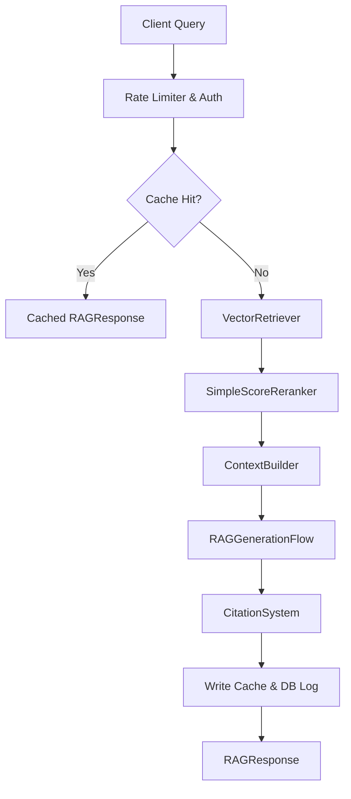

# 21. Cognitive RAG Engine Architecture

This document describes the design, implementation, and features of the production-ready AegisAI Retrieval-Augmented Generation (RAG) engine.

## Overview
The AegisAI RAG engine enables secure, high-fidelity context retrieval and grounded question answering over tenant-isolated document chunks. It is designed to scale dynamically, fall back gracefully, protect tenant boundaries, and avoid hallucinations or fabrication.

## Core Modules

### 1. Vector Retriever (`VectorRetriever`)
Performs cosine distance search over document embeddings.
- **Tenant Isolation**: Strictly filters chunks by `user_id` and `workspace_id`.
- **Pgvector Support**: Cosine similarity is computed directly in PostgreSQL:
  $$\text{Similarity} = 1.0 - \text{cosine\_distance}$$
- **SQLite Fallback**: If pgvector or PostgreSQL is not available, chunk embeddings are read from the database, and similarity is computed in memory using NumPy/Python math operations.

### 2. Simple Score Reranker (`SimpleScoreReranker`)
Enhances retrieve recall using a weighted linear combination:
$$\text{Score} = (0.7 \times \text{semantic\_similarity}) + (0.3 \times \text{keyword\_overlap}) + \text{metadata\_boost}$$
- **Keyword Overlap**: Calculates word token intersections normalized by query token length.
- **Metadata Boost**: Grants a $+0.05$ boost for matching file extensions, section title keywords, or source document names.

### 3. Context Builder (`ContextBuilder`)
Assembles grounded prompt contexts.
- **Formatting**: Structurally wraps chunks with clear metadata tags (`[Source N: <filename>, Page: <page>]`).
- **Truncation**: Enforces a strict context token window limit (default: 4000 tokens) to prevent prompt window overflow.

### 4. Generation Flow (`RAGGenerationFlow`)
Coordinates LLM prompting and evidence verification.
- **Safe Fallback**: If no matching context chunks are retrieved or the context is empty, immediately bypasses the LLM and returns the predefined message:
  `"I am sorry, but the provided documents do not contain sufficient information to answer your question."`
- **System Instructions**: Configures the LLM to restrict answers to the context and format citations exactly as `[1]`, `[2]`.

### 5. Citation System (`CitationSystem`)
Matches LLM citation references to source chunks.
- **Sanitization**: Identifies and removes fabricated citation index markers (e.g. `[99]`) from generated text if they do not refer to a valid retrieved chunk.

## API Endpoints

### 1. Unified Query (`POST /api/v1/rag/query`)
Accepts JSON parameters matching `RAGRequest` and returns a completed `RAGResponse`.

### 2. Event Stream (`GET /api/v1/rag/stream`)
Accepts query parameters and streams tokens back via Server-Sent Events (SSE). It appends a final `[METADATA]` JSON block mapping citations and chunks before emitting `[DONE]`.

## Caching & Rate Limits
- **Redis Cache**: Caches RAG responses using a SHA-256 hash of the query and parameters under a tenant-isolated key namespace.
- **Rate Limiter**: Integrates rate limiting per user (60 RPM by default) to defend resources from query floods.
