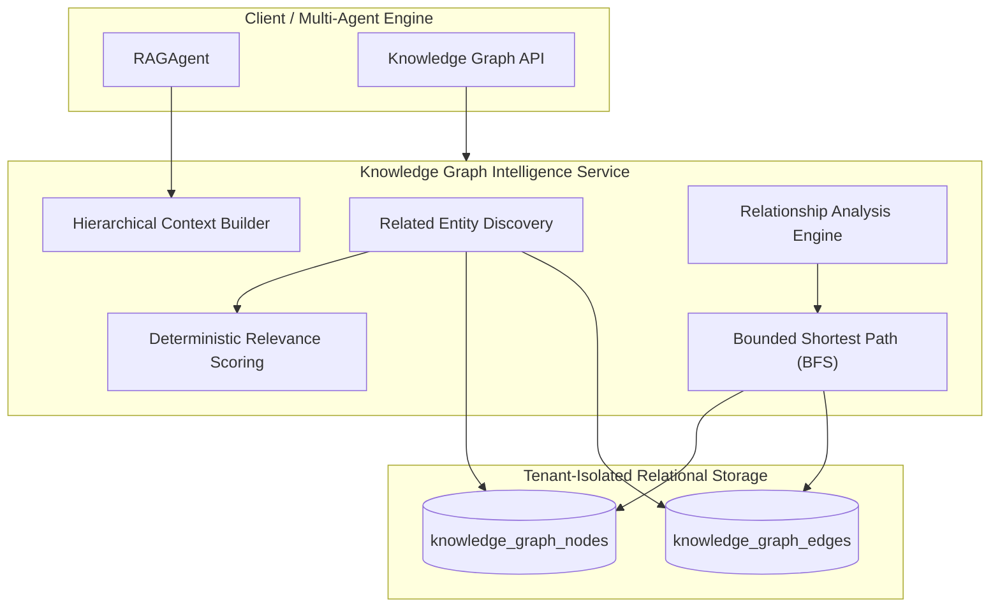

# AegisAI — Phase 5.1: Knowledge Graph Intelligence

## Overview
Phase 5.1 extends AegisAI's Knowledge Graph Foundation into an **intelligent context and reasoning layer**. It equips the platform with bounded multi-hop pathfinding, deterministic relevance scoring, entity relationship analysis, hierarchical context extraction for RAG/Multi-Agent execution, and enhanced search.

---

## 1. Architecture



---

## 2. Core Capabilities

### A. Related Entity Discovery & Deterministic Ranking
- **Algorithm**: Breadth-First Search (BFS) with visited set tracking and configurable depth ($1 \le \text{depth} \le 5$).
- **Relevance Formula**:
  $$\text{Relevance Score} = \text{Clamp}\left(\frac{1}{1 + 0.4 \times \text{distance}} \times \prod \text{Edge Confidence} \times \overline{W}_{\text{relations}} \times W_{\text{node\_type}}, 0.0, 1.0\right)$$
- **Explainable & Testable**: Strictly deterministic with no ungrounded LLM hallucination.

### B. Bounded Shortest Path Discovery
- Cycle-safe bidirectional traversal identifying the shortest relationship path between any two tenant entities.
- Returns hop count, ordered node sequence, and per-step edge attributes (direction, relationship type, confidence).

### C. Relationship Analysis
- Distinguishes direct connections from indirect multi-hop pathways.
- Generates structured connectivity summaries between arbitrary knowledge nodes.

### D. Hierarchical Graph Context Generation
- Transforms subgraphs into clean, formatted text trees for LLM prompt injection:
  ```
  === KNOWLEDGE GRAPH RELATIONSHIPS ===
  Entity: AegisAI Core [PROJECT]
    ├── (CONTAINS) -> Architecture Spec [DOCUMENT] (relevance: 0.9524)
    ├── (CONTAINS -> CONTAINS) -> Chunk #1 [DOCUMENT_CHUNK] (relevance: 0.5026)
    └── (USES) -> Python SDK [SKILL] (relevance: 0.7714)
  =====================================
  ```

---

## 3. API Endpoints

All endpoints require JWT authentication and strictly enforce `(user_id, workspace_id)` tenant boundary isolation.

| Method | Endpoint | Description |
|---|---|---|
| `GET` | `/api/v1/knowledge-graph/nodes/{node_id}/related` | Discovers and ranks connected entities within $N$ hops. |
| `POST` | `/api/v1/knowledge-graph/path` | Bounded shortest path discovery between source and target nodes. |
| `POST` | `/api/v1/knowledge-graph/analyze` | In-depth relationship analysis and pathway summary. |
| `POST` | `/api/v1/knowledge-graph/context` | Generates formatted graph context for LLM prompt injection. |
| `GET` | `/api/v1/knowledge-graph/search/enhanced` | Multi-field search with optional neighbor expansion. |

---

## 4. Multi-Agent & RAG Integration

- [`RAGAgent`](file:///d:/CP/AegisAI/backend/app/core/agent/rag.py) uses `KnowledgeGraphIntelligenceService` to enrich `state["graph_context"]` when relevant entities or relationships are retrieved.
- **Fail-Safe Fallback**: If graph traversal returns empty or encounters an error, vector RAG continues gracefully without interruption.

---

## 5. Security & Isolation
- Every database query strictly filters on `workspace_id == current_user_workspace_id` and `user_id == current_user_id`.
- Cross-tenant requests raise `NodeNotFound` (HTTP 404) or `PermissionDenied` (HTTP 403) with zero information leakage.
- Traversal depth is clamped ($1 \le \text{depth} \le 5$) and query results are capped ($\le 500$) to eliminate Denial-of-Service vectors.
