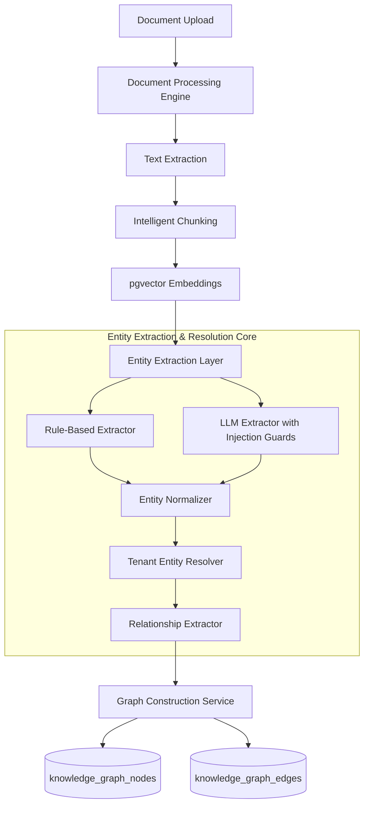

# AegisAI — Phase 5.2: Entity Extraction & Automatic Graph Construction

## Overview
Phase 5.2 automates the extraction of structured domain entities and semantic relationships from processed document chunks, transforming raw documents into queryable, tenant-isolated Knowledge Graph nodes and edges.

---

## 1. Architecture Pipeline

---

## 2. Key Components

### A. Base & Provider Extractors
- [`BaseEntityExtractor`](file:///d:/CP/AegisAI/backend/app/services/entity_extraction/base.py): Unified extraction contract supporting `extract_entities` and `extract_relationships`.
- [`RuleBasedEntityExtractor`](file:///d:/CP/AegisAI/backend/app/services/entity_extraction/rule_based.py): 100% deterministic local pattern matcher using tech dictionaries, organization indicators, headings, and regex triggers.
- [`LLMEntityExtractor`](file:///d:/CP/AegisAI/backend/app/services/entity_extraction/llm_extractor.py): Optional AI-driven extractor equipped with prompt injection delimiters (`<DOCUMENT_CONTENT>`) that treats untrusted text strictly as data.

### B. Entity Normalizer & Canonicalization
- [`EntityNormalizer`](file:///d:/CP/AegisAI/backend/app/services/entity_extraction/normalizer.py):
  - Normalizes Unicode (NFKC) and collapses internal whitespace.
  - Strips leading/trailing punctuation.
  - Canonicalizes aliases (e.g. `postgres` $\to$ `PostgreSQL`, `fast-api` $\to$ `FastAPI`, `lang graph` $\to$ `LangGraph`).

### C. Tenant-Isolated Entity Resolution
- [`EntityResolver`](file:///d:/CP/AegisAI/backend/app/services/entity_extraction/resolver.py):
  - Deduplicates entities within the tenant's workspace `(user_id, workspace_id)`.
  - Enriches provenance metadata (`document_id`, `chunk_id`, `page_number`, `section_title`).
  - Strict boundary guarantee: Never resolves to or queries entities from other workspaces.

### D. Graph Construction Service & Idempotency
- [`GraphConstructionService`](file:///d:/CP/AegisAI/backend/app/services/graph_construction.py):
  - Orchestrates `Document` $\to$ `CONTAINS` $\to$ `DocumentChunk` $\to$ `REFERENCES` $\to$ `Entity` hierarchy.
  - Formulates relationship edges between co-occurring entities.
  - **Idempotency Guarantee**: Repeated execution on the same document updates existing entities without creating duplicate records.

---

## 3. API Endpoints

All endpoints require JWT authentication and resolve `(user_id, workspace_id)` from the security context.

| Method | Endpoint | Description |
|---|---|---|
| `POST` | `/api/v1/knowledge-graph/documents/{document_id}/extract` | Runs entity extraction and builds the graph for a document. |
| `GET` | `/api/v1/knowledge-graph/documents/{document_id}/entities` | Returns all Knowledge Graph entity nodes connected to the document. |
| `GET` | `/api/v1/knowledge-graph/documents/{document_id}/relationships` | Returns all edge relationships formed from the document. |
| `POST` | `/api/v1/knowledge-graph/documents/{document_id}/rebuild` | Safely rebuilds knowledge graph nodes and edges for the document. |

---

## 4. Security & Isolation Protections
1. **Tenant Boundary Enforcement**: Queries filter strictly on `(workspace_id == current_user.workspace_id, user_id == current_user.id)`.
2. **Prompt Injection Defense**: Untrusted user document text is sandboxed and never interpreted as system instructions or tool execution triggers.
3. **Resource Clamping**: Entity count ($\le 50$) and relationship count ($\le 100$) per chunk are strictly bounded.
4. **Non-Fatal Pipeline Hook**: Graph construction exceptions are logged as warnings and never fail the core document ingestion flow.
