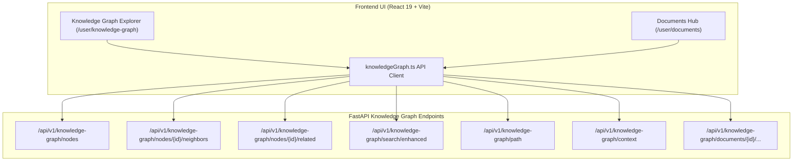

# AegisAI — Phase 5.3: Interactive Knowledge Graph Explorer UI

## Overview
Phase 5.3 implements an interactive, real-time Knowledge Graph Explorer UI in the AegisAI frontend, linking live graph intelligence and document entity extraction endpoints to a force-directed visual canvas.

---

## 1. Architecture

---

## 2. Key Features

### A. Graph Explorer Canvas
- **Force-Directed Physics Simulation**: Smooth spring-attraction, Coulomb charge repulsion, and center-gravity layout.
- **Node Type Palette**: High-contrast color-coded nodes for `PROJECT`, `SKILL`, `DOCUMENT`, `DOCUMENT_CHUNK`, `USER`, `ORGANIZATION`, `TASK`, `AGENT`, `MEMORY`.
- **Canvas Interaction**: Zoom ($0.4\times \to 2.5\times$), pan drag, node drag, reset/fit-to-screen, and physics pause/play toggles.

### B. Live Enhanced Search & Filtering
- **Debounced Autocomplete Search**: Connects to `GET /api/v1/knowledge-graph/search/enhanced`.
- **Filters**: Instant client/server filtering by `NodeType` and `RelationshipType`.

### C. Selected Entity Inspector
- **Node Attributes**: Name, type badge, description, confidence, provenance (document ID, chunk index, page number).
- **Lazy Expansion**: "Expand Connected Neighbors" dynamically fetches and merges 1-hop connected nodes from the database into the canvas.
- **Multi-Hop Related Entities**: Displays ranked related entities with distance and deterministic relevance scores.

### D. Bounded Shortest Path Discovery
- **Pathfinder Modal**: User selects source and target entities to invoke `POST /api/v1/knowledge-graph/path`.
- **Visual Highlighting**: Highlights shortest pathway nodes and edges on the graph canvas in pink.

### E. Hierarchical Graph Context Generation
- **Context Modal**: Invokes `POST /api/v1/knowledge-graph/context` to render and copy LLM prompt-ready text trees.

### F. Document UI Integration
- **Knowledge Graph Tab**: Embedded directly into the Documents Hub (`/user/documents`), listing extracted entities and relationships for any active document.
- **Actions**: "Extract Graph", "Rebuild Graph", and 1-click "Open Explorer" deep link (`/user/knowledge-graph?docId=...`).

---

## 3. Security & Isolation
- **Strict JWT Propagation**: API calls automatically include `Authorization: Bearer <token>` through the centralized `client.ts` request engine.
- **Tenant Scoping**: All lookups, expansions, pathfindings, and searches are strictly isolated to the authenticated user's workspace on the backend.
- **No Client Trust**: Client never specifies or alters `user_id` or `workspace_id` query parameters.
