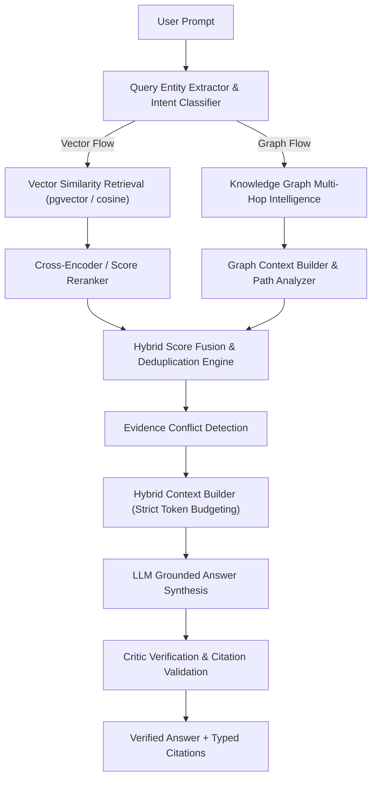

# AegisAI — Phase 5.4: Hybrid Graph + Vector RAG Reasoning

## Overview
Phase 5.4 implements a production-grade **Hybrid Retrieval and Reasoning Layer** that combines vector semantic document retrieval (pgvector / cosine fallback) with Knowledge Graph topological intelligence (`KnowledgeGraphService`, `KnowledgeGraphIntelligenceService`), multi-agent reasoning, score fusion, conflict detection, and critic safety gates.

---

## 1. Architecture



---

## 2. Core Modules & Components

### A. Query Entity & Intent Analysis (`app/core/rag/hybrid/query_analysis.py`)
- **Deterministic Entity Extraction**: Uses canonical dictionaries and regex rules to extract candidate domain concepts, skills, technologies, and organizations.
- **Intent Profiling**:
  - `vector_centric`: Direct document/paragraph queries.
  - `graph_centric`: Queries concerning relationships, dependencies, hierarchies, and pathways.
  - `hybrid`: Default for complex questions requiring factual document snippets alongside entity topologies.

### B. Score Normalization & Fusion (`app/core/rag/hybrid/fusion.py`)
- **Linear Combination**:
  $$\text{Score}_{\text{hybrid}} = \text{Clamp}(w_{\text{vec}} \cdot S_{\text{vec}} + w_{\text{graph}} \cdot S_{\text{graph}} + w_{\text{meta}} \cdot S_{\text{meta}}, 0.0, 1.0)$$
- **Default Weights**: Vector ($0.60$), Graph ($0.30$), Metadata ($0.10$).
- **Deduplication**: When a graph entity links to an extracted document chunk, results merge into a single `hybrid` source item.
- **Conflict Detection**: Flags contradictory or temporal deprecation markers (`"deprecated"`, `"migrated from"`, `"superseded"`).

### C. Context Demarcation & Budgeting (`app/core/rag/hybrid/context.py`)
- Strict separation between `=== DOCUMENT EVIDENCE ===` and `=== KNOWLEDGE GRAPH TOPOLOGY ===`.
- Budget allocation prevents prompt overflowing ($70\%$ allocated to document chunks, $30\%$ to graph topology).
- Prompt injection protection sanitizes raw content and wraps untrusted data in evidence delimiters.

### D. Service & Factory (`app/core/rag/hybrid/service.py`, `factory.py`)
- Orchestrates concurrent vector retrieval and graph traversal.
- Emits structured results with latency, candidate count, confidence, and typed citations.
- Tenant-scoped caching with Redis using SHA-256 parameter keys.

---

## 3. Endpoints & API

### `POST /api/v1/rag/hybrid/query`
- **Request Body**:
  ```json
  {
    "query": "What database does AegisAI use for multi-tenancy?",
    "top_k": 5,
    "graph_depth": 2,
    "similarity_threshold": 0.0
  }
  ```
- **Response**:
  ```json
  {
    "query": "...",
    "answer": "...",
    "retrieved_chunks": [...],
    "graph_entities": [...],
    "citations": [...],
    "graph_citations": [...],
    "confidence": 0.95,
    "conflict_detected": false,
    "retrieval_metrics": {
      "latency_ms": 142.5,
      "vector_candidates_count": 5,
      "graph_nodes_count": 3,
      "fused_items_count": 4
    }
  }
  ```

---

## 4. Multi-Agent & Critic Integration
- **RAGAgent**: Integrates `HybridRAGService` to produce structured graph and vector evidence.
- **CriticAgent**: Verifies chunk authenticity, relationship validity, and strictly enforces tenant workspace boundaries (cross-tenant leaks immediately cause `CriticDecision.FAIL`).
- **ResponseGeneratorAgent**: Synthesizes verified evidence into readable answers with attributed citation pills.

---

## 5. Security & Multi-Tenancy
- All vector queries, graph traversals, and Redis cache keys enforce `user_id` and `workspace_id` derived exclusively from verified JWT authentication tokens.
- No user-supplied tenant parameters are trusted.
