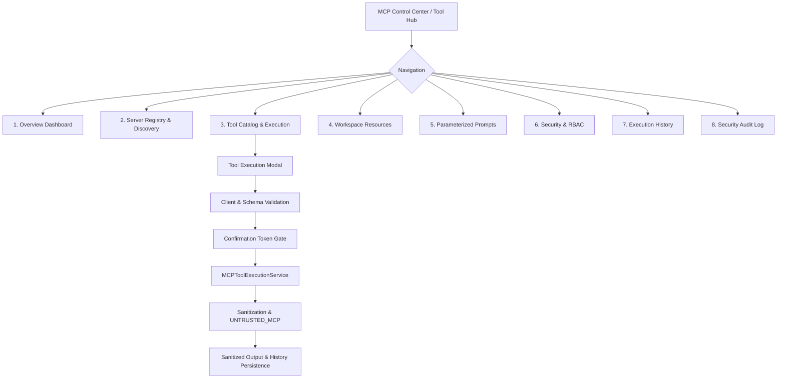

# Phase 6.8: MCP Control Center & Tool Hub

## Overview
Phase 6.8 delivers the production-grade **AegisAI MCP Control Center / Tool Hub**, connecting the frontend interface directly to the live backend services without mock data. It provides unified visibility, management, execution, and security auditing for Model Context Protocol (MCP) servers, tools, workspace resources, prompt templates, and execution traces.

---

## 1. Control Center Architecture

---

## 2. Interface Capabilities & Views

### A. Overview Dashboard
- **Live Metrics**:
  - Servers: Active, inactive, error, disabled counts.
  - Capabilities: Total tools, resources, prompts, enabled count, stale count.
  - Security: Allowed vs. Gated vs. Denied operations.
  - Executions: Completed, failed, requires_confirmation counts.
  - Health: Server status, discovery timestamp, health check timestamp.
- **Quick Actions**: Deep links into Server Registry, Tool Catalog, and Security Dashboard.

### B. Server Management & Discovery
- **Server Registry**: Live list of registered servers with transport indicators (`sse`, `streamable_http`, `stdio`), authentication schemes, protocol versions, and latency.
- **Inline Operations**:
  - Health Check Trigger (`POST /api/v1/mcp/servers/{id}/health`)
  - Discovery Refresh Trigger (`POST /api/v1/mcp/servers/{id}/refresh`)
  - Enable / Disable Toggle (`POST /api/v1/mcp/servers/{id}/enable` / `disable`)
  - Server Registration Modal with transport, auth, and URL validation.
- **Server Capabilities Modal**: Split view of tools, resources, and prompt templates with dynamic JSON Schema rendering.

### C. Tool Catalog & Execution Runner
- **Deterministic Search & Filters**: Filter by server origin, risk level (`SAFE`, `RESTRICTED`, `INVALID`), stale status, and pinned favorites.
- **Interactive Execution Runner**:
  - Auto-generated argument forms based on tool parameter JSON Schemas.
  - Gated confirmation flow for `RESTRICTED` tools (requires explicit acknowledgment and requests HMAC-signed single-use confirmation tokens).
  - Sanitized execution output display with copy-to-clipboard, collapsible formatting, and duration benchmarks.

### D. Resources Hub
- Search and browse workspace resources by URI or name.
- Resource Reader with size-bounding (1MB limit), truncation indicators, and clear `UNTRUSTED_MCP` trust-label badges.

### E. Prompts Hub
- Search and browse parameterized prompt templates.
- Parameter input forms to dynamically render prompt messages with `UNTRUSTED_MCP` tagged role blocks.

### F. Security & RBAC Dashboard
- Real-time visualization of trust boundaries, HMAC-SHA256 confirmation gates, SSRF defense, and workspace tenant isolation.
- Active capability permissions matrix (`mcp:tool:*`, `mcp:resource:*`, `mcp:prompt:*`, `mcp:server:*`, `mcp:admin`).

### G. Execution History
- Real-time history table showing all executions in the workspace from `ToolExecution` and `Execution` models.
- Filter by status (`ALL`, `COMPLETED`, `REQUIRES_CONFIRMATION`, `FAILED`).
- Detailed execution trace modal with sanitized outputs and error logs.

### H. Security Audit Log
- Searchable and filterable log of security decisions (`ALLOW`, `REQUIRE_CONFIRMATION`, `DENY`).
- Redacted sensitive parameters in metadata.

---

## 3. Real-Time Streaming & Multi-Agent Integration
- SSE events connected to Chat UI:
  - `MCP_TOOL_STARTED` / `MCP_TOOL_COMPLETED` / `MCP_TOOL_FAILED`
  - `MCP_RESOURCE_STARTED` / `MCP_RESOURCE_COMPLETED`
  - `MCP_PROMPT_STARTED` / `MCP_PROMPT_COMPLETED`
  - `MCP_TOOL_CONFIRMATION_REQUIRED`
  - `MCP_SECURITY_DENIED`

---

## 4. Verification & Testing
- **Backend Endpoints Added**:
  - `GET /api/v1/mcp/overview`
  - `GET /api/v1/mcp/executions`
- **Unit Tests Added**:
  - `backend/tests/unit/test_mcp_ui_endpoints.py` (3/3 passing)
- **Regression Suite**:
  - `pytest tests/unit/ -v`: **297 / 297 unit tests passing (100%)**.
- **Frontend Production Build**:
  - `npm run build`: **0 errors, built in 698ms**.
