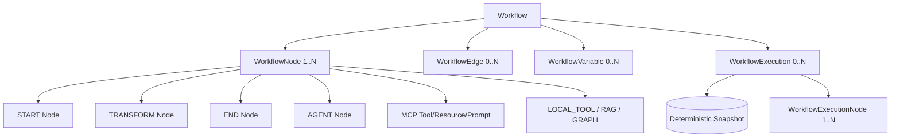

# Phase 7.1: Workflow Engine Foundation

## Overview
Phase 7.1 establishes the core domain architecture, data persistence, deterministic DAG validation, execution snapshotting, variable resolution, and REST API foundation for the **AegisAI Workflow Builder Engine**.

---

## 1. Workflow Domain & Entity Architecture

### Models Implemented
- `Workflow`: High-level workflow header with tenant workspace scoping (`workspace_id`), status (`draft`, `active`, `paused`, `archived`), version tracking, and active toggles.
- `WorkflowNode`: Nodes with unique `node_key` per workflow, strongly typed `node_type` (`START`, `END`, `AGENT`, `RAG`, `GRAPH`, `MEMORY`, `MCP_TOOL`, `MCP_RESOURCE`, `MCP_PROMPT`, `LOCAL_TOOL`, `CONDITION`, `HUMAN_APPROVAL`, `TRANSFORM`), JSON config, and canvas coordinates.
- `WorkflowEdge`: Directed links connecting `source_node_id` and `target_node_id` with execution `priority` and conditional routing triggers.
- `WorkflowVariable`: Typed workflow variables (`string`, `number`, `boolean`, `json`) with secret masking support.
- `WorkflowExecution`: Immutable run record binding `workflow_id`, `workflow_version`, input parameters, snapshot state, execution status, output data, and error traces.
- `WorkflowExecutionNode`: Step-by-step audit record tracking state transitions (`PENDING` $\to$ `RUNNING` $\to$ `COMPLETED` / `FAILED` / `SKIPPED` / `CANCELLED`).

---

## 2. Deterministic DAG Validation & Cycle Detection

The `WorkflowValidationService` executes structural and topological validation rules:
1. **START Node Cardinality**: Exactly one START node must be present.
2. **END Node Cardinality**: At least one END node must be present.
3. **Node Key Uniqueness**: `node_key` must be unique across the workflow.
4. **Self-Loop Rejection**: `source_node == target_node` is strictly prohibited.
5. **Cycle Detection (Kahn's Algorithm)**: Cyclic dependencies are rejected prior to activation.
6. **Reachability Analysis**: Unreachable nodes emit structured warnings without breaking execution.
7. **Node Configuration**: Node configurations are checked against Pydantic validators (`StartNodeConfig`, `EndNodeConfig`, `TransformNodeConfig`, etc.).

---

## 3. Workflow Execution Foundation & Variable Resolution

### Safe Variable Resolution
Expressions in templates and transform mapping are safely evaluated without dynamic code execution (`eval`):
- `{{input.field_name}}` $\to$ Resolves from execution `input_data`.
- `{{variables.var_name}}` $\to$ Resolves from workflow variable definitions.
- `{{nodes.node_key.output.path}}` or `{{nodes.node_key.path}}` $\to$ Resolves from accumulated prior node outputs.

### Topological Execution
Execution order is deterministically resolved using in-degree ordering, breaking ties by edge priority (descending) and node key (ascending).

---

## 4. REST APIs & Client Bindings

| Method | Endpoint | Description |
|---|---|---|
| `POST` | `/api/v1/workflows` | Create a new workflow definition |
| `GET` | `/api/v1/workflows` | List workflows in the active workspace |
| `GET` | `/api/v1/workflows/{id}` | Get full workflow detail with nodes/edges |
| `PUT` | `/api/v1/workflows/{id}` | Update workflow (increments version if structural) |
| `DELETE` | `/api/v1/workflows/{id}` | Soft delete workflow |
| `POST` | `/api/v1/workflows/{id}/validate` | Run DAG validation rules |
| `POST` | `/api/v1/workflows/{id}/activate` | Validate and set workflow active |
| `POST` | `/api/v1/workflows/{id}/pause` | Pause an active workflow |
| `POST` | `/api/v1/workflows/{id}/archive` | Archive workflow |
| `POST` | `/api/v1/workflows/{id}/execute` | Execute workflow with input data |
| `GET` | `/api/v1/workflows/{id}/executions` | List executions of a workflow |
| `GET` | `/api/v1/workflows/executions/{id}` | Get execution trace and node outputs |
| `POST` | `/api/v1/workflows/executions/{id}/cancel` | Cancel an active execution |

---

## 5. Verification Results

- **Unit Test Regression**: **334 / 334 PASSED (100%)**
  - 317 baseline tests
  - 17 new Phase 7.1 tests across models, validation, services, execution, variables, tenant isolation, and API endpoints.
- **Frontend Build**: Vite production compilation passed in 695ms with **0 errors**.
- **Alembic Migration**: `011_workflow_engine_foundation.py` created for all 6 tables.
