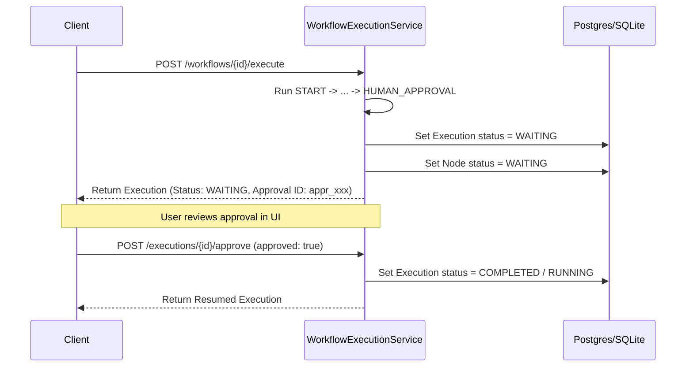

# Phase 7.3: Workflow Node Execution & Agent/MCP/RAG Integration

## Overview
Phase 7.3 connects the Phase 7.2 Visual Workflow Builder with real AegisAI backend execution engines. A saved workflow can now execute all 13 supported node types in deterministic DAG topological order, propagate structured outputs and citations through a strongly typed execution context, evaluate deterministic conditional routing without dynamic code execution, pause safely for human approval gates, and cancel long-running executions.

---

## 1. Execution Architecture

```mermaid
graph TD
    Trigger[POST /workflows/{id}/execute] --> Authenticate[Tenant Isolation & RBAC Validation]
    Authenticate --> Snapshot[Capture Immutable Workflow Snapshot]
    Snapshot --> Context[Initialize WorkflowExecutionContext]
    Context --> Scheduler[Deterministic DAG Scheduler<br/>Kahn's Topological Sort + Edge Priorities]
    Scheduler --> Dispatcher[WorkflowNodeExecutor]
    Dispatcher --> Agents[Multi-Agent Pipeline<br/>AegisAIPipeline]
    Dispatcher --> RAG[RAG Retrieval & Citations<br/>RAGService]
    Dispatcher --> Graph[Knowledge Graph Traversal<br/>KnowledgeGraphIntelligenceService]
    Dispatcher --> Memory[Memory Recall & Store<br/>MemoryProviderFactory]
    Dispatcher --> MCP[MCP Security & Execution<br/>MCPToolExecutionService / MCPResourceService / MCPPromptService]
    Dispatcher --> Control[Control Flow<br/>START / END / TRANSFORM / CONDITION / HUMAN_APPROVAL]
    Dispatcher --> Routing[Conditional Edge Evaluator]
    Routing -->|Eligible Edge| NextNode[Next DAG Node]
    Routing -->|Ineligible Edge| SkipNode[Mark Downstream Branch SKIPPED]
    Dispatcher --> Audit[(WorkflowExecution & WorkflowExecutionNode DB)]
```

---

## 2. Supported Node Types & Subsystem Integrations

| Node Type | Integration Layer | Execution Behavior & Provenance | Safety / Isolation Boundary |
|---|---|---|---|
| **`START`** | Native Workflow Engine | Exposes structured input payload (`{"input": context.input_data}`) | Zero external access |
| **`END`** | Native Workflow Engine | Resolves output template or field mapping into final workflow output | Safe string & variable substitution |
| **`TRANSFORM`** | Native Workflow Engine | Computes declarative dictionary mapping and variable resolution | Strict regex substitution, zero `eval()` |
| **`CONDITION`** | Native Workflow Engine | Evaluates boolean expressions (`equals`, `not_equals`, `greater_than`, `less_than`, `contains`, `exists`) | Deterministic binary boolean output |
| **`HUMAN_APPROVAL`** | Native Workflow Engine | Pauses execution in `WAITING` status and records approval ID | Requires explicit `POST /approve` call to proceed |
| **`AGENT`** | Multi-Agent Pipeline (`AegisAIPipeline`) | Executes multi-agent or specialized agent task based on `config.agent_type` and `config.goal` | Isolated in workspace tenant boundary |
| **`RAG`** | `RAGService` / `RAGFactory` | Vector semantic search, pgvector similarity filtering, and citation extraction | Strict workspace and user document filtering |
| **`GRAPH`** | `KnowledgeGraphIntelligenceService` | Graph neighborhood exploration, entity linking, and topological traversal | Workspace boundary preserved |
| **`MEMORY`** | `MemoryProviderFactory` | Vector and semantic memory lookup across episodic and semantic memory | Tenant-isolated memory partitions |
| **`MCP_TOOL`** | `MCPToolExecutionService` | Invocations gated by MCP Confirmation Token, rate limits, and risk policy | Never bypasses MCPSecurityService |
| **`MCP_RESOURCE`** | `MCPResourceService` | Reads MCP resource context and attaches `UNTRUSTED_MCP` provenance | Never treated as trusted system instructions |
| **`MCP_PROMPT`** | `MCPPromptService` | Renders remote prompt template and attaches `UNTRUSTED_MCP` provenance | Untrusted context boundary |
| **`LOCAL_TOOL`** | `ToolRegistry` | Executes allowlisted local utilities (calculator, search, document reader) | Strictly allowlisted registry |

---

## 3. Conditional Routing & Branch Pruning

Each directed edge in the workflow graph can define a declarative condition:
```json
{
  "left": "{{nodes.age_check.output.result}}",
  "operator": "equals",
  "right": true
}
```
During DAG execution:
1. When a node completes, all outgoing edges are evaluated.
2. If an edge condition evaluates to `false`, the downstream target node is added to the `skipped_nodes` set.
3. When the DAG scheduler encounters a skipped node, it records a `WorkflowExecutionNode` with status `SKIPPED`, and cascades the skipped state to any dependent nodes.
4. Active branches continue executing deterministically to completion.

---

## 4. Human Approval Flow & Execution Resumption



---

## 5. Security & Resource Bounds

1. **Tenant & RBAC Isolation**: All execution operations require verified JWT identity and workspace membership.
2. **Immutable Snapshot Isolation**: Execution starts from an immutable JSON snapshot captured at `POST /execute`. Subsequent graph edits or version bumps do not affect running executions.
3. **Data Redaction & Sanitization**: `CredentialStore.redact_sensitive_dict` scrubs sensitive variables, authentication tokens, and passwords from node inputs, outputs, and database persistence.
4. **Execution Bounds**:
   - `MAX_NODES_PER_EXECUTION = 50`
   - Cycle detection rejects loop graphs before execution starts.
   - Self-loops and infinite recursion are strictly prohibited.

---

## 6. REST API Endpoints

| Method | Route | Description |
|---|---|---|
| `POST` | `/api/v1/workflows/{id}/execute` | Starts execution from immutable snapshot with input data |
| `GET` | `/api/v1/workflows/{id}/executions` | Lists paginated historical executions for a workflow |
| `GET` | `/api/v1/workflows/executions/{execution_id}` | Retrieves execution trace details with all executed node records |
| `POST` | `/api/v1/workflows/executions/{execution_id}/approve` | Approves or rejects a workflow execution paused in `WAITING` status |
| `POST` | `/api/v1/workflows/executions/{execution_id}/cancel` | Aborts an active or pending workflow execution |

---

## 7. Verification Metrics

- **Unit Test Regression**: **349 / 349 PASSED (100%)** in 33.90s (340 baseline + 9 new Phase 7.3 unit tests).
- **Frontend Production Build**: Vite production compilation passed in 817ms with **0 errors**.
- **Database Migration**: **No migration required** (schema 011 natively supports execution tracking and node states).
