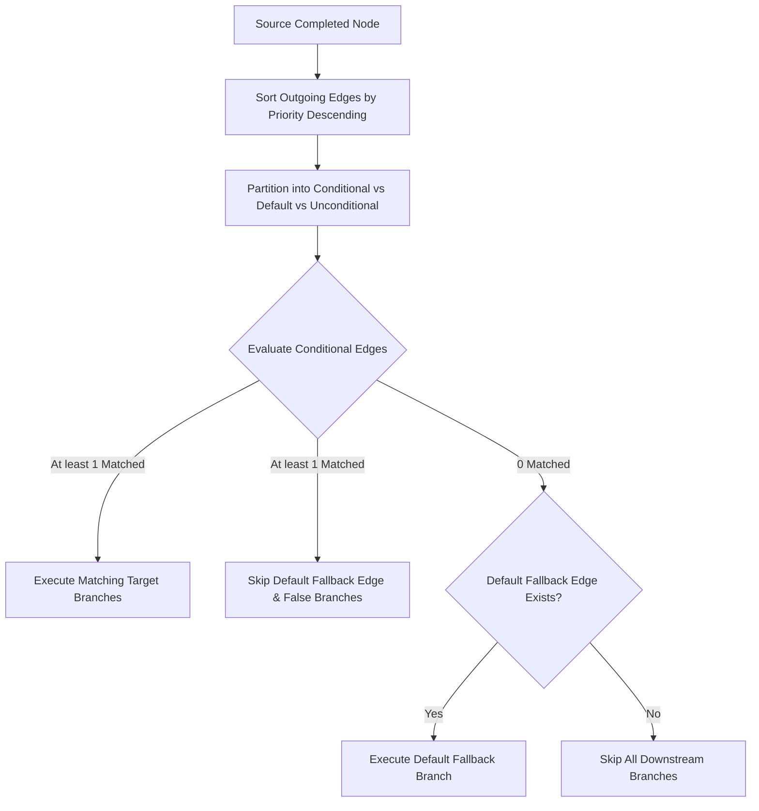

# Phase 7.4: Advanced Conditions, Branching & Deterministic Routing

## Overview
Phase 7.4 evolves the AegisAI Workflow engine's conditional branching into a production-grade deterministic routing system. It introduces a dedicated type-safe `ConditionEvaluator` supporting 14 comparison operators, compound logic groups (`AND`, `OR`, `NOT`), nested condition trees with bounded depth, deterministic multi-branch routing, and default/fallback branch selection without dynamic code execution (`eval()` / `exec()`).

---

## 1. Condition Model & Grammar

A condition is defined either as a **Single Leaf Condition** or a **Compound Condition Group**.

### Single Leaf Condition
```json
{
  "left": "{{nodes.agent_1.output.score}}",
  "operator": "greater_than",
  "right": 0.8
}
```

### Compound Condition Group (`AND` / `OR` / `NOT`)
```json
{
  "logic": "AND",
  "conditions": [
    {
      "left": "{{input.country}}",
      "operator": "equals",
      "right": "India"
    },
    {
      "left": "{{nodes.agent_1.output.score}}",
      "operator": "greater_or_equal",
      "right": 0.8
    }
  ]
}
```

### Nested Condition Tree
```json
{
  "logic": "OR",
  "conditions": [
    {
      "logic": "AND",
      "conditions": [
        {"left": "{{input.age}}", "operator": "greater_or_equal", "right": 21},
        {"left": "{{input.role}}", "operator": "equals", "right": "admin"}
      ]
    },
    {
      "logic": "NOT",
      "conditions": [
        {"left": "{{input.is_restricted}}", "operator": "equals", "right": true}
      ]
    }
  ]
}
```

---

## 2. Supported Operators

### Logic Operators
- **`AND`**: All child conditions must evaluate to `true`.
- **`OR`**: At least one child condition must evaluate to `true`.
- **`NOT`**: Inverts the boolean result of exactly 1 child condition.

### Comparison Operators (14 Operators)
| Operator | Semantics | Type-Safe Behavior |
|---|---|---|
| `equals` | Equality check (`==`) | Performs type-safe value comparison or numeric coercion |
| `not_equals` | Inequality check (`!=`) | Negation of `equals` |
| `greater_than` | Numeric strictly greater (`>`) | Converts operands to floats; returns `false` on non-numeric types |
| `less_than` | Numeric strictly less (`<`) | Converts operands to floats; returns `false` on non-numeric types |
| `greater_or_equal`| Numeric greater than or equal (`>=`)| Converts operands to floats |
| `less_or_equal` | Numeric less than or equal (`<=`) | Converts operands to floats |
| `contains` | Substring, list member, or dict key check | `right in left` for strings, lists, or dictionary keys |
| `not_contains` | Negation of `contains` | Returns `true` if `right` is not found in `left` |
| `in` | Membership check | `left in right` for lists, strings, or dictionary keys |
| `not_in` | Non-membership check | Returns `true` if `left` is not in `right` |
| `starts_with` | Prefix match | `str(left).startswith(str(right))` |
| `ends_with` | Suffix match | `str(left).endswith(str(right))` |
| `exists` | Existence and non-empty check | Returns `true` if `left is not None and left != ""` |
| `not_exists` | Missing or empty check | Returns `true` if `left is None or left == ""` |

---

## 3. Structural Limits & Guardrails
- **`MAX_CONDITION_NESTING_DEPTH = 3`**: Prevents deeply nested condition graphs.
- **`MAX_CONDITIONS_PER_GROUP = 10`**: Bounds condition group size.
- **`MAX_OPERAND_LENGTH = 10000`**: Restricts string operand lengths.
- **Zero dynamic code evaluation**: Absolute ban on `eval()`, `exec()`, `Function()`, and AST execution.

---

## 4. Multi-Branch Deterministic Edge Routing



---

## 5. Workflow Validation Rules

`WorkflowValidationService` validates the following before workflow activation:
1. **Invalid Operators**: Rejects unrecognized comparison or logic operators.
2. **Cardinality Rules**: `NOT` requires exactly 1 child; empty `conditions` lists are rejected.
3. **Nesting Bounds**: Rejects structures with depth exceeding 3 levels.
4. **Default Route Integrity**: Rejects multiple `is_default: true` outgoing edges from the same node (`MULTIPLE_DEFAULT_EDGES`).

---

## 6. Frontend Visual Condition Builder

- **`WorkflowEdgeEditor.jsx`**:
  - **Routing Guard Selector**: Always Run, Default Fallback, Single Rule, Condition Group.
  - **Visual Condition Group Builder**: Match Logic buttons (`AND` / `OR` / `NOT`), Add Rule / Remove Rule, full 14 operator dropdown.
  - **Fallback Switch**: Configures `is_default: true` with explanatory guidance.
  - **Branch Priority Control**: Visual priority input for ordering multi-way branches.
- **`WorkflowNodeEditor.jsx`**:
  - Updated Condition Node form with the complete 14-operator dropdown and operand controls.

---

## 7. Verification Metrics

- **Unit Test Regression**: **355 / 355 PASSED (100%)** in 58.19s (349 baseline + 6 new Phase 7.4 unit tests).
- **Frontend Production Build**: Vite production compilation passed in 2.34s with **0 errors**.
- **Database Migration**: **No migration required** (schema 011 natively stores conditions in `workflow_edges.condition`).
