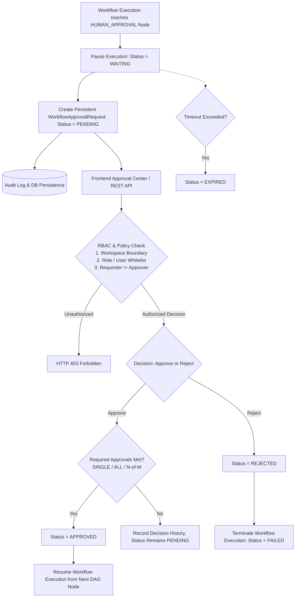
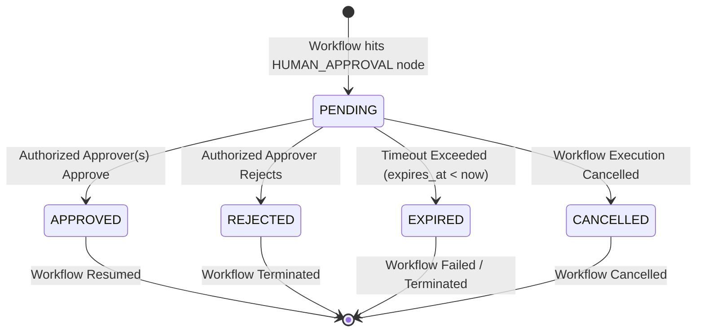

# Phase 7.5: Human Approval & Governance Subsystem

## Overview
Phase 7.5 establishes a secure, tenant-isolated Human Approval & Governance subsystem for AegisAI Workflows. It introduces persistent `WorkflowApprovalRequest` domain entities, RBAC-enforced approver authorization, multi-approver policies, requester/approver separation, timeout/expiration management, workflow pause & resume mechanics, cancellation handling, immutable audit trails, and a frontend Approval Center.

---

## 1. Approval Architecture

---

## 2. Approval Request Lifecycle

### Valid State Transitions
- `PENDING` $\to$ `APPROVED`
- `PENDING` $\to$ `REJECTED`
- `PENDING` $\to$ `EXPIRED`
- `PENDING` $\to$ `CANCELLED`
- Invalid transitions (e.g. `APPROVED` $\to$ `REJECTED`, `EXPIRED` $\to$ `APPROVED`) are strictly rejected.

---

## 3. Governance Policies & Security Controls

| Governance Control | Policy Rule & Behavior |
|---|---|
| **Requester vs Approver Separation** | When `requester_can_approve = False`, the user who initiated the workflow execution cannot approve their own request (`PermissionError: Self-approval is prohibited`). |
| **Approver Resolution & RBAC** | Resolves eligible approvers from `approver_roles` (e.g. `["admin"]`) and/or `approver_users`. Non-workspace members and unauthorized roles are blocked. |
| **Multi-Approver Policies** | Supports `single_approver` (1 approval required), `all_approvers` (all assigned users must approve), and customizable `required_count`. |
| **Duplicate Prevention** | Prevents the same user from submitting multiple decisions for the same request. |
| **Immutable Decision Audit** | Appends every decision to `decision_history` with `user_id`, `username`, `decision`, `reason`, and `timestamp`. |
| **Secret Redaction** | Strips sensitive credentials and tokens using `CredentialStore.redact_sensitive_dict`. |
| **Tenant Isolation** | All operations filter by `workspace_id`. Cross-tenant retrieval, approval, or rejection returns HTTP 404/403. |

---

## 4. REST API Endpoints

| Method | Route | Description |
|---|---|---|
| `GET` | `/api/v1/workflows/approvals` | Lists approval requests for active workspace (filterable by `status: pending, approved, rejected, expired`) |
| `GET` | `/api/v1/workflows/approvals/{approval_id}` | Retrieves details and immutable decision history for an approval request |
| `POST` | `/api/v1/workflows/approvals/{approval_id}/approve` | Records an authorized approval decision and resumes workflow execution |
| `POST` | `/api/v1/workflows/approvals/{approval_id}/reject` | Records an authorized rejection decision and terminates workflow execution |
| `POST` | `/api/v1/workflows/executions/{execution_id}/approve` | Backwards-compatible execution-level approval endpoint |
| `POST` | `/api/v1/workflows/executions/{execution_id}/cancel` | Cancels execution and automatically marks pending approvals as `CANCELLED` |

---

## 5. Frontend Approval Center
- **Location**: [`frontend/src/pages/user/UserWorkflowApprovals.jsx`](file:///d:/CP/AegisAI/frontend/src/pages/user/UserWorkflowApprovals.jsx)
- **Features**:
  - Live filter tabs: **Pending Review**, **Approved**, **Rejected**, **All**.
  - Displays approval card with title, message, workflow node, policy, assigned roles, requested timestamp, expiration countdown, and audit trail.
  - Interactive **Approve** dialog with optional comments.
  - Interactive **Reject** modal with required rejection reason input.
- **Workflow Tab Integration**: Embedded into `UserWorkflows.jsx` as a primary navigation tab.

---

## 6. Verification Metrics

- **Unit Test Regression**: **361 / 361 PASSED (100%)** in 89.55s (355 baseline + 6 new Phase 7.5 unit tests).
- **Frontend Production Build**: Vite production compilation passed in 1.88s with **0 errors**.
- **Database Migration**: `012_workflow_approval_governance` created and applied.
