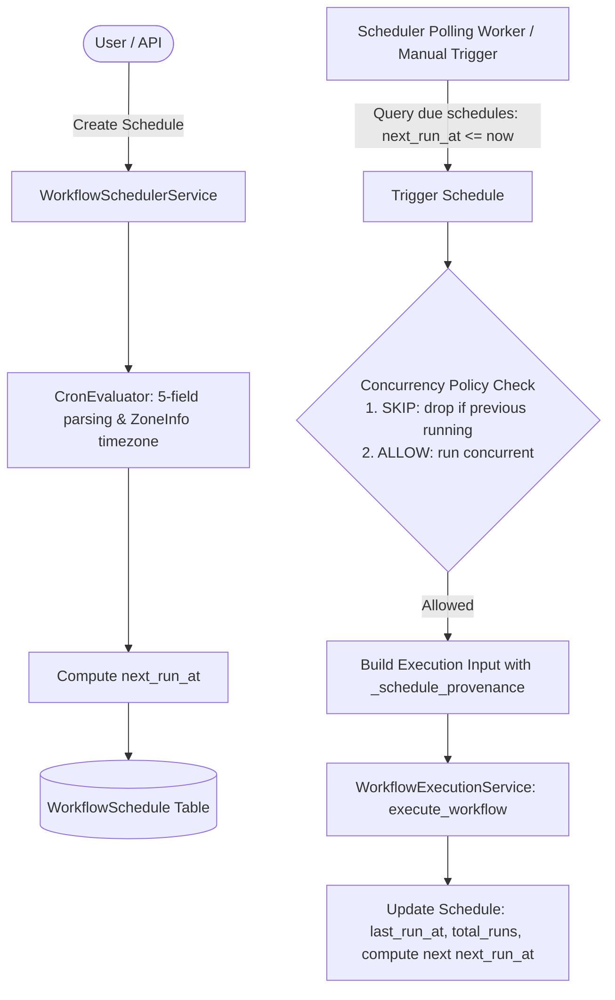

# Phase 7.6: Workflow Scheduling & Recurring Execution Subsystem

## Overview
Phase 7.6 delivers a production-grade, secure, tenant-isolated workflow scheduling and recurring execution subsystem for the AegisAI Workflow Platform. It introduces persistent `WorkflowSchedule` domain entities, a pure Python 5-field cron parsing and timezone calculation engine (`CronEvaluator`), workflow version pinning, concurrency policies, misfire policies, execution provenance tracking, REST APIs, and a frontend scheduling management interface.

---

## 1. Scheduling Architecture



---

## 2. Schedule Domain Model

- **Database Table**: `workflow_schedules` (Migration `013_workflow_scheduling`)
- **Key Attributes**:
  - `id`: UUID primary key
  - `workflow_id`: Target workflow
  - `workspace_id`: Strict tenant isolation
  - `created_by`: User ID of schedule creator
  - `name` & `description`: Human-readable identifier
  - `schedule_type`: `cron`, `one_time`, `delayed`
  - `cron_expression`: 5-field standard cron string (e.g. `0 9 * * *`, `*/15 * * * *`)
  - `run_at`: Future UTC timestamp for one-time/delayed triggers
  - `timezone`: IANA timezone identifier (e.g. `Asia/Kolkata`, `America/New_York`, `UTC`)
  - `status`: `active`, `paused`, `completed`, `disabled`, `expired`, `error`
  - `is_enabled`: Boolean activation toggle
  - `workflow_version`: Pinned workflow version at schedule creation time
  - `concurrency_policy`: `skip` (default), `allow`, `queue`
  - `misfire_policy`: `run_once` (default), `skip`, `run_latest`
  - `next_run_at`: Pre-calculated UTC timestamp for the next firing occurrence
  - `last_run_at` & `last_execution_id`: Tracking and execution history link
  - `total_runs` & `failure_count`: Execution counters

---

## 3. Cron & Timezone Engine (`CronEvaluator`)

- **Pure Python, Zero External Dependencies**:
  - Fully standard 5-field cron parsing: `minute (0-59)`, `hour (0-23)`, `day_of_month (1-31)`, `month (1-12)`, `day_of_week (0-6)`.
  - Supports wildcards (`*`), steps (`*/15`), ranges (`8-17`), lists (`1,15,30`).
  - Strict input validation rejecting out-of-bounds numbers and malformed syntax.
- **Timezone Awareness & DST Transitions**:
  - Uses Python 3.9+ native `zoneinfo.ZoneInfo(tz_name)`.
  - Computes matching local occurrences and converts deterministically to UTC for storage and indexing.
- **Rate-Limiting & Guardrails**:
  - Enforces minimum execution interval (60 seconds) to prevent infinite loops and runaway scheduler load.
  - Workspace limit: Maximum 100 schedules per workspace.
  - Workflow limit: Maximum 20 schedules per workflow.

---

## 4. Execution Provenance & Concurrency Control

When triggered by the scheduler, the workflow receives immutable trigger provenance inside its execution `input_data`:
```json
{
  "_schedule_provenance": {
    "schedule_id": "9b1deb4d-3b7d-4bad-9bdd-2b0d7b3dcb6d",
    "schedule_name": "Daily Morning Sync",
    "trigger_type": "schedule",
    "workflow_version": 1,
    "triggered_at": "2026-09-01T09:00:00Z"
  }
}
```

- **Concurrency `skip`**: If `last_execution_id` is still in `RUNNING` or `WAITING` state, the scheduler skips duplicate firing and advances `next_run_at` without duplicating execution instances.
- **One-time Completion**: One-time schedules immediately transition to `status = COMPLETED` and disable after firing.

---

## 5. REST API Endpoints

| Method | Route | Description |
|---|---|---|
| `GET` | `/api/v1/workflows/schedules` | Lists workspace schedules (with `workflow_id` and `status` filters) |
| `POST` | `/api/v1/workflows/schedules` | Creates a new workflow schedule |
| `GET` | `/api/v1/workflows/schedules/{id}` | Retrieves schedule details and next run prediction |
| `PUT` | `/api/v1/workflows/schedules/{id}` | Updates schedule expression, timezone, or policies |
| `DELETE` | `/api/v1/workflows/schedules/{id}` | Soft deletes schedule |
| `POST` | `/api/v1/workflows/schedules/{id}/pause` | Pauses an active schedule |
| `POST` | `/api/v1/workflows/schedules/{id}/resume` | Resumes a paused schedule and recalculates `next_run_at` |
| `POST` | `/api/v1/workflows/schedules/{id}/trigger` | Manually triggers immediate execution |

---

## 6. Frontend Scheduling UI

- **Location**: [`frontend/src/pages/user/UserWorkflowSchedules.jsx`](file:///d:/CP/AegisAI/frontend/src/pages/user/UserWorkflowSchedules.jsx)
- **Features**:
  - Filter tabs: **All**, **Active**, **Paused**, **Completed**.
  - Interactive schedule creation modal with target workflow selector, quick cron preset chips (e.g. *Every 5 minutes*, *Daily 9 AM*, *Weekdays 9 AM*), timezone picker, and concurrency policy dropdown.
  - Quick action controls: **Manual Trigger (Play)**, **Pause/Resume**, and **Delete**.
  - Metadata cards showing next run prediction, recurrence expression, and total executions count.
- **Workflow Tab Integration**: Embedded directly into [`frontend/src/pages/user/UserWorkflows.jsx`](file:///d:/CP/AegisAI/frontend/src/pages/user/UserWorkflows.jsx) under the **Schedules** navigation tab.

---

## 7. Verification Metrics

- **Unit Test Regression**: **368 / 368 PASSED (100%)** in 68.43s (361 baseline + 7 new Phase 7.6 unit tests).
- **Frontend Production Build**: Vite production compilation passed in 2.65s with **0 errors**.
- **Database Migration**: `013_workflow_scheduling` created and applied.
