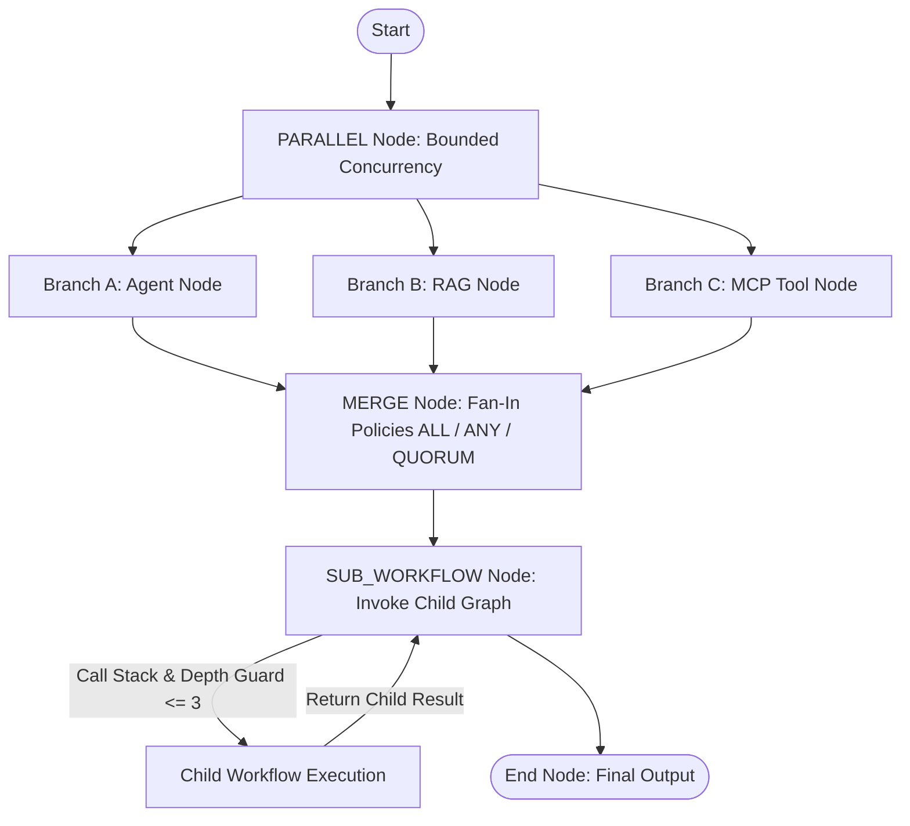

# Phase 7.7: Advanced Workflows & Workflow Composition Subsystem

## Overview
Phase 7.7 extends the AegisAI deterministic workflow engine with advanced workflow composition, controlled parallel execution, fan-out / fan-in merge orchestration, and nested sub-workflow invocation while strictly preserving the DAG architecture, tenant isolation, and deterministic execution guarantees.

---

## 1. Composition Architecture



---

## 2. Advanced Node Types

### 1. `PARALLEL` Node (`WorkflowNodeType.PARALLEL`)
- **Purpose**: Controls fan-out execution into multiple concurrent downstream branches.
- **Config**:
  - `max_concurrency` (default: 5, max: 20): Bounded concurrency limiter.
  - `branches`: Optional list of active branch keys.
- **Deterministic Behavior**: Follows edge routing rules, priority, and conditions established in Phase 7.4.

### 2. `MERGE` Node (`WorkflowNodeType.MERGE`)
- **Purpose**: Gathers and deterministically aggregates outputs from multiple upstream branches.
- **Config**:
  - `policy`:
    - `all`: Waits for all upstream branches to reach a terminal completed state.
    - `any`: Merges on the first completed upstream branch.
    - `quorum`: Merges when at least `quorum_count` branches complete.
  - `quorum_count`: Minimum required completed branches (default: 2).
  - `merge_key`: Key name under which individual branch results are organized (default: `"branches"`).
- **Deterministic Output Structure**:
  ```json
  {
    "aggregated": {
      "branch_a": { ... },
      "branch_b": { ... }
    },
    "policy": "all",
    "total_merged": 2
  }
  ```

### 3. `SUB_WORKFLOW` Node (`WorkflowNodeType.SUB_WORKFLOW`)
- **Purpose**: Allows parent workflows to invoke reusable child workflows as a single node step.
- **Config**:
  - `workflow_id` or `workflow_name`: Identifier of the child workflow within the same workspace.
  - `input_mapping`: Declarative mapping of parent context variables to child input parameters.
  - `propagate_failure` (default: `true`): If true, child failure terminates parent execution with error details.
- **Guardrails & Safety Limits**:
  - **Recursion & Cycle Protection**: Maintains an immutable `call_stack` across invocations; immediately rejects self-invocation and indirect circular loops.
  - **Maximum Execution Depth**: Hard limit of 3 nesting levels.
  - **Workspace Tenant Isolation**: A workflow can only invoke child workflows located within its own `workspace_id`.

---

## 3. Visual Builder Integration

- **Node Palette**: [`frontend/src/components/workflow/WorkflowNodePalette.jsx`](file:///d:/CP/AegisAI/frontend/src/components/workflow/WorkflowNodePalette.jsx) updated with `Parallel Fan-Out`, `Merge Fan-In`, and `Sub-Workflow` drag-and-drop tiles.
- **Node Inspector**: [`frontend/src/components/workflow/WorkflowNodeEditor.jsx`](file:///d:/CP/AegisAI/frontend/src/components/workflow/WorkflowNodeEditor.jsx) equipped with forms for concurrency limits, merge policies, quorum thresholds, target workflow selectors, and failure propagation toggles.

---

## 4. Verification Metrics

- **Unit Test Regression**: **371 / 371 PASSED (100%)** in 62.92s (368 baseline + 3 new Phase 7.7 composition unit tests).
- **Frontend Production Build**: Vite production compilation passed in 2.28s with **0 errors**.
