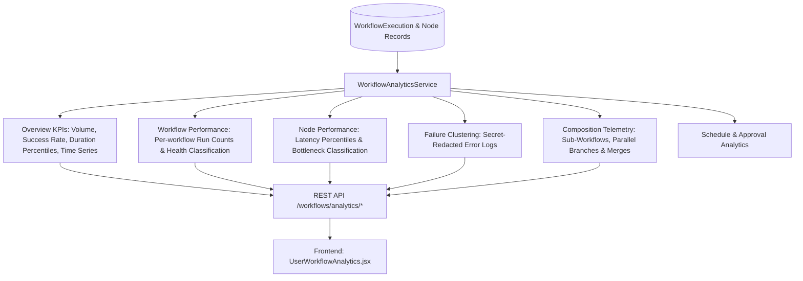

# Phase 7.8: Workflow Monitoring, Observability & Analytics Subsystem

## Overview
Phase 7.8 establishes a production-grade monitoring, observability, and analytics layer for the AegisAI Workflow Platform. It provides deterministic, reproducible metrics, execution timelines, duration percentiles, bottleneck classification, sanitized error clustering, composition telemetry, and an interactive monitoring UI under strict workspace isolation and RBAC.

---

## 1. Analytics Architecture

---

## 2. Core Metrics & Deterministic Formulas

- **Execution Success Rate**:
  $$\text{success\_rate} = \frac{\text{completed\_executions}}{\text{completed} + \text{failed} + \text{cancelled}} \times 100$$
- **Execution Failure Rate**:
  $$\text{failure\_rate} = \frac{\text{failed\_executions}}{\text{completed} + \text{failed} + \text{cancelled}} \times 100$$
- **Average Duration**:
  $$\text{avg\_duration} = \frac{\sum \text{duration of completed executions}}{\text{completed\_execution\_count}}$$
- **Duration Percentiles**:
  - `median_duration`: 50th percentile of completed execution durations.
  - `p95_duration`: 95th percentile of completed execution durations.

---

## 3. Workflow Health Classification Policy

Workflow health is categorized deterministically without LLM ambiguity:

| Health Status | Rule Definition | Description |
|---|---|---|
| **`HEALTHY`** | `total_runs == 0` OR (`success_rate >= 85.0%` AND `latest_status != "failed"`) | Optimal execution state with high reliability. |
| **`WARNING`** | `50.0% <= success_rate < 85.0%` OR (`latest_status == "failed"` AND `success_rate >= 50.0%`) | Flaky execution or recent failure needing inspection. |
| **`CRITICAL`** | `total_runs > 0` AND `success_rate < 50.0%` | Severe failure rate requiring user intervention. |

---

## 4. Node Bottleneck Classification

Execution nodes are categorized based on runtime statistics:
- **`SLOW`**: Average node execution duration $\ge 5.0$ seconds.
- **`HIGH_FAILURE`**: Node failure rate $\ge 30.0\%$.
- **`HIGH_WAIT`**: Node spent in waiting state $\ge 5$ times.
- **`HIGH_VOLUME`**: Total executions $\ge 50$.
- **`NORMAL`**: Standard execution profile.

---

## 5. Secret Redaction & Data Privacy
- Uses [`CredentialStore.redact_sensitive_str()`](file:///d:/CP/AegisAI/backend/app/core/mcp/security.py) and regex key masking.
- Automatically redacts API keys, tokens, passwords, bearer credentials, and private keys from failure summaries and execution detail traces before sending to the client.

---

## 6. REST API Endpoints

| Method | Route | Description |
|---|---|---|
| `GET` | `/api/v1/workflows/analytics/overview` | High-level KPI metrics & time-series trends (`?days=7`) |
| `GET` | `/api/v1/workflows/analytics/performance` | Per-workflow performance metrics and health classifications |
| `GET` | `/api/v1/workflows/analytics/nodes` | Per-node duration percentiles and bottleneck categories |
| `GET` | `/api/v1/workflows/analytics/failures` | Sanitized failure clusters with redacted error messages |
| `GET` | `/api/v1/workflows/analytics/composition` | Sub-workflow invocations, fan-out, and merge distributions |
| `GET` | `/api/v1/workflows/analytics/schedules` | Automated schedule run metrics |
| `GET` | `/api/v1/workflows/analytics/approvals` | Human approval turnaround times and decision rates |
| `GET` | `/api/v1/workflows/executions/{id}/analytics` | Node-level duration waterfall for a single execution |

---

## 7. Frontend Monitoring Dashboard

- **Location**: [`frontend/src/pages/user/UserWorkflowAnalytics.jsx`](file:///d:/CP/AegisAI/frontend/src/pages/user/UserWorkflowAnalytics.jsx)
- **Features**:
  - Top KPI cards: Total Executions, Success Rate, Avg Duration, Active Workflows.
  - Time window switchers: **24 Hours**, **7 Days**, **30 Days**.
  - Execution Status breakdown progress bar.
  - Tabbed analytics views:
    - **Workflow Performance**: Table with search, health filter, duration statistics, and status indicators.
    - **Node Bottlenecks**: Breakdown of slowest and highest failure nodes.
    - **Failure Clusters**: Sanitized error logs with occurrence counts.
    - **Composition & Telemetry**: Nested sub-workflow invocations and parallel execution metrics.
- **Navigation Integration**: Embedded in [`frontend/src/pages/user/UserWorkflows.jsx`](file:///d:/CP/AegisAI/frontend/src/pages/user/UserWorkflows.jsx) under the **Analytics** tab.

---

## 8. Verification Metrics

- **Unit Test Regression**: **375 / 375 PASSED (100%)** in 62.12s (371 baseline + 4 new Phase 7.8 analytics tests, 0 regressions).
- **Frontend Production Build**: Vite production compilation passed in 2.47s with **0 errors**.
- **Database Schema**: Reused existing indexes and tables (`workflow_executions`, `workflow_execution_nodes`, `workflows`, etc.) without requiring a new migration.
