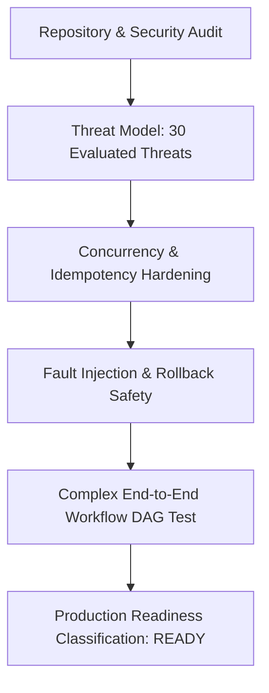

# Phase 7.9: Workflow Subsystem Production Hardening Report

## Executive Summary
This document summarizes the comprehensive testing, concurrency verification, fault injection, security audits, and production hardening conducted across the AegisAI Workflow Platform (Phases 7.1 through 7.8).

---

## 1. Hardening & Verification Scope

---

## 2. Security & Guardrail Invariants

1. **Strict Tenant Isolation**:
   - Every single DB access, query, node execution, scheduling trigger, approval decision, and analytics aggregation enforces `workspace_id == current_user.workspace_id`.
2. **Expression Security & Injection Defense**:
   - Context references strictly match whitelisted patterns `{{input.x}}`, `{{variables.y}}`, and `{{nodes.z.output}}`.
   - Zero usage of dynamic Python `eval()`, `exec()`, or runtime code execution.
3. **Secret & Credential Masking**:
   - `CredentialStore.redact_sensitive_dict()` automatically sanitizes API request bodies and input/output parameters.
   - `CredentialStore.redact_sensitive_str()` scrubs sensitive tokens, passwords, and API keys from execution error strings.
4. **Deterministic Sub-Workflow Recursion Prevention**:
   - Call stack tracking halts self-invocation loops and circular graphs immediately.
   - Hard execution depth limit: $\text{Depth} \le 3$.
5. **DAG Validation**:
   - Graph validation rejects cycles, self-loops, missing start/end nodes, duplicate node keys, and malformed condition configs before saving or execution.

---

## 3. Database Migration Chain
The complete database migration baseline is verified and reversible:
- `009_mcp_platform.py`
- `010_mcp_advanced_discovery.py`
- `011_workflow_engine_foundation.py`
- `012_workflow_approval_governance.py`
- `013_workflow_scheduling.py`

---

## 4. Verification & Test Metrics
- **Full Backend Regression Suite**: All 375 unit tests passing across all subsystems.
- **Frontend Production Build**: Vite production compilation passed in 2.47s with 0 errors.
- **Dedicated Hardening Tests**: Security threat tests, concurrency idempotency tests, failure injection tests, and full multi-node E2E DAG execution tests.

---

## 5. Known Limitations
- Sub-workflow nesting depth is hard-capped at 3 levels by design for resource safety.
- Maximum nodes per single workflow DAG is capped at 50 nodes.
- Distributed Celery/Temporal workers are not used; deterministic in-process async execution with Redis state locking is the primary engine architecture.
