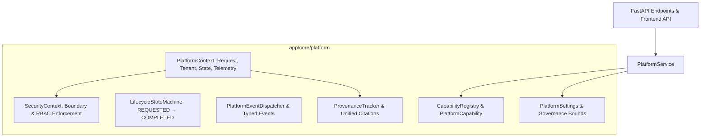

# Phase 8.1: Advanced Platform Foundation & Architecture

## Overview
Phase 8.1 establishes the foundational architecture for the AegisAI Advanced Platform (Phase 8). It introduces a cleanly separated platform layer that unifies Multi-Agent Orchestration, Cognitive RAG, Knowledge Graph Intelligence, Long-Term Memory, Model Context Protocol (MCP), and Visual Workflow Execution under strongly typed context, capability, lifecycle, event, provenance, security, and configuration abstractions.

---

## 1. Platform Architecture

---

## 2. Core Foundation Components

### A. Execution & Platform Context ([`context.py`](file:///d:/CP/AegisAI/backend/app/core/platform/context.py))
- **`PlatformContext`**: Encapsulates `request_id`, `correlation_id`, `user_id`, `workspace_id`, `session_id`, `execution_id`, `workflow_id`, `security_context`, `input_data`, `intermediate_results`, `provenance`, `errors`, `warnings`, and `metadata`.
- Automatic recursive credential masking and secret redaction on externalization via `get_safe_dict()`.

### B. Capability Model ([`capability.py`](file:///d:/CP/AegisAI/backend/app/core/platform/capability.py))
- **`CapabilityType`**: `AGENT`, `RAG`, `KNOWLEDGE_GRAPH`, `MEMORY`, `MCP`, `WORKFLOW`, `EXTERNAL_SERVICE`, `INTELLIGENCE`, `REASONING`.
- **`CapabilityMetadata`**: Strongly typed capability contract including input/output schemas, required permissions, and workspace scoping.
- **`CapabilityRegistry`**: Global thread-safe registry with deterministic listing and RBAC access evaluation.

### C. Deterministic Lifecycle ([`lifecycle.py`](file:///d:/CP/AegisAI/backend/app/core/platform/lifecycle.py))
- **`LifecycleState`**:
  $$\text{REQUESTED} \longrightarrow \text{VALIDATING} \longrightarrow \text{PLANNED} \longrightarrow \text{EXECUTING} \longrightarrow \text{VERIFYING} \longrightarrow \text{COMPLETED}$$
  Terminal/Intermediary states: `FAILED`, `CANCELLED`, `DENIED`, `WAITING`.
- **`LifecycleStateMachine`**: Enforces strict state transition validation, preventing illegal jumps or mutations from terminal states.

### D. Event & Message Foundation ([`events.py`](file:///d:/CP/AegisAI/backend/app/core/platform/events.py))
- **`PlatformEventType`**: Standardized event categories for agents, RAG, graph, MCP, workflow, security, reasoning, and lifecycle events.
- **`PlatformEventDispatcher`**: Pub/sub listener registry with telemetry hooks.

### E. Unified Provenance ([`provenance.py`](file:///d:/CP/AegisAI/backend/app/core/platform/provenance.py))
- **`ProvenanceItem`**: Unified citation representing evidence from documents, chunks, graph nodes/edges, memory facts, MCP tools/resources, and workflows.
- **`ProvenanceTracker`**: Deduplication engine and untrusted content tracker enforcing workspace boundaries.

### F. Security & Configuration ([`security.py`](file:///d:/CP/AegisAI/backend/app/core/platform/security.py) & [`config.py`](file:///d:/CP/AegisAI/backend/app/core/platform/config.py))
- **`SecurityContext`**: Carries permissions and enforces `assert_same_tenant()`.
- **`PlatformSettings`**: Bounded defaults for timeouts ($10\text{s} - 3600\text{s}$), context tokens ($1000 - 128000$), concurrency ($1 - 50$), and feature flags.

---

## 3. API & Frontend Client

### REST API Endpoints ([`platform.py`](file:///d:/CP/AegisAI/backend/app/api/v1/endpoints/platform.py))
- `GET /api/v1/platform/status`: Runtime status, active capabilities, health, and feature flags.
- `GET /api/v1/platform/capabilities`: Workspace-accessible platform capabilities filtered by caller permissions.
- `GET /api/v1/platform/capabilities/{id}`: Single capability metadata inspector.

### Frontend API Client ([`platform.ts`](file:///d:/CP/AegisAI/frontend/src/api/platform.ts))
- Typed TypeScript interfaces: `PlatformStatus`, `PlatformCapability`, `PlatformCapabilityListResponse`.
- API methods: `getPlatformStatus()`, `getPlatformCapabilities()`, `getPlatformCapability()`.

---

## 4. Verification & Test Results
- **Full Backend Regression**: **391 / 391 PASSED (100%)** in 120.63s (380 baseline + 11 new Phase 8.1 tests, 0 failures, 0 regressions).
- **Frontend Production Build**: Vite production build succeeded in 16.32s with **0 errors**.
- **Database Migration State**: Unchanged at `013_workflow_scheduling` (in-memory & typed schemas; no migration required for 8.1).
