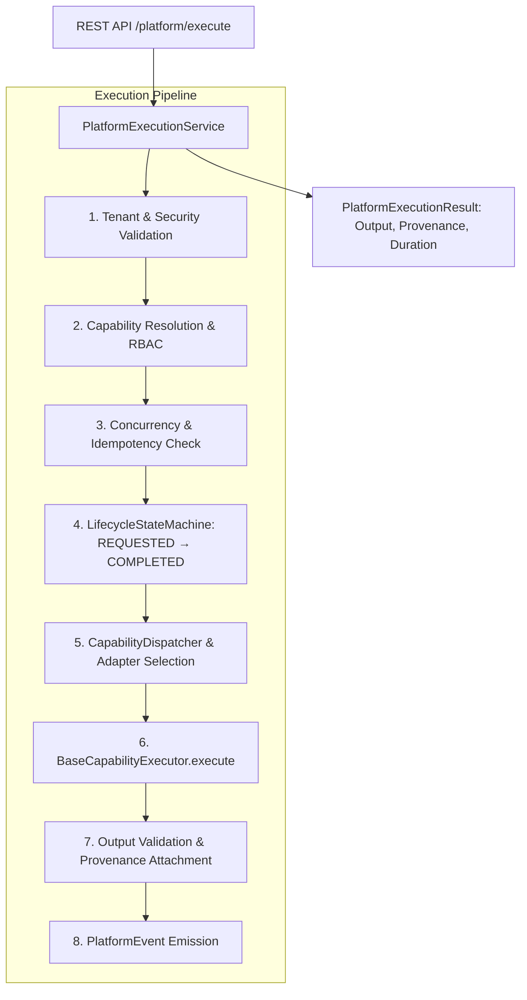

# Phase 8.2: Core Platform Execution Engine

## Overview
Phase 8.2 delivers the production-grade Core Platform Execution Engine for the AegisAI Advanced Platform. Building directly upon the Phase 8.1 foundation, the execution engine provides a generic, deterministic invocation layer capable of resolving and executing registered platform capabilities while strictly preserving workspace tenant isolation, RBAC, deterministic lifecycles, timeout bounds, concurrency limits, cancellation, and unified evidence provenance.

---

## 1. Engine Architecture

---

## 2. Core Execution Pipeline

1. **Context & Tenant Boundary Validation**:
   - `SecurityContext.assert_same_tenant()` rejects cross-tenant spoofing attempts.
2. **Capability Resolution & RBAC**:
   - Validates existence in `CapabilityRegistry`.
   - Rejects disabled capabilities.
   - Enforces role-based permissions (`CapabilityPermissionDenied`).
3. **Deterministic Lifecycle Progression**:
   $$\text{REQUESTED} \longrightarrow \text{VALIDATING} \longrightarrow \text{PLANNED} \longrightarrow \text{EXECUTING} \longrightarrow \text{VERIFYING} \longrightarrow \text{COMPLETED}$$
   Terminal/Intermediate states: `FAILED`, `CANCELLED`, `DENIED`, `WAITING`.
4. **Adapter Dispatch**:
   - Capability-specific logic decoupled via `BaseCapabilityExecutor` adapters:
     - `AgentCapabilityAdapter`: Multi-agent reasoning pipeline.
     - `RAGCapabilityAdapter`: Cognitive retrieval & citations.
     - `GraphCapabilityAdapter`: Knowledge Graph queries.
     - `MemoryCapabilityAdapter`: Long-Term Memory recall.
     - `MCPCapabilityAdapter`: Model Context Protocol tool/resource invocation.
     - `WorkflowCapabilityAdapter`: Visual workflow execution step.
     - `EchoCapabilityAdapter`: Base identity & testing adapter.
5. **Output Validation & Provenance Generation**:
   - Output checked against schemas.
   - Structured `ProvenanceItem` generated with trust level (`VERIFIED_RAG`, `VERIFIED_GRAPH`, `UNTRUSTED_MCP`, etc.).
6. **Secret Redaction & Event Emission**:
   - Inputs, outputs, warnings, and errors automatically sanitized via `CredentialStore`.
   - `PlatformEvent` emitted across lifecycle milestones.

---

## 3. REST API Endpoints

| Method | Endpoint | Description |
|---|---|---|
| `POST` | `/api/v1/platform/execute` | Executes capability through the Platform Execution Engine |
| `GET` | `/api/v1/platform/executions/{execution_id}` | Retrieves execution result and lifecycle status |
| `POST` | `/api/v1/platform/executions/{execution_id}/cancel` | Cancels an active execution |

---

## 4. Frontend API Client ([`platform.ts`](file:///d:/CP/AegisAI/frontend/src/api/platform.ts))
- Typed interfaces: `PlatformExecutionRequest`, `PlatformExecutionResult`.
- Methods: `executePlatformCapability()`, `getPlatformExecution()`, `cancelPlatformExecution()`.

---

## 5. Verification & Test Metrics
- **Full Backend Regression**: **398 / 398 PASSED (100%)** in 55.85s (391 baseline + 7 new Phase 8.2 tests, 0 failures, 0 regressions).
- **Frontend Production Build**: Vite production compilation passed in 12.90s with **0 errors**.
- **Database Migration State**: Unchanged at `013_workflow_scheduling` (in-memory execution tracking; no migration required).
