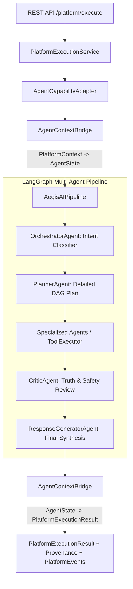

# Phase 8.3: Multi-Agent Integration

## Overview
Phase 8.3 integrates the existing AegisAI LangGraph Multi-Agent cognitive architecture with the Phase 8 Platform Execution Engine. Multi-agent orchestration is established as a first-class platform capability (`agent.orchestrator`) without modifying or duplicating the core multi-agent reasoning, planning, tool execution, critic verification, or response synthesis components.

---

## 1. Architecture Flow

---

## 2. Core Components

### 1. `AgentContextBridge` ([`agent_bridge.py`](file:///d:/CP/AegisAI/backend/app/core/platform/agent_bridge.py))
- **`platform_context_to_agent_state`**:
  - Safely converts `PlatformContext` to LangGraph `AgentState`.
  - Strictly enforces workspace boundaries: user-controlled input cannot override `workspace_id`, `user_id`, or `security_context`.
- **`agent_state_to_execution_output`**:
  - Extracts final synthesized response, execution plan steps, Critic evaluation decision, token counts, and latency.
  - Converts citations from RAG (`DOCUMENT_CHUNK`), Knowledge Graph (`GRAPH_NODE`), MCP Tools (`MCP_TOOL`), and reasoning milestones into strongly typed `ProvenanceItem` records with trust levels (`VERIFIED_RAG`, `VERIFIED_GRAPH`, `UNTRUSTED_MCP`, `TRUSTED_INTERNAL`).

### 2. `AgentCapabilityAdapter` ([`agent_adapter.py`](file:///d:/CP/AegisAI/backend/app/core/platform/agent_adapter.py))
- Inherits from `BaseCapabilityExecutor`.
- Validates query inputs and transparently maps parameter aliases (`prompt` $\to$ `query`).
- Executes `AegisAIPipeline` asynchronously or synchronously.
- Emits structured `PlatformEvent` instances across lifecycle milestones:
  - `agent_execution_started`
  - `agent_planning_started`
  - `agent_critic_completed`
  - `agent_response_generated`

### 3. Capability Metadata & Registration
- Registered in `CapabilityRegistry` under `agent.orchestrator` with type `AGENT`.
- Strongly typed input/output schemas:
  - **Input**: Requires `query` (or `prompt`), with optional `provider`, `model`, and `session_id`.
  - **Output**: Returns `response`, `plan`, `critic_decision`, `confidence_score`, and token usage.

---

## 3. Security & Isolation
- **Tenant Isolation**: Direct assertions prevent cross-tenant agent execution attempts.
- **Context Spoofing Defense**: Verified caller identity takes precedence over all payload contents.
- **Credential Redaction**: Inputs, outputs, agent states, and event payloads pass through `CredentialStore` secret sanitization.

---

## 4. Verification & Metrics
- **Phase 8.3 Test Suites**:
  - [`test_platform_agent_integration.py`](file:///d:/CP/AegisAI/backend/tests/unit/test_platform_agent_integration.py): Context bridging, adapter execution, event dispatch, and input validation.
  - [`test_platform_agent_security.py`](file:///d:/CP/AegisAI/backend/tests/unit/test_platform_agent_security.py): Cross-tenant denial and context spoofing defenses.
- **Full Backend Regression Suite**: **404 / 404 PASSED (100%)** in 66.72s (0 failures, 0 regressions).
- **Frontend Production Build**: Vite build passed in 1.37s with **0 errors**.
- **Database Migration State**: Unchanged at `013_workflow_scheduling`.
