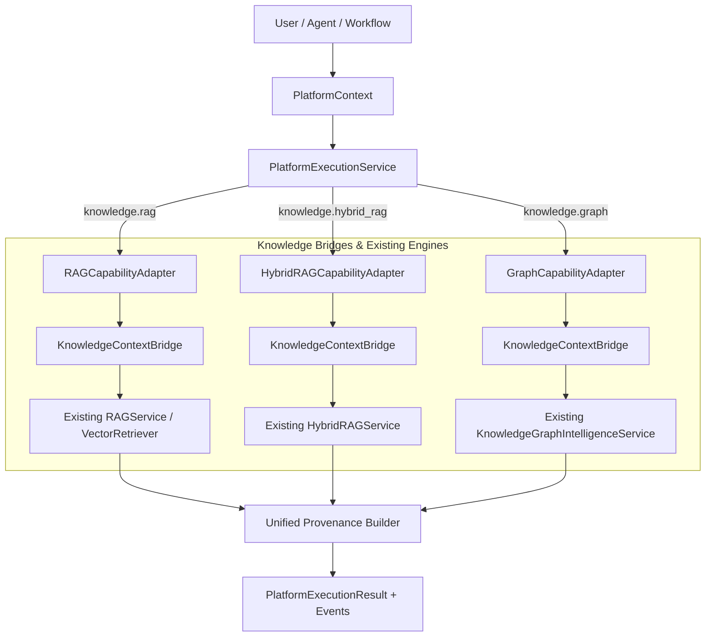

# Phase 8.4: Knowledge / RAG Platform Integration

## Overview
Phase 8.4 integrates AegisAI's existing Vector RAG, Hybrid Graph + Vector RAG, and Knowledge Graph Intelligence systems with the Phase 8 Platform Execution Engine. Knowledge capabilities are established as first-class platform capabilities (`knowledge.rag`, `knowledge.hybrid_rag`, `knowledge.graph`) with unified provenance, strict tenant isolation, parameter bounding, and structured event dispatching without altering or duplicating the underlying retrieval algorithms.

---

## 1. Architecture Flow

---

## 2. Core Components

### 1. `KnowledgeContextBridge` ([`knowledge_bridge.py`](file:///d:/CP/AegisAI/backend/app/core/platform/knowledge_bridge.py))
- **Parameter Validation & Bounds**:
  - `validate_rag_query_params`: Validates query non-emptiness, bounds length $\le 2000$ characters, caps `top_k`/`limit` $\le 50$, bounds `similarity_threshold` $\in [0.0, 1.0]$, and caps `graph_depth` $\le 5$.
  - `platform_context_to_rag_query`: Locks `workspace_id` to `context.workspace_id` and `user_id` to `context.user_id`, preventing user payload spoofing.
- **Unified Provenance & Output Transformation**:
  - `rag_response_to_execution_output`: Generates `DOCUMENT_CHUNK` provenance with `VERIFIED_RAG` trust level.
  - `hybrid_rag_response_to_execution_output`: Produces separate `document_evidence` and `graph_evidence` preserving distinct source identities, emitting `DOCUMENT_CHUNK` and `GRAPH_NODE` provenance items.
  - `graph_response_to_execution_output`: Transforms nodes, relationships, and traversal paths into `GRAPH_NODE` / `GRAPH_EDGE` provenance records with `VERIFIED_GRAPH` trust level.

### 2. Knowledge Capability Adapters ([`knowledge_adapters.py`](file:///d:/CP/AegisAI/backend/app/core/platform/knowledge_adapters.py))
- **`RAGCapabilityAdapter`**: Executes vector similarity retrieval, reranking, and citation extraction.
- **`HybridRAGCapabilityAdapter`**: Executes combined vector similarity search with Knowledge Graph multi-hop entity traversal and score fusion.
- **`GraphCapabilityAdapter`**: Executes entity resolution, relationship lookup, and neighborhood path analytics via `KnowledgeGraphIntelligenceService`.
- **Milestone Events**: Emits `RAG_EVENT` and `GRAPH_EVENT` (`rag_retrieval_started`, `rag_retrieval_completed`, `rag_graph_expansion_started`, `rag_graph_expansion_completed`, `graph_reasoning_started`).

### 3. Capability Registration & Schemas ([`platform_service.py`](file:///d:/CP/AegisAI/backend/app/services/platform_service.py))
- Registered capabilities:
  - `knowledge.rag` (Type: `RAG`)
  - `knowledge.hybrid_rag` (Type: `RAG`)
  - `knowledge.graph` (Type: `KNOWLEDGE_GRAPH`)
  - Aliases maintained: `rag.retriever`, `knowledge_graph.engine`
- Strongly typed input/output JSON schemas enforced by `BaseCapabilityExecutor.validate_input()`.

---

## 3. Trust Boundaries & Data Invariant
- **Document & Graph content is DATA**: Retrieved text chunks and entity graph metadata are treated purely as passive data and never converted into executable instructions.
- **Tenant Isolation**: Cross-tenant retrieval attempts are strictly denied at the platform level with `LifecycleState.DENIED`.
- **Credential Scrubbing**: Metadata and outputs are sanitized through `CredentialStore.redact_sensitive_dict`.

---

## 4. Verification & Metrics
- **Phase 8.4 Test Suites** (2 suites, 10 tests):
  - [`test_platform_knowledge_integration.py`](file:///d:/CP/AegisAI/backend/tests/unit/test_platform_knowledge_integration.py): Query bounds, response transformation, vector execution, hybrid execution, graph execution, event emission.
  - [`test_platform_knowledge_security.py`](file:///d:/CP/AegisAI/backend/tests/unit/test_platform_knowledge_security.py): Cross-tenant RAG denial, cross-tenant Graph denial, context spoofing defense, oversized query rejection.
- **Full Backend Regression Suite**: **414 / 414 PASSED (100%)** in 44.50s (404 baseline + 10 new tests, 0 failures, 0 regressions).
- **Frontend Production Build**: Vite build completed in 1.28s with **0 errors**.
- **Database Migration State**: Unchanged at `013_workflow_scheduling`.
