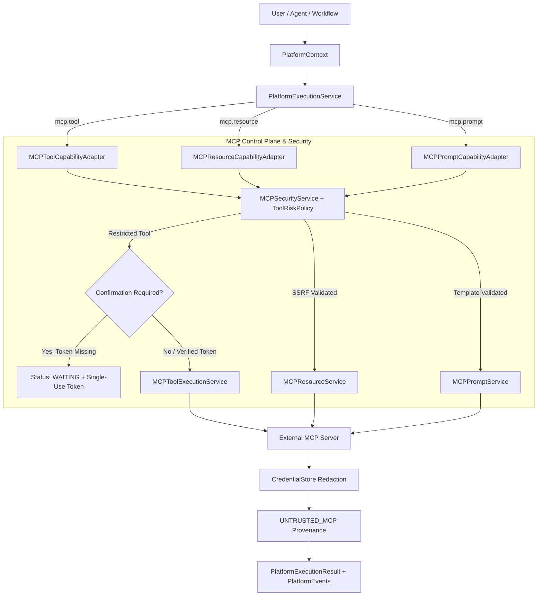

# Phase 8.5: MCP / External Tool Platform Integration

## Overview
Phase 8.5 integrates AegisAI's existing Phase 6 Model Context Protocol (MCP) platform with the Phase 8 Platform Execution Engine. MCP tools, resources, and prompt templates are established as first-class Phase 8 capabilities (`mcp.tool`, `mcp.resource`, `mcp.prompt`) with single-use cryptographic confirmation gating for restricted tools, SSRF protection for external resources, system-role protection for prompt rendering, strict tenant isolation, and unified `UNTRUSTED_MCP` provenance.

---

## 1. Architecture Flow

---

## 2. Core Components

### 1. `MCPContextBridge` ([`mcp_bridge.py`](file:///d:/CP/AegisAI/backend/app/core/platform/mcp_bridge.py))
- **Parameter Validation & Identity Locking**:
  - `platform_context_to_tool_params`: Extracts `tool_name` or `tool_id`, bounds arguments, redacts embedded secrets, and locks `workspace_id` to `context.workspace_id`.
  - `platform_context_to_resource_params`: Enforces URI length bounds ($\le 1024$), blocks `file://` schemes, and blocks private/localhost networks (SSRF prevention).
  - `platform_context_to_prompt_params`: Validates template arguments map and prompt name.
- **Output Transformation & Provenance**:
  - `tool_result_to_execution_output`: Emits `MCP_TOOL` provenance with `UNTRUSTED_MCP` trust level.
  - `resource_result_to_execution_output`: Emits `MCP_RESOURCE` provenance with `UNTRUSTED_MCP` trust level and response truncation.
  - `prompt_result_to_execution_output`: Emits `MCP_PROMPT` provenance with `UNTRUSTED_MCP` trust level.

### 2. MCP Capability Adapters ([`mcp_adapters.py`](file:///d:/CP/AegisAI/backend/app/core/platform/mcp_adapters.py))
- **`MCPToolCapabilityAdapter`**: Executes tools via `MCPToolExecutionService`. If a restricted tool is invoked without a valid confirmation token, transitions to `WAITING` with single-use cryptographic token.
- **`MCPResourceCapabilityAdapter`**: Reads external resources via `MCPResourceService` with SSRF and path safety checks.
- **`MCPPromptCapabilityAdapter`**: Renders prompt templates via `MCPPromptService`.
- **`MCPCapabilityAdapter`**: Unified router adapter for legacy and polymorphic MCP dispatch.
- **Milestone Events**: Dispatches structured `PlatformEvent` instances (`mcp_tool_started`, `mcp_tool_completed`, `mcp_resource_started`, `mcp_resource_completed`, `mcp_prompt_started`, `mcp_prompt_completed`, `mcp_confirmation_required`).

### 3. Capability Registration & Schemas ([`platform_service.py`](file:///d:/CP/AegisAI/backend/app/services/platform_service.py))
- Registered capabilities:
  - `mcp.tool` (Type: `MCP`)
  - `mcp.resource` (Type: `MCP`)
  - `mcp.prompt` (Type: `MCP`)
  - `mcp.platform` (Type: `MCP` - legacy router alias)

---

## 3. Security, Confirmation & Trust
- **Single-Use Cryptographic Confirmation**: Restricted tools require a cryptographic confirmation token bound to user ID, workspace ID, tool ID, and arguments hash, preventing replay or argument tampering.
- **SSRF & Path Traversal Guards**: Forbidden schemes (`file://`) and loopback hosts (`localhost`, `127.0.0.1`) are strictly rejected.
- **Untrusted MCP Data Boundary**: External tool results, resource bodies, and prompt outputs carry `UNTRUSTED_MCP` trust labels and are never treated as privileged instructions.
- **Secret Redaction**: API keys, tokens, and authorization headers are scrubbed using `CredentialStore`.

---

## 4. Verification & Metrics
- **Phase 8.5 Test Suites** (2 suites, 12 tests):
  - [`test_platform_mcp_integration.py`](file:///d:/CP/AegisAI/backend/tests/unit/test_platform_mcp_integration.py): Parameter bounding, resource/prompt transformation, tool execution, restricted tool confirmation gating, resource read, prompt render, event emission.
  - [`test_platform_mcp_security.py`](file:///d:/CP/AegisAI/backend/tests/unit/test_platform_mcp_security.py): Cross-tenant tool denial, cross-tenant resource denial, workspace spoofing defense, SSRF forbidden URI rejection, credential redaction.
- **Full Backend Regression Suite**: **426 / 426 PASSED (100%)** in 44.93s (414 baseline + 12 new tests, 0 failures, 0 regressions).
- **Frontend Production Build**: Vite build completed in 1.23s with **0 errors**.
- **Database Migration State**: Unchanged at `013_workflow_scheduling`.
