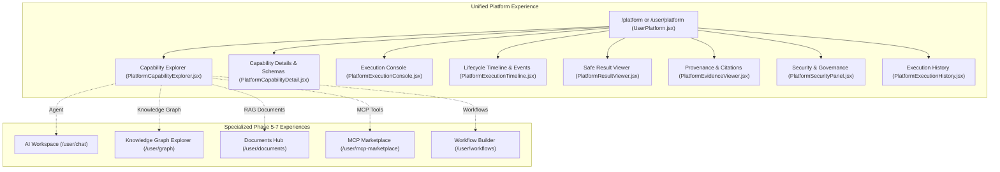

# Phase 8.6: Unified Platform Frontend Experience

## Overview
Phase 8.6 delivers a production-grade unified experience layer for the AegisAI Platform (`/user/platform` and `/platform`). It establishes a centralized command center orchestrating Multi-Agent execution, Cognitive RAG, Knowledge Graph traversal, MCP external tools, and Workflows while preserving direct access to all specialized interfaces developed across Phases 5 through 7.

---

## 1. Architecture & Navigation Hierarchy

---

## 2. Core Frontend Components

### 1. `UserPlatform.jsx` ([`UserPlatform.jsx`](file:///d:/CP/AegisAI/frontend/src/pages/user/UserPlatform.jsx))
- **Unified Hub Container**: Centralizes status metrics, navigation tabs, capability selection, execution triggering, lifecycle polling, and confirmation state.
- **Deep Linking Support**: Fully supports URL query parameters for tab navigation, pre-selected capabilities, and execution inspection (`?tab=capabilities&capability=knowledge.rag`).
- **Telemetry Bar**: Displays platform system health, active capability counters, and real-time state refresh.

### 2. `PlatformCapabilityExplorer.jsx` ([`PlatformCapabilityExplorer.jsx`](file:///d:/CP/AegisAI/frontend/src/components/platform/PlatformCapabilityExplorer.jsx))
- **Category Filter Pills**: Filter across Multi-Agent, Cognitive RAG, Knowledge Graph, MCP, Workflow, and Memory.
- **Search Engine**: Instant query filtering matching name, capability ID, description, and tags.
- **Capability Cards**: Displays activation badges, capability versioning, tags, quick execution triggers, and links to specialized UIs.

### 3. `PlatformCapabilityDetail.jsx` ([`PlatformCapabilityDetail.jsx`](file:///d:/CP/AegisAI/frontend/src/components/platform/PlatformCapabilityDetail.jsx))
- **Schema Visualizer**: Formats and syntax-highlights Input JSON Schema and Output JSON Schema.
- **Security Permissions**: Highlights required RBAC permissions and security scopes.

### 4. `PlatformExecutionConsole.jsx` ([`PlatformExecutionConsole.jsx`](file:///d:/CP/AegisAI/frontend/src/components/platform/PlatformExecutionConsole.jsx))
- **Schema-Driven Guided Form**: Automatically switches input fields based on the selected capability (Agent queries, RAG top_k/thresholds, Graph depth, MCP tool arguments).
- **Raw JSON Editor Mode**: Allows direct JSON payload editing with realtime syntax validation.
- **Advanced Execution Controls**: Configurable timeout bounds and idempotency key generator.
- **Restricted MCP Tool Confirmation Modal**: Intercepts `WAITING` states for restricted tools, presenting tool details and submitting single-use cryptographic tokens.

### 5. `PlatformExecutionTimeline.jsx` ([`PlatformExecutionTimeline.jsx`](file:///d:/CP/AegisAI/frontend/src/components/platform/PlatformExecutionTimeline.jsx))
- **6-Stage Deterministic Lifecycle Stepper**:
  $$\text{REQUESTED} \longrightarrow \text{VALIDATING} \longrightarrow \text{PLANNED} \longrightarrow \text{EXECUTING} \longrightarrow \text{VERIFYING} \longrightarrow \text{COMPLETED}$$
- **Live Event Stream**: Chronological terminal-styled log capturing `PlatformEvent` action telemetry.
- **Execution Cancellation**: Dedicated cancel button triggering `POST /api/v1/platform/executions/{id}/cancel`.

### 6. `PlatformResultViewer.jsx` ([`PlatformResultViewer.jsx`](file:///d:/CP/AegisAI/frontend/src/components/platform/PlatformResultViewer.jsx))
- **Safe Output Rendering**: Renders synthesized answers, planning steps, structured tables, and collapsible JSON trees without `dangerouslySetInnerHTML`.
- **Alert Banners**: Highlights execution errors and warnings.

### 7. `PlatformEvidenceViewer.jsx` ([`PlatformEvidenceViewer.jsx`](file:///d:/CP/AegisAI/frontend/src/components/platform/PlatformEvidenceViewer.jsx))
- **Unified Provenance & Citations**: Tracks `DOCUMENT_CHUNK`, `GRAPH_NODE`, `GRAPH_EDGE`, `MCP_TOOL`, `MCP_RESOURCE`, `MCP_PROMPT`, and `MEMORY` records.
- **Trust Boundary Indicators**:
  - `VERIFIED_RAG`: Cryptographically grounded document chunks.
  - `VERIFIED_GRAPH`: Verified entity/edge graph intelligence.
  - `UNTRUSTED_MCP`: External MCP tool data with untrusted warning badges.
  - `TRUSTED_INTERNAL`: Multi-agent reasoning and deterministic transformations.
- **Snippet Inspector**: Modal viewer for examining source texts and metadata payloads.

### 8. `PlatformSecurityPanel.jsx` ([`PlatformSecurityPanel.jsx`](file:///d:/CP/AegisAI/frontend/src/components/platform/PlatformSecurityPanel.jsx))
- **Tenant & RBAC Verification**: Displays authenticated caller context, active workspace ID, zero-leak credential scrubbing status, and core security invariants.

### 9. `PlatformExecutionHistory.jsx` ([`PlatformExecutionHistory.jsx`](file:///d:/CP/AegisAI/frontend/src/components/platform/PlatformExecutionHistory.jsx))
- **Session Telemetry History**: Filterable, searchable table of execution records with duration, timestamps, and quick-inspect triggers.

---

## 3. Strongly Typed API Client ([`platform.ts`](file:///d:/CP/AegisAI/frontend/src/api/platform.ts))
- Integrates cleanly with existing `request` transport and automatic JWT Refresh Token Rotation (RTR).
- Strongly typed TypeScript interfaces: `PlatformStatus`, `PlatformCapability`, `PlatformCapabilityListResponse`, `PlatformExecutionRequest`, `PlatformExecutionResult`.

---

## 4. Verification & Metrics
- **Frontend Production Build**: Vite production build completed in 786ms with **0 errors**.
- **Full Backend Regression Suite**: **426 / 426 PASSED (100%)** in 35.81s with 0 regressions.
- **Database Migration State**: Unchanged at `013_workflow_scheduling`.
- **Security & XSS Verification**: Strict passive data rendering with zero `eval`, `exec`, or `dangerouslySetInnerHTML`.
