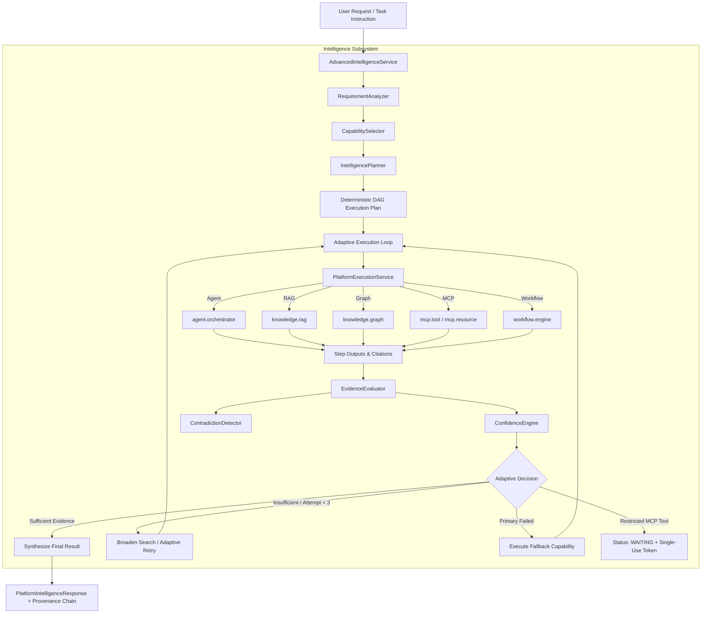

# Phase 8.7: Advanced Intelligence & Adaptive Capability Orchestration

## Overview
Phase 8.7 implements a production-grade Advanced Intelligence layer above AegisAI's existing Phase 8 platform execution infrastructure. It provides deterministic intent and requirement analysis, capability scoring, DAG dependency planning, and adaptive multi-capability orchestration with evidence evaluation, contradiction detection, and calibrated confidence scoring.

---

## 1. Architecture Flow

---

## 2. Core Components

### 1. `RequirementAnalyzer` ([`requirement_analyzer.py`](file:///d:/CP/AegisAI/backend/app/core/platform/intelligence/requirement_analyzer.py))
- Deterministically parses natural language instructions and structural inputs.
- Identifies requirement types: `DOCUMENT_EVIDENCE`, `GRAPH_REASONING`, `MCP_TOOL`, `MCP_RESOURCE`, `AGENT_REASONING`, `WORKFLOW_EXECUTION`, `MEMORY_CONTEXT`.

### 2. `CapabilitySelector` ([`capability_selector.py`](file:///d:/CP/AegisAI/backend/app/core/platform/intelligence/capability_selector.py))
- Scores registered platform capabilities using calibrated factors:
  $$\text{score} = \text{intent\_match} + \text{type\_match} + \text{compatibility} + \text{evidence\_value} + \text{reliability} - \text{latency}$$
- Enforces strict permission gating via `SecurityContext.has_permission`.
- Deterministic tie-breaking on identical scores using capability ID ordering.

### 3. `IntelligencePlanner` ([`planner.py`](file:///d:/CP/AegisAI/backend/app/core/platform/intelligence/planner.py))
- Generates deterministic DAG execution plans supporting 3 execution modes:
  - `SEQUENTIAL`: Step-by-step linear dependency chain ($A \to B \to C$).
  - `PARALLEL`: Independent evidence gathering running concurrently with downstream synthesis dependency.
  - `ADAPTIVE`: Evidence gathering prioritized first, intermediate results evaluated dynamically.
- Enforces hard execution bounds:
  - `MAX_INTELLIGENCE_STEPS = 12`
  - `MAX_PLAN_DEPTH = 6`
  - `MAX_PARALLEL_BRANCHES = 5`
  - Strict cycle detection (rejects self-loops and mutual dependencies).

### 4. `EvidenceEvaluator` & `ConfidenceEngine` ([`evaluator.py`](file:///d:/CP/AegisAI/backend/app/core/platform/intelligence/evaluator.py))
- **`EvidenceEvaluator`**: Validates whether gathered citations satisfy planned requirements and verifies source diversity.
- **`ConfidenceEngine`**: Computes calibrated confidence scores in $[0.0, 1.0]$ and categorizes confidence level: `HIGH` ($\ge 0.80$), `MEDIUM` ($\ge 0.60$), `LOW` ($\ge 0.40$), `INSUFFICIENT` ($< 0.40$).
- **`ContradictionDetector`**: Detects structured conflicting attributes across step results (e.g. conflicting entity states).

### 5. `AdvancedIntelligenceService` ([`engine.py`](file:///d:/CP/AegisAI/backend/app/core/platform/intelligence/engine.py))
- Central execution engine coordinating the full intelligence flow.
- All actual capability steps are executed strictly through `PlatformExecutionService`.
- Manages adaptive retries (broadening search top_k $\le 50$, up to `MAX_ADAPTIVE_ATTEMPTS = 3`).
- Handles restricted MCP tool confirmation gating, transitioning to `WAITING`.
- Emits structured milestone `INTELLIGENCE_EVENT` events.
- Synthesizes final responses and attaches complete provenance chains.

---

## 3. Security, Invariants & Provenance
- **Layered Security**: Intelligence selection never bypasses RBAC, tenant isolation, or MCP risk policies.
- **Data Boundary**: External tool data and retrieved document text remain passive data (`UNTRUSTED_MCP` / `VERIFIED_RAG`) and are never escalated into system instructions.
- **Confirmation Gating**: Single-use cryptographic tokens are preserved when restricted tools are selected.
- **Decision Provenance**: Each plan decision and evaluation is recorded with `INTELLIGENCE_DECISION` provenance.

---

## 4. API Endpoint
- **`POST /api/v1/platform/intelligence/execute`**: Executes an intelligent multi-capability plan adaptively.
- Registered capability: `intelligence.orchestrator` (Type: `INTELLIGENCE`).

---

## 5. Verification & Metrics
- **Phase 8.7 Test Suites** (2 suites, 10 tests):
  - [`test_platform_intelligence_core.py`](file:///d:/CP/AegisAI/backend/tests/unit/test_platform_intelligence_core.py): Requirement analysis, scoring, DAG planning, cycle rejection, limits, confidence engine, contradiction detection.
  - [`test_platform_intelligence_integration.py`](file:///d:/CP/AegisAI/backend/tests/unit/test_platform_intelligence_integration.py): Full intelligent query execution, platform dispatcher capability invocation, MCP confirmation waiting gating, cross-tenant denial.
- **Full Backend Regression Suite**: **436 / 436 PASSED (100%)** in 36.83s (426 baseline + 10 new Phase 8.7 tests, 0 failures, 0 regressions).
- **Frontend Production Build**: Vite build passed in 802ms with **0 errors**.
- **Database Migration State**: Unchanged at `013_workflow_scheduling` (no database migration required).
