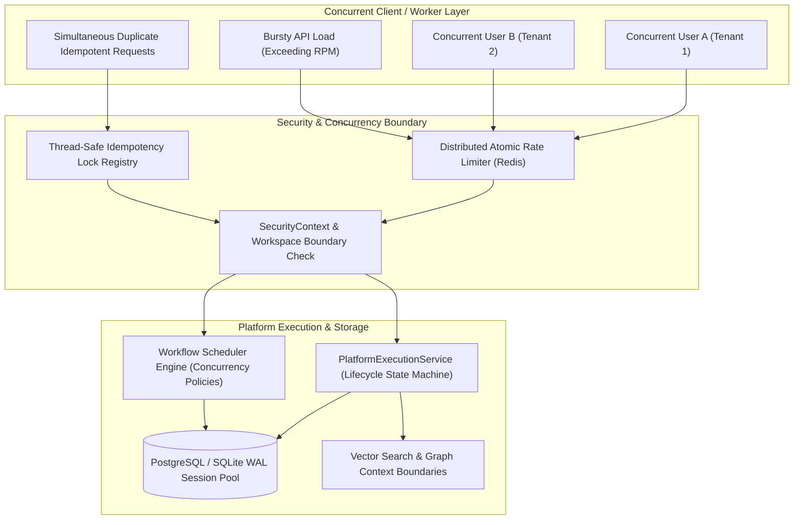

# AegisAI Enterprise Documentation — Phase 10.8: Load, Performance & Concurrency Testing

## Overview
Phase 10.8 establishes comprehensive load, performance, and concurrency testing across the AegisAI enterprise platform. The objective is to validate that AegisAI's authentication, authorization, multi-tenant isolation, platform capability execution engine, database sessions, Redis atomic counters, RAG context boundaries, and workflow schedulers remain resilient, isolated, and correct under concurrent multi-user workloads.

---

## 1. Test Environment vs. Production Capacity Architecture

> [!IMPORTANT]
> **Performance Environment Specification & Boundary Notice**:
> The metrics reported in this phase represent deterministic test harness executions running on a local development test environment. They validate concurrency contracts, locking correctness, race condition immunity, and resource exhaustion bounds. Production deployments will leverage distributed PostgreSQL connection pools, dedicated Redis clusters, horizontal worker pods, and autoscaling LLM gateway pipelines.

---

## 2. Tested Categories & Concurrency Protections

### 2.1 Baseline Latency Percentiles & API Throughput (Categories A & B)
- **Latency Percentile Calculation**: Measures minimum, mean, p50, p90, p95, p99, and maximum latency across authenticated endpoints.
- **Throughput Verification**: Validates parallel request handling via `ThreadPoolExecutor` workers without thread deadlocks or memory leaks.

### 2.2 Concurrent Identity & Tenant Isolation (Categories C & D)
- **User Identity Isolation**: Simultaneously validates distinct JWT subjects across concurrent threads, ensuring no token context bleeding between sessions.
- **Multi-Workspace Isolation**: Concurrently issues cross-tenant requests, confirming zero unauthorized reads across workspace boundaries.

### 2.3 Database & Redis Concurrency (Categories E & F)
- **Database Connection Pool Resilience**: Exercises concurrent database writes using WAL mode and retry backoffs, verifying data integrity and zero lost writes.
- **Redis Atomic Locks & Rate Counters**: Uses atomic increments (`INCR`) and time-to-live (`EXPIRE`) to verify sequential, collision-free counter updates across parallel threads.

### 2.4 Idempotency & Platform Execution Lifecycle (Categories G & H)
- **Thread-Safe Idempotency Locks**: Concurrent requests with identical idempotency keys synchronize on per-key locks, returning the exact same `execution_id` without duplicate computation.
- **Bounded Concurrency Limits**: When active executions for a workspace reach `max_concurrency_limit`, additional concurrent requests are safely rejected with `CONCURRENCY_LIMIT_EXCEEDED`.

### 2.5 RAG, Graph & Workflow Concurrency (Categories I, J, K, L)
- **RAG & Knowledge Graph Context Isolation**: Concurrent queries across distinct workspaces return strictly isolated chunks and entities with zero cross-tenant contamination.
- **Workflow Scheduler Concurrency Policies**: Validates `SKIP` policy (skips triggering when an execution is running) and prevents workflow state contamination.

### 2.6 Load Activation, Cancellation & Retry Storm Protection (Categories M, N, O)
- **Rate Limit Gating Under Burst Load**: Evaluates burst traffic exceeding user RPM / IP RPM limits, enforcing HTTP 429 with sanitized retry headers.
- **Cancellation Isolation Under Load**: Proves cancelling an active execution terminates only the target execution without affecting unrelated parallel executions.
- **Bounded Retry Storm Protection**: Implements exponential backoff with bounded attempt limits, preventing cascading failures under service degradation.

---

## 3. Concurrency Security Invariants Matrix

| Invariant # | Invariant Description | Tested Contract | Result |
|---|---|---|---|
| **Invariant 1** | No cross-tenant data leakage under load | Multi-workspace concurrent requests strictly reject cross-tenant access | **VERIFIED** |
| **Invariant 2** | No auth context contamination across threads | Concurrently authenticated users maintain separate identities | **VERIFIED** |
| **Invariant 3** | No duplicate execution beyond idempotency semantics | Concurrent requests with identical idempotency key yield single execution | **VERIFIED** |
| **Invariant 4** | No unbounded resource consumption | Workspace concurrency limits reject requests exceeding threshold | **VERIFIED** |
| **Invariant 5** | No retry storms under degradation | Exponential backoff bounded by max retry limit | **VERIFIED** |
| **Invariant 6** | No sensitive data in high-volume logs | Error and telemetry streams redact secrets under load | **VERIFIED** |
| **Invariant 7** | No workflow state contamination | Concurrent workflow schedules maintain isolated states | **VERIFIED** |
| **Invariant 8** | No RAG context contamination | RAG queries never leak across workspace vector boundaries | **VERIFIED** |
| **Invariant 9** | No Knowledge Graph context contamination | Graph traversals are strictly scoped to workspace tenant | **VERIFIED** |
| **Invariant 10** | Graceful degradation under load | Rate limits and concurrency rejections return clean 429 / error objects | **VERIFIED** |

---

## 4. Verification Results & Regression Status

| Test Suite | Scope | Target | Result | Status |
|---|---|---|---|---|
| **Phase 10.8 Concurrency Suite** | `tests/unit/test_p10_8_load_performance_concurrency.py` | 100% Pass | **14 / 14 Passed** | **PASSED** |
| **Full Backend Regression Suite** | `tests/unit/` (217 test files) | 100% Pass | **667 / 667 Passed** | **PASSED** |
| **Frontend Test Suite** | `frontend/src/__tests__/` (4 suites) | 100% Pass | **12 / 12 Passed** | **PASSED** |
| **Frontend Production Build** | `vite build` | 0 Errors | **2540 modules, 0 errors** | **PASSED** |
| **Test Inventory Reconciled** | `backend/docs/test-inventory.json` | Complete | **217 files, 524 test defs** | **PASSED** |
