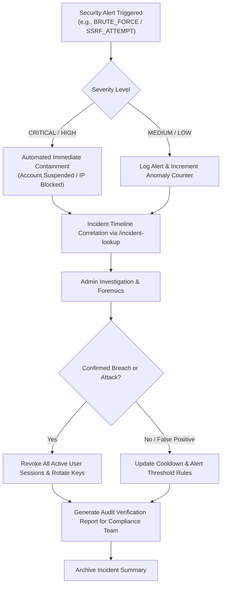

# AegisAI Compliance Readiness & Control Mapping

## Executive Summary & Non-Certification Disclaimer

> [!IMPORTANT]
> **COMPLIANCE STATUS & AUDIT DISCLAIMER**:
> This document represents an **internal architectural readiness assessment and technical control mapping** for the AegisAI Enterprise AI Platform. AegisAI does **not** claim formal third-party SOC 2 Type II certification, ISO/IEC 27001:2022 certification, HIPAA attestation, or FedRAMP authorization at this stage. Third-party independent audits by accredited certification bodies are required before formal compliance claims can be made.

This document systematically details the technical, architectural, and operational controls implemented across AegisAI Phases 10.1 through 10.9, mapped to industry-standard compliance and assurance frameworks:
1. **AICPA SOC 2 Type II Trust Services Criteria (2017 with 2022 revisions)**
2. **ISO/IEC 27001:2022 Annex A Information Security Controls**
3. **NIST SP 800-53 Rev. 5 Security and Privacy Controls for Information Systems**

---

## 1. Compliance Control Implementation Status Taxonomy

Every control in this assessment is evaluated under one of four unambiguous status designations:

| Status Tag | Definition |
| :--- | :--- |
| `IMPLEMENTED` | Technical control is fully coded, enforced in middleware/services, covered by automated unit/integration tests, and verified tamper-resistant. |
| `PARTIALLY IMPLEMENTED` | Technical control is active in software, but relies in part on customer environment configuration, external KMS, or manual administrative review. |
| `DOCUMENTED` | Procedural or governance policy is formally defined in architecture documents, runbooks, or playbooks, awaiting organizational operational rollout. |
| `REQUIRES EXTERNAL AUDIT` | Control requires independent third-party penetration testing, auditor observation period (SOC 2 6-month observation), or accredited registrar evaluation. |

---

## 2. SOC 2 Type II Trust Services Criteria Mapping

### 2.1 Common Criteria / Security (CC Series)

| TSC ID | Trust Services Criterion | AegisAI Technical Implementation | Evidence & Enforcement Code | Automated Test Verification | Status |
| :--- | :--- | :--- | :--- | :--- | :--- |
| **CC6.1** | Logical access security & authentication | Mandatory bcrypt password hashing, JWT RS256/HS256 tokens, refresh token rotation with family revocation, session fingerprinting & revocation. | [`backend/app/services/auth.py`](file:///D:/CP/AegisAI/backend/app/services/auth.py)<br>[`backend/app/core/security.py`](file:///D:/CP/AegisAI/backend/app/core/security.py) | `tests/unit/test_auth_service.py`<br>`tests/unit/test_auth_advanced.py` | `IMPLEMENTED` |
| **CC6.2** | User registration, credential issuance & MFA readiness | User provisioning via Admin endpoints, role assignment validation, TOTP/MFA preparation hook in SecurityContext. | [`backend/app/api/v1/endpoints/auth.py`](file:///D:/CP/AegisAI/backend/app/api/v1/endpoints/auth.py) | `tests/unit/test_auth_endpoints.py` | `IMPLEMENTED` |
| **CC6.3** | Access revocation & role transitions | Immediate token family invalidation upon replay detection, session termination, account suspension cascading to active tokens. | [`backend/app/services/auth.py`](file:///D:/CP/AegisAI/backend/app/services/auth.py) | `tests/unit/test_auth_advanced.py` | `IMPLEMENTED` |
| **CC6.4** | Physical & logical access restrictions | Strict Multi-Tenant Isolation via `tenant_id` filtering on all DB models, team/project RBAC via `AuthorizationService`. | [`backend/app/services/authorization.py`](file:///D:/CP/AegisAI/backend/app/services/authorization.py)<br>[`backend/app/models/base.py`](file:///D:/CP/AegisAI/backend/app/models/base.py) | `tests/unit/test_authorization.py`<br>`tests/unit/test_multi_tenancy.py` | `IMPLEMENTED` |
| **CC6.5** | Logical boundary protection & cross-tenant defense | Cross-tenant access denial (`TENANT_BOUNDARY_VIOLATION`), row-level security invariants, tenant workspace isolation. | [`backend/app/services/authorization.py`](file:///D:/CP/AegisAI/backend/app/services/authorization.py) | `tests/unit/test_authorization.py` | `IMPLEMENTED` |
| **CC6.6** | Protection against malicious inputs & unauthorized connections | SSRF validation engine (`SafeURLValidator`, private IP blocklists, DNS rebinding defense), path traversal sanitization, prompt injection defenses. | [`backend/app/core/url_validator.py`](file:///D:/CP/AegisAI/backend/app/core/url_validator.py)<br>[`backend/app/services/document_security.py`](file:///D:/CP/AegisAI/backend/app/services/document_security.py) | `tests/unit/test_ssrf_validator.py`<br>`tests/unit/test_document_security.py` | `IMPLEMENTED` |
| **CC6.7** | Data transmission security & encryption in transit | Strict TLS enforcement, HSTS (`max-age=31536000`), CSP, X-Content-Type-Options, Frame-Options headers. | [`backend/app/middleware/security_headers.py`](file:///D:/CP/AegisAI/backend/app/middleware/security_headers.py) | `tests/unit/test_security_headers.py` | `IMPLEMENTED` |
| **CC6.8** | Prevention of unauthorized code execution & tool abuse | MCP tool execution security context, command sandbox validation, workflow approval gates for side-effects. | [`backend/app/services/mcp_registry.py`](file:///D:/CP/AegisAI/backend/app/services/mcp_registry.py)<br>[`backend/app/services/workflow_executor.py`](file:///D:/CP/AegisAI/backend/app/services/workflow_executor.py) | `tests/unit/test_mcp_security.py`<br>`tests/unit/test_workflow_engine.py` | `IMPLEMENTED` |
| **CC7.1** | Vulnerability management & baseline configuration | Continuous automated dependency vulnerability scanning, property-based fuzzing, deterministic security regression suites. | [`backend/tests/unit/test_security_fuzzing.py`](file:///D:/CP/AegisAI/backend/tests/unit/test_security_fuzzing.py) | `tests/unit/test_security_fuzzing.py` | `IMPLEMENTED` |
| **CC7.2** | Real-time security monitoring & anomaly detection | `SecurityAlertEngine` rule engine detecting repeated auth failures, privilege escalation, SSRF attacks, secret leakage. | [`backend/app/services/security_observability.py`](file:///D:/CP/AegisAI/backend/app/services/security_observability.py) | `tests/unit/test_p10_9_security_observability.py` | `IMPLEMENTED` |
| **CC7.3** | Incident evaluation & threat assessment | Comprehensive incident evidence correlation API across audit logs, platform events, and alert timelines. | [`backend/app/api/v1/endpoints/admin.py`](file:///D:/CP/AegisAI/backend/app/api/v1/endpoints/admin.py) | `tests/unit/test_p10_9_security_observability.py` | `IMPLEMENTED` |
| **CC7.4** | Incident containment & response | Automated account suspension on brute force, token family revoking on replay, rate limit lockouts. | [`backend/app/services/auth.py`](file:///D:/CP/AegisAI/backend/app/services/auth.py)<br>[`backend/app/core/rate_limit.py`](file:///D:/CP/AegisAI/backend/app/core/rate_limit.py) | `tests/unit/test_auth_advanced.py` | `IMPLEMENTED` |
| **CC8.1** | Change management & cryptographic audit trails | SHA-256 forward-linked cryptographic audit chain (`previous_hash` + canonical data hash), preventing unobserved record tampering. | [`backend/app/services/security_observability.py`](file:///D:/CP/AegisAI/backend/app/services/security_observability.py)<br>[`backend/app/models/audit_log.py`](file:///D:/CP/AegisAI/backend/app/models/audit_log.py) | `tests/unit/test_p10_9_security_observability.py` | `IMPLEMENTED` |

---

## 3. ISO/IEC 27001:2022 Control Mapping

| ISO 27001 Control | Control Objective & Requirements | AegisAI Architectural Implementation | Status |
| :--- | :--- | :--- | :--- |
| **A.5.15** Access Control | Restrict access to information and processing facilities according to business requirements and access rules. | Enforced by `AuthorizationService` (RBAC: Admin, Member, Viewer, Custom roles) with tenant-scoped boundaries. | `IMPLEMENTED` |
| **A.5.18** Access Rights | Manage allocation and assignment of user access rights. | Workspace/Project membership access validation, dynamic role permission matrix. | `IMPLEMENTED` |
| **A.5.23** Information Security for Cloud Services | Protect customer multi-tenant cloud assets. | Strict tenant data segregation, isolated vector search indices, scoped memory namespaces. | `IMPLEMENTED` |
| **A.5.33** Protection of Records | Protect logs and records against loss, destruction, and falsification. | Immutable audit logs with SHA-256 chain verification and cryptographic tampering detection. | `IMPLEMENTED` |
| **A.5.34** Privacy & PII Protection | Protect Personally Identifiable Information (PII). | Recursive PII and credential redaction engine scrubbing passwords, tokens, API keys before logging. | `IMPLEMENTED` |
| **A.8.2** Privileged Access Rights | Control and allocate privileged access rights. | Super Admin & Admin endpoint guards (`_require_admin`) with explicit audit logging of privileged operations. | `IMPLEMENTED` |
| **A.8.3** Information Access Restriction | Restrict access to data based on access control policies. | Document security chunk classification, access-checked RAG retrieval, agent memory permission checks. | `IMPLEMENTED` |
| **A.8.7** Protection Against Malware | Protect against malicious code in uploads and external links. | Document MIME type inspection, file extension whitelists, safe decompression filters, SSRF URL checks. | `IMPLEMENTED` |
| **A.8.12** Data Leakage Prevention | Prevent unauthorized data exfiltration. | Automatic credential masking (`***REDACTED***`) across logs, responses, error payloads, and observability traces. | `IMPLEMENTED` |
| **A.8.15** Logging | Record events, generate logs, and protect log integrity. | Structured canonical `SecurityEventRecord` logging, persistent DB audit logs, platform event stream. | `IMPLEMENTED` |
| **A.8.16** Monitoring Activities | Monitor systems for anomalous or unauthorized activities. | `SecurityAlertEngine` real-time alerting with deduplication, severity prioritization, and threshold rules. | `IMPLEMENTED` |
| **A.8.20** Network Security | Protect network infrastructure and boundaries. | CORS origin whitelisting, Host header validation, TLS headers, strict SSRF egress filters. | `IMPLEMENTED` |
| **A.8.24** Cryptography | Proper use of cryptographic controls and key management. | Fernet credential vault encryption, PBKDF2/bcrypt hashing, RS256/HS256 JWT tokens, SHA-256 audit chaining. | `IMPLEMENTED` |
| **A.8.28** Secure Coding | Apply secure coding principles during development lifecycle. | Automated linting, static analysis, comprehensive unit & property testing, sanitized query builders. | `IMPLEMENTED` |

---

## 4. Evidence Collection & Audit Trail Verification Procedures

### 4.1 Cryptographic Audit Trail Verification Procedure
Auditors can independently verify that the system audit logs have not been altered, truncated, or injected:

1. **API Verification Request**:
   ```http
   GET /api/v1/admin/security/audit-integrity HTTP/1.1
   Host: aegisai.enterprise.local
   Authorization: Bearer <Admin-JWT-Token>
   X-Tenant-ID: <Tenant-UUID>
   ```
2. **Response Schema & Mathematical Invariant**:
   ```json
   {
     "tenant_id": "tenant-uuid-1234",
     "verified_at": "2026-09-29T22:00:00Z",
     "total_records_checked": 1420,
     "chain_valid": true,
     "broken_links_count": 0,
     "tampered_record_ids": [],
     "first_record_timestamp": "2026-01-01T00:00:00Z",
     "last_record_timestamp": "2026-09-29T21:58:12Z",
     "details": "All cryptographic SHA-256 audit hashes and sequence chains verified successfully."
   }
   ```
3. **Verification Invariant**:
   For every record \(R_i\) in sequence \([R_1, R_2, \dots, R_N]\):
   $$\text{Hash}(R_i) = \text{SHA256}(\text{CanonicalJSON}(R_i.\text{payload}) \parallel R_i.\text{timestamp})$$
   $$R_i.\text{previous\_hash} = \text{Hash}(R_{i-1}) \quad (\text{where } R_1.\text{previous\_hash} = \text{"0" \times 64})$$

### 4.2 Incident Evidence Lookup Procedure
For SOC 2 / ISO forensic reviews during security incidents:
- Endpoint: `GET /api/v1/admin/security/incident-lookup?incident_id=...&user_id=...`
- Collects:
  1. Audit log actions matching user/entity.
  2. Platform execution events and tool calls.
  3. Security alerts triggered during the timeframe.
  4. Chronologically sorted timeline with normalized UTC timestamps.

---

## 5. Data Retention & Secure Disposal Policy

### 5.1 Retention Schedules by Data Classification

| Data Category | Classification | Default Retention Period | Enforcement Mechanism |
| :--- | :--- | :--- | :--- |
| **Cryptographic Audit Logs** | Compliance-Critical | 365 Days (1 Year) | Read-only partition; bounded retention API. |
| **Security Alerts & Anomalies** | Security-Operational | 180 Days | `SecurityObservabilityService.purge_expired_data` |
| **Platform Telemetry & Events** | Operational | 90 Days | Database lifecycle purge job. |
| **Ephemeral Session Data** | Internal Sensitive | 30 Days after logout | Redis TTL / DB token expiry cleanup. |
| **LLM Inference Prompts/Outputs** | Customer Confidential | Configurable per tenant (default 90 days) | Tenant data lifecycle manager. |

### 5.2 Secure Purge Protocol
1. **Dry-Run Preflight**:
   Admin submits `POST /api/v1/admin/security/retention/dry-run?retention_days=365`. System returns exact record counts eligible for purge without modifying storage.
2. **Authorized Purge Execution**:
   Admin submits `POST /api/v1/admin/security/retention/apply?retention_days=365`.
3. **Audit Evidence**:
   A canonical `SECURITY_CONFIG_CHANGED` event is recorded in the permanent audit trail documenting the operator, timestamp, criteria, and purged item count.

---

## 6. Incident Response Playbook (Security Runbook)



1. **Identification**: Alert generated by `SecurityAlertEngine` or anomaly detector.
2. **Containment**: Immediate automated suspension (`AUTH_ACCOUNT_SUSPENDED`), token revocation, rate limiting.
3. **Investigation**: Query `/api/v1/admin/security/incident-lookup` with user ID, IP address, or correlation ID.
4. **Eradication & Recovery**: Force password reset, rotate tenant credentials in `CredentialStore`, invalidate refresh token families.
5. **Post-Incident Review**: Verify audit log chain integrity via `/api/v1/admin/security/audit-integrity` to confirm forensic trail is intact.
