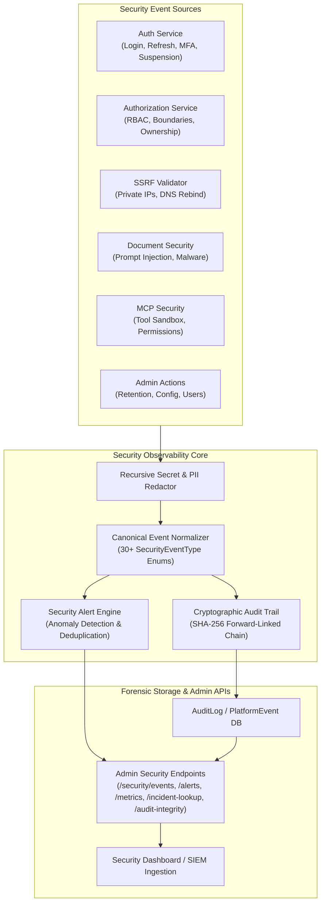

# AegisAI Security Observability & Audit Infrastructure

## Overview

The AegisAI Security Observability subsystem provides an enterprise-grade, multi-tenant, cryptographically verified security monitoring, alerting, and forensic investigation framework. It bridges low-level system actions (HTTP requests, agent runs, tool invocations, authentication attempts) into structured, canonical security telemetry that is tamper-evident and compliant with SOC 2, ISO/IEC 27001, and NIST standards.



---

## 1. Canonical Security Event Taxonomy

AegisAI defines 30+ canonical security event types categorized across operational security domains:

| Event Type | Category | Default Severity | Description |
| :--- | :--- | :--- | :--- |
| `AUTH_LOGIN_SUCCESS` | Authentication | `LOW` | Successful user authentication with valid credentials. |
| `AUTH_LOGIN_FAILED` | Authentication | `MEDIUM` | Failed login attempt due to invalid password or user. |
| `AUTH_LOGOUT` | Authentication | `LOW` | User voluntary logout and session termination. |
| `AUTH_TOKEN_ROTATED` | Authentication | `LOW` | Refresh token successfully exchanged for new token pair. |
| `AUTH_REFRESH_REPLAY` | Authentication | `CRITICAL` | Attempted reuse of an already-consumed refresh token (Token Theft). |
| `AUTH_SESSION_EXPIRED` | Authentication | `LOW` | Session ended due to inactivity or TTL expiration. |
| `AUTH_SESSION_REVOKED` | Authentication | `MEDIUM` | Session explicitly terminated by user or administrator. |
| `AUTH_ACCOUNT_LOCKED` | Authentication | `HIGH` | Account temporarily locked due to consecutive failures. |
| `AUTH_ACCOUNT_SUSPENDED`| Authentication | `HIGH` | Account suspended by admin or automated brute force rule. |
| `AUTHZ_DENIED` | Authorization | `MEDIUM` | User attempted action outside their assigned RBAC role. |
| `AUTHZ_PRIVILEGE_ESCALATION` | Authorization | `HIGH` | Attempt to acquire unauthorized role or super-admin privileges. |
| `TENANT_BOUNDARY_VIOLATION` | Authorization | `CRITICAL` | Attempt to read/write resources belonging to another tenant. |
| `TEAM_ACCESS_DENIED` | Authorization | `MEDIUM` | Workspace/Team access denied due to lack of membership. |
| `PROJECT_ACCESS_DENIED` | Authorization | `MEDIUM` | Project-level resource access denied. |
| `SSRF_ATTEMPT_BLOCKED` | Network / Boundary | `HIGH` | Outbound request blocked targeting private/internal network IP. |
| `DNS_REBINDING_DETECTED`| Network / Boundary | `CRITICAL` | Hostname resolved to public IP then rebound to private IP. |
| `PROMPT_INJECTION_DETECTED`| AI Security | `HIGH` | Prompt injection signature identified in user/document input. |
| `MALICIOUS_DOCUMENT_BLOCKED`| AI Security | `HIGH` | Uploaded document failed security scanning or sanitization. |
| `MCP_TOOL_ACCESS_DENIED` | Platform / Tool | `HIGH` | Agent attempted to invoke an unregistered or forbidden MCP tool. |
| `MCP_TOOL_FAILED_SECURITY`| Platform / Tool | `HIGH` | Tool execution failed sandbox or permission checks. |
| `SECRET_LEAK_PREVENTED` | Data Protection | `HIGH` | Sensitive API key or token detected in prompt/output and redacted. |
| `RATE_LIMIT_EXCEEDED` | Infrastructure | `MEDIUM` | API request rate limit threshold exceeded for client IP/user. |
| `SECURITY_CONFIG_CHANGED`| Administration | `HIGH` | Platform security parameter or retention policy updated. |
| `USER_ROLE_CHANGED` | Administration | `HIGH` | User role promoted or demoted by administrator. |
| `API_KEY_CREATED` | Credential | `MEDIUM` | New programmatic API key issued. |
| `API_KEY_REVOKED` | Credential | `MEDIUM` | Programmatic API key revoked. |
| `AUDIT_LOG_EXPORTED` | Compliance | `MEDIUM` | Audit trail or compliance evidence exported by admin. |
| `DATA_RETENTION_PURGED` | Compliance | `HIGH` | Historical audit/telemetry records purged per retention policy. |
| `INTEGRITY_CHECK_FAILED`| System | `CRITICAL` | Cryptographic audit chain mismatch or record tampering detected. |

---

## 2. Cryptographic Audit Trail Architecture

### 2.1 SHA-256 Hash Chaining
To provide forward-linked cryptographic tamper evidence, every `AuditLog` record contains:
1. `data_hash`: SHA-256 hash of the canonical JSON payload (keys sorted, separators compact) concatenated with the record timestamp:
   $$\text{data\_hash} = \text{SHA256}(\text{CanonicalJSON}(\text{payload}) + \text{ISO8601Timestamp})$$
2. `previous_hash`: SHA-256 pointer to the prior record in sequence (genesis record uses `0` repeated 64 times).
3. `record_hash`: Full block hash binding the chain:
   $$\text{record\_hash} = \text{SHA256}(\text{previous\_hash} + \text{data\_hash})$$

```
+--------------------------+         +--------------------------+
|  Audit Record #101       |         |  Audit Record #102       |
|  Timestamp: 2026-09-29   |         |  Timestamp: 2026-09-29   |
|  Payload: {...}          |         |  Payload: {...}          |
|  data_hash: a1b2c3...    |         |  data_hash: f9e8d7...    |
|  previous_hash: 987654...|         |  previous_hash: 334455...|<--- Link to #101
|  record_hash: 334455...  |----+    |  record_hash: 778899...  |
+--------------------------+    |    +--------------------------+
                                |
                                +-------------------------------+
```

### 2.2 Tamper Verification Engine
The `SecurityObservabilityService.verify_audit_log_integrity(tenant_id)` method iterates over the chronological record sequence for the tenant and verifies:
- Mathematical integrity of each individual record's `data_hash`.
- Unbroken continuity of `previous_hash` pointing to the previous record's `record_hash`.
- Any altered payload, deleted record, or injected record immediately triggers an `INTEGRITY_CHECK_FAILED` alert and identifies the offending record ID.

---

## 3. Real-Time Security Alert Engine

The `SecurityAlertEngine` inspects streaming security events and evaluates deterministic anomaly detection rules:

1. **Repeated Authentication Failures (`RULE_BRUTE_FORCE_AUTH`)**:
   - **Trigger**: $\ge 5$ `AUTH_LOGIN_FAILED` events from the same IP/user within 5 minutes.
   - **Action**: Generates `CRITICAL` alert; triggers automated IP/account rate limiting.
2. **Refresh Token Replay (`RULE_TOKEN_REPLAY`)**:
   - **Trigger**: Single `AUTH_REFRESH_REPLAY` event.
   - **Action**: Immediate `CRITICAL` alert; invalidates entire user token family.
3. **Cross-Tenant Boundary Violation (`RULE_TENANT_BREACH_ATTEMPT`)**:
   - **Trigger**: Single `TENANT_BOUNDARY_VIOLATION` event.
   - **Action**: `CRITICAL` alert logged with source IP, actor ID, and target resource ID.
4. **SSRF Attack Attempt (`RULE_SSRF_PROBE`)**:
   - **Trigger**: `SSRF_ATTEMPT_BLOCKED` or `DNS_REBINDING_DETECTED`.
   - **Action**: `HIGH` alert recording attempted target URI and egress vector.
5. **Prompt Injection (`RULE_PROMPT_INJECTION`)**:
   - **Trigger**: `PROMPT_INJECTION_DETECTED`.
   - **Action**: `HIGH` alert flagging document/prompt payload ID.
6. **Deduplication & Cooldown**:
   - Duplicate alerts matching the same rule and entity within the 60-second cooldown window are coalesced to prevent alert fatigue.

---

## 4. Sensitive Data Redaction & Sanitization

All incoming security event payloads are recursively scrubbed before logging, storage, or telemetry emission:

```python
SENSITIVE_KEYS = {
    "password", "new_password", "old_password",
    "token", "access_token", "refresh_token", "jwt",
    "secret", "api_key", "secret_key", "private_key",
    "authorization", "cookie", "set-cookie",
    "credential", "credentials", "credit_card"
}
```

Redacted values are replaced with `***REDACTED***`. Deeply nested dictionaries, lists, and JSON-encoded strings are recursively parsed and sanitized.

---

## 5. Security Metrics & Operational Visibility

The `/api/v1/admin/security/metrics` endpoint provides aggregated, multi-tenant security operational telemetry:
- **Total Security Events** (aggregated across past 24h/7d/30d)
- **Events by Category** (Authentication, Authorization, Boundary, AI Security, Platform)
- **Events by Severity** (Low, Medium, High, Critical)
- **Active Alerts Breakdown**
- **Authentication Failure Ratio**
- **Top Security Targets & IPs**

All metrics are calculated directly from persisted, tenant-isolated event records without artificial placeholders.

---

## 6. Incident Evidence Correlation API

For forensic post-incident reviews, the `/api/v1/admin/security/incident-lookup` endpoint aggregates multi-source evidence:
- Input parameters: `incident_id`, `user_id`, `ip_address`, `start_time`, `end_time`.
- Output: Unified, chronologically ordered timeline containing:
  - Audit log entries
  - Real-time platform execution telemetry
  - Triggered security alerts
  - Normalized UTC timestamps and actor context

This provides immediate, auditable proof for forensic examiners and compliance auditors during incident reviews.
