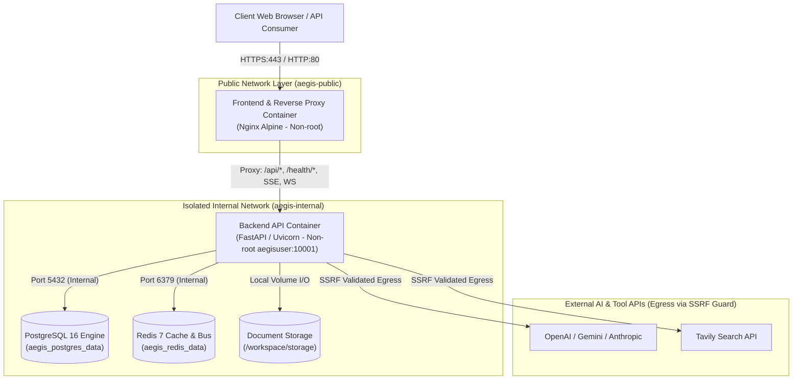

# AegisAI Enterprise — Production Containerization & Deployment Architecture

## Executive Summary & Deployment Disclaimer

> [!IMPORTANT]
> **DEPLOYMENT & ENVIRONMENT SCOPE**:
> This document defines the **production containerization, environment configuration, and deployment architecture** for the AegisAI Enterprise Multi-Agent Operating System. This specification provides container-native, multi-stage, non-root Docker configurations, isolated network topologies, health/readiness probe contracts, and deployment runbooks. External cloud infrastructure (AWS/GCP/Azure/Kubernetes) was not provisioned during Phase 11.1; container runtime verification reflects container-level testing and configuration validation.

---

## 1. Production Architecture Overview

The AegisAI containerized deployment architecture enforces strict boundary separation between public ingress and isolated internal stateful services:



---

## 2. Component Containers & Build Specifications

### 2.1 Backend Production Container (`docker/production/app.dockerfile`)
- **Base Image**: `python:3.12-slim`
- **Build Methodology**: Multi-stage build
  - *Stage 1 (Builder)*: Installs `build-essential`, `libpq-dev`, exports runtime-only requirements via Poetry (`--without dev`), and pre-compiles wheel archives into `/build/wheels`.
  - *Stage 2 (Runtime)*: Installs pre-compiled wheels without build tools or build cache, reducing image size by $>60\%$.
- **Security Boundaries**:
  - Non-root runtime user: `aegisuser` (UID `10001`, GID `10001`).
  - Persistent directories `/workspace/storage` and `/workspace/logs` initialized with `10001:10001` ownership.
  - Development tools, unit tests, and compilers are excluded from the runtime container.
- **ASGI Server Command**:
  ```bash
  uvicorn app.main:app --host 0.0.0.0 --port 8000 --workers 1 --proxy-headers --forwarded-allow-ips *
  ```
- **Healthcheck**:
  ```dockerfile
  HEALTHCHECK --interval=30s --timeout=5s --start-period=10s --retries=3 \
      CMD curl -f http://localhost:8000/health || exit 1
  ```

### 2.2 Frontend Production Container (`docker/production/frontend.dockerfile`)
- **Build Methodology**: Multi-stage build
  - *Stage 1 (Builder)*: `node:20-alpine`, installs dependencies deterministically with `npm ci`, compiles production SPA bundle via `npm run build`.
  - *Stage 2 (Runtime)*: `nginx:alpine-slim`, copies static assets to `/usr/share/nginx/html`, injects optimized `nginx.conf`.
- **Nginx Reverse Proxy Responsibilities**:
  - Serves static assets with 30-day cache headers and gzip compression.
  - Enforces SPA routing fallback (`try_files $uri $uri/ /index.html;`).
  - Proxies `/api/` traffic to `backend:8000`.
  - Proxies `/health`, `/live`, `/ready` probe requests.
  - Enforces unbuffered SSE streaming (`proxy_buffering off;`, `proxy_read_timeout 86400s;`).
  - Upgrades WebSocket connections with `Upgrade` and `Connection` headers.
  - Injects browser security headers (`X-Frame-Options`, `X-Content-Type-Options`, `Referrer-Policy`).

---

## 3. Environment Strategy & Configuration Matrix

AegisAI defines 4 explicit environment profiles: `prod`, `staging`, `dev`, and `test`.

| Environment Variable | Category | Required in Prod? | Default in Dev | Production Description & Invariants |
| :--- | :--- | :--- | :--- | :--- |
| `ENVIRONMENT` | Core | **Yes** | `dev` | Profile selector: `prod`, `staging`, `dev`, or `test`. |
| `PROJECT_NAME` | Core | No | `"AegisAI Enterprise Backend"` | Display name for system logs and telemetry. |
| `SECRET_KEY` | Security | **Yes** | *N/A* | JWT signing key. **Must be $\ge 32$ random characters**. Cannot use defaults. |
| `ALGORITHM` | Security | No | `HS256` | JWT algorithm (`HS256` or `RS256`). |
| `ACCESS_TOKEN_EXPIRE_MINUTES`| Security | No | `60` | Lifespan of short-lived access JWT tokens. |
| `REFRESH_TOKEN_EXPIRE_DAYS` | Security | No | `7` | Lifespan of refresh tokens in rotation families. |
| `POSTGRES_SERVER` | Database | **Yes** | `localhost` | PostgreSQL hostname or container service name (`db`). |
| `POSTGRES_PORT` | Database | No | `5432` | PostgreSQL port. |
| `POSTGRES_DB` | Database | **Yes** | `aegisai` | Database name. |
| `POSTGRES_USER` | Database | **Yes** | `postgres` | Database username. |
| `POSTGRES_PASSWORD` | Database | **Yes** | *N/A* | Strong database password (cannot be default `postgres` in prod). |
| `DATABASE_URL` | Database | No | *None* | Optional full SQLAlchemy connection URI overriding individual parameters. |
| `REDIS_HOST` | Cache/Bus | **Yes** | `localhost` | Redis hostname or container service name (`redis`). |
| `REDIS_PORT` | Cache/Bus | No | `6379` | Redis port. |
| `REDIS_PASSWORD` | Cache/Bus | Optional | *None* | Authentication password for Redis instance. |
| `CORS_ORIGINS` | Web Security | **Yes** | `["http://localhost:5173"]`| JSON array of exact allowed frontend origins (no wildcards). |
| `ALLOWED_HOSTS` | Web Security | **Yes** | `["localhost", "127.0.0.1"]`| Trusted host headers for Host-header attack prevention. |
| `ENABLE_HSTS` | Web Security | No | `false` (Auto `true` in prod) | Forces `Strict-Transport-Security: max-age=31536000`. |
| `DOCUMENT_STORAGE_PATH` | Storage | **Yes** | `storage` | Absolute path to persistent document volume (`/workspace/storage`). |
| `MAX_DOCUMENT_SIZE_MB` | Storage | No | `50` | Maximum file upload limit in megabytes. |
| `OPENAI_API_KEY` | AI Provider | Conditional | *None* | Secret key for OpenAI models. Injected via environment. |
| `GEMINI_API_KEY` | AI Provider | Conditional | *None* | Secret key for Google Gemini models. Injected via environment. |
| `ANTHROPIC_API_KEY` | AI Provider | Conditional | *None* | Secret key for Anthropic Claude models. Injected via environment. |

---

## 4. Health, Liveness & Readiness Probes

AegisAI implements distinct probe endpoints compliant with container runtimes (Docker Compose, Kubernetes, ECS):

| Endpoint | Target Probe | Check Scope | Success Response | Failure Response |
| :--- | :--- | :--- | :--- | :--- |
| `GET /health/liveness` | Container Liveness | Verifies ASGI event loop is active and responsive. Does not execute DB queries. | `200 OK`<br>`{"status": "alive"}` | `500 / Process Exit` |
| `GET /health/readiness` | Ingress Readiness | Active ping to PostgreSQL (`SELECT 1`) and Redis (`PING`). | `200 OK`<br>`{"status": "ready"}` | `503 Service Unavailable`<br>`{"status": "not_ready"}` |
| `GET /health` | Diagnostic Health | Diagnostic dependencies check with subsystem connection statuses. | `200 OK` (if Online)<br>`503` (if Degraded) | `503 Service Unavailable` |

---

## 5. Deployment Runbook & Lifecycle Management

### 5.1 Pre-Deployment Migration Procedure
Before launching new backend containers against a shared database:
1. **Database Snapshot**: Take a point-in-time snapshot or `pg_dump` of PostgreSQL.
2. **Execute Migrations**: Run Alembic upgrade in an ephemeral migration container:
   ```bash
   docker run --rm \
     --network aegis-internal-net \
     -e DATABASE_URL="postgresql://aegis_user:secret@db:5432/aegisai_prod" \
     aegisai-backend:production \
     alembic upgrade head
   ```
3. **Verify Lineage**: Confirm migration head matches verified version (`018_notifications_realtime`).

### 5.2 Starting the Production Stack
```bash
# 1. Create .env.prod with secure secrets
cp .env.example .env.prod
# (Populate SECRET_KEY, POSTGRES_PASSWORD, etc.)

# 2. Build and launch production compose stack
docker compose -f docker-compose.prod.yml up -d --build

# 3. Monitor container health status
docker compose -f docker-compose.prod.yml ps
```

### 5.3 Graceful Shutdown Protocol
When receiving `SIGTERM`:
1. Nginx stops accepting new connections and flushes active streams.
2. FastAPI ASGI server stops accepting new HTTP requests.
3. In-flight agent and workflow executions complete or transition to `CANCELLED` state with persistence.
4. Database connection pools and Redis clients close cleanly.

---

## 6. Realtime, SSE & WebSocket Requirements

AegisAI relies heavily on Server-Sent Events (SSE) for token streaming and WebSockets for collaboration updates. The reverse proxy must enforce:
1. `proxy_buffering off;` (Disables Nginx response buffering to ensure immediate chunk delivery to browsers).
2. `proxy_read_timeout 86400s;` (Prevents premature connection teardown on idle streams).
3. `proxy_set_header Upgrade $http_upgrade;` and `proxy_set_header Connection "upgrade";` (Ensures WebSocket protocol handshakes succeed).

---

## 7. Known Deployment Limitations & Residual Risks

1. **Local Docker Runtime Requirement**: Local container builds require a host with Docker Desktop / Docker Engine installed. When running in environments without Docker CLI, configuration validation and unit tests verify container artifacts and YAML structure.
2. **Single-Node vs. Multi-Node Cluster**: The provided `docker-compose.prod.yml` orchestrates a single-node host. For multi-node high availability (HA), deploy with Kubernetes / Helm using the same container images and environment specifications.
3. **Managed Cloud Database**: In enterprise production deployments, self-hosted PostgreSQL container should be replaced by a managed database (e.g., AWS RDS PostgreSQL, GCP Cloud SQL) using the `DATABASE_URL` connection string.
