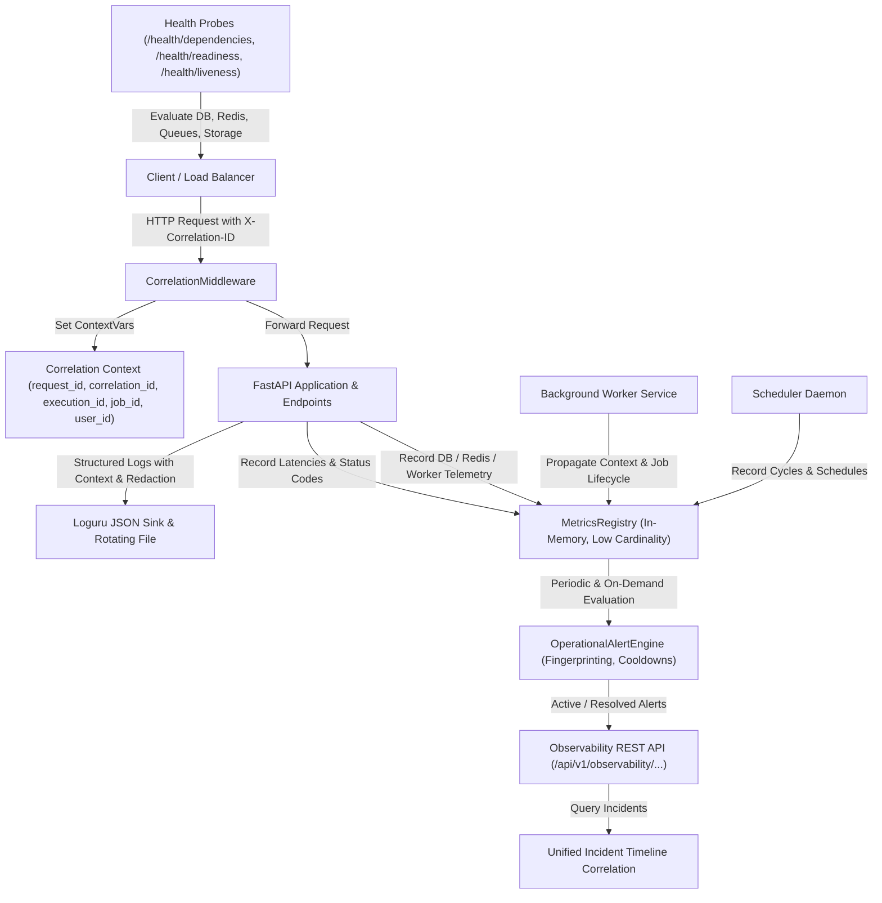

# 87. Production Observability & Monitoring

## 1. Executive Summary

Phase 11.5 establishes a unified, production-grade observability and monitoring architecture for AegisAI. It integrates structured JSON logging with recursive secret scrubbing, an asynchronous execution correlation model, an in-memory low-overhead metrics registry with strict bounded-cardinality controls, operational threshold alerting with deduplication/cooldown lifecycle management, diagnostic dependency health probes, and multi-source incident timeline correlation.

---

## 2. Architecture Overview

---

## 3. Core Components

### 3.1 Single Correlation Model (`app.core.correlation`)
- **Context Variables (`contextvars`)**: Thread-safe and asynchronous propagation of `request_id`, `correlation_id`, `execution_id`, `job_id`, `workflow_id`, `workspace_id`, and `user_id`.
- **Header Sanitization**: `sanitize_header_value` strips control characters, null bytes, and CRLF injection attempts while bounding length to 128 characters.
- **Middleware Injection**: `CorrelationMiddleware` intercepts incoming requests, binds correlation IDs to `request.state` and context variables, injects `X-Request-ID` and `X-Correlation-ID` into response headers, and records request outcomes and execution latencies in the `MetricsRegistry`.
- **Bounded Route Cardinality**: URL path parameters such as UUIDs (`/api/v1/workspaces/40b4cd41-...`) and integers (`/api/v1/items/123`) are normalized to `/:id` before recording route-level metric tags.

### 3.2 Structured JSON Logging (`app.core.logging`)
- **Loguru Sink**: Configurable log level (`settings.LOG_LEVEL`), format (`settings.LOG_FORMAT`), and rotation/retention (`settings.LOG_ROTATION`, `settings.LOG_RETENTION`).
- **Contextual Serialization**: Log records automatically include timestamp, log level, module, function, line, and active correlation context (`request_id`, `correlation_id`, `execution_id`, `job_id`).
- **Recursive Secret Scrubbing**: All log messages, extra dicts, and exceptions are sanitized using `CredentialStore.scrub_text` and `CredentialStore.scrub_dict`, removing Bearer tokens, private keys, database connection strings, passwords, and API keys.

### 3.3 Unified In-Memory Metrics Registry (`app.core.metrics`)
- **Latency Percentiles**: Computes deterministic `p50`, `p90`, `p95`, `p99`, `min`, `max`, and `mean` latencies using sliding-window sample collections.
- **HTTP Metrics**: Request throughput (RPS), total requests, status code distribution (`2xx`, `3xx`, `4xx`, `5xx`), and error rate percentages.
- **Infrastructure Metrics**: Database connection pool metrics (checkouts, rollbacks, connection failures, pool exhaustions), Redis operation counts, lock contentions, and queue depths.
- **Worker & Scheduler Telemetry**: Job lifecycle transitions (`queued`, `started`, `succeeded`, `failed`, `retried`, `dead_lettered`, `cancelled`, `stale_recovered`), scheduler cycles, and triggered schedules.
- **Domain Capability Telemetry**: Subsystem telemetry across Agent invocations, tool calls, critic rejections, RAG queries/retrievals, Knowledge Graph traversals, MCP tools/security blocks, and Workflow executions.

### 3.4 Operational Alerting Engine (`app.services.operational_alerts`)
- **Rule Evaluators**:
  - `HIGH_5XX_ERROR_RATE`: Triggers CRITICAL alert when 5xx HTTP error rate exceeds threshold (e.g. 5%).
  - `DEAD_LETTER_BURST`: Triggers HIGH alert when dead-lettered worker job count reaches threshold (e.g. >= 5).
  - `DATABASE_POOL_SATURATION`: Triggers WARNING alert when connection pool exhaustions or connection failures occur.
- **Fingerprinting & Cooldown**: Computes SHA-256 fingerprint from rule name, metric, and entity to prevent alert storms and duplicate alerts during active state.
- **Lifecycle Transitions**: Supports state progression from `TRIGGERED` -> `ACKNOWLEDGED` (with actor tracking) -> `RESOLVED`.
- **Incident Timeline Correlation**: Queries across in-memory alerts, database `BackgroundJob` records, and `AuditLog` entries for a given `correlation_id`, `request_id`, or `job_id`, outputting a chronological, secret-scrubbed evidence timeline.

### 3.5 Diagnostic & Dependency Probes (`app.main`)
- `GET /health/dependencies`: Verifies PostgreSQL connectivity and query latency, Redis connectivity, worker cluster queue depths, and storage path accessibility.
- `GET /health/readiness`: Returns 200 OK only when critical database and Redis dependencies are ready to serve traffic (returns 503 if unavailable).
- `GET /health/liveness`: Lightweight health check for container orchestration and process survival.

---

## 4. API Endpoints Reference

| Method | Path | Description | Access Control |
|---|---|---|---|
| `GET` | `/api/v1/observability/overview` | Aggregated system health, throughput, error rate, p95 latency, and active alerts | Admin / Tenant User |
| `GET` | `/api/v1/observability/metrics/requests` | Detailed request latency percentiles, error categories, and route stats | Admin / Tenant User |
| `GET` | `/api/v1/observability/metrics/infrastructure` | Database pool, Redis operations, worker queues, and scheduler cycles | Admin / Tenant User |
| `GET` | `/api/v1/observability/metrics/domains` | Capability execution telemetry for MCP, RAG, Graph, Agent, Workflows | Admin / Tenant User |
| `GET` | `/api/v1/observability/alerts` | List active and historical operational alerts with status/severity filters | Admin / Tenant User |
| `POST` | `/api/v1/observability/alerts/{alert_id}/acknowledge` | Acknowledge an operational alert | Admin / Tenant User |
| `POST` | `/api/v1/observability/alerts/{alert_id}/resolve` | Resolve an operational alert | Admin / Tenant User |
| `GET` | `/api/v1/observability/incident/timeline` | Correlate multi-source timeline given correlation_id or job_id | Admin / Tenant User |
| `GET` | `/health/dependencies` | Diagnostic dependency probe for DB, Redis, workers, storage | Public / Monitoring |
| `GET` | `/health/readiness` | Container readiness probe (200 OK / 503 Service Unavailable) | Public / K8s |
| `GET` | `/health/liveness` | Container liveness probe | Public / K8s |

---

## 5. Verification Matrix

| Verification Area | Target | Verified Result | Status |
|---|---|---|---|
| Header Sanitization | CRLF & Control Char Stripping | Verified by test | PASS |
| Correlation Propagation | ContextVars & HTTP Response Headers | Verified by test | PASS |
| Structured Logging | JSON Sink & Recursive Secret Redaction | Verified by test | PASS |
| Metrics Registry | Latency Percentiles & Route Bounding | Verified by test | PASS |
| Worker & Scheduler Telemetry | Lifecycle Transitions & Cycles | Verified by test | PASS |
| Operational Alerts | Deduplication, Acknowledge, Resolve | Verified by test | PASS |
| Incident Timeline | Multi-source Correlation (Alerts, Jobs, Audits) | Verified by test | PASS |
| Health & Dependency Probes | DB, Redis, Storage, Readiness 503 | Verified by test | PASS |
| Dedicated Phase 11.5 Tests | `test_p11_5_production_observability.py` | 24 / 24 passed | PASS |
| Backend Unit Regression | All 223 test files | 779 / 779 passed | PASS |
| Frontend Unit Tests | Vitest suite | 12 / 12 passed | PASS |
| Frontend Production Build | Vite 2540 modules | 0 errors | PASS |
