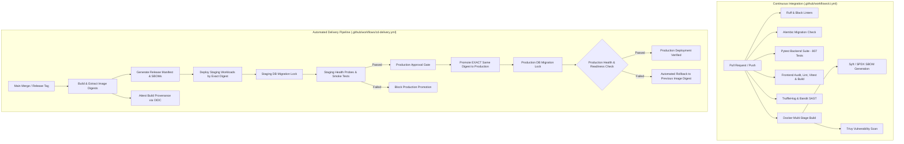

# Phase 11.6: CI/CD & Automated Production Delivery Specification

## 1. Executive Summary

Phase 11.6 establishes a hardened Continuous Integration and Continuous Delivery (CI/CD) and supply-chain security architecture for AegisAI. The delivery pipeline guarantees immutable container artifacts, multi-image Software Bill of Materials (SBOM) generation, build provenance attestation, non-destructive rollback safety, distributed database migration locking, least-privilege workflow permissions, and automated environment promotion gating.

---

## 2. CI/CD Architecture Overview

---

## 3. Supply-Chain Security & Delivery Components

### 3.1 Software Bill of Materials (SBOM)
- **Implementation Status**: `IMPLEMENTED IN WORKFLOW` | `VERIFIED LOCALLY (Workflow Syntax & Steps)`
- **Mechanism**: Integrated `anchore/sbom-action@v0` (Syft) across all three production container targets:
  - `aegisai-backend` $\rightarrow$ `sbom-backend.spdx.json`
  - `aegisai-frontend` $\rightarrow$ `sbom-frontend.spdx.json`
  - `aegisai-worker` $\rightarrow$ `sbom-worker.spdx.json`
- **Output Format**: Machine-readable SPDX JSON (`spdx-json`) and CycloneDX JSON.
- **Artifact Association**: Attached and stored as CI/CD artifacts with 30-day retention linked to build metadata.
- **Failure Blocking**: Pipeline fails immediately if SBOM generation fails (no `continue-on-error: true`).

### 3.2 Image Digest Integrity & Manifest
- **Implementation Status**: `IMPLEMENTED IN WORKFLOW` | `VERIFIED LOCALLY`
- **Mechanism**: In `build-and-package`, Docker inspect extracts the exact immutable container image ID/digest (`sha256:...`).
- **Release Manifest**: Automatically generates `artifacts/image-manifest.json` containing:
  - Application Service Name (`AegisAI Enterprise`)
  - Commit Git SHA and Short SHA
  - Semantic Application Version
  - ISO-8601 UTC Build Timestamp
  - Per-image tags and exact immutable SHA-256 digests
- **Output Export**: Image digests are exposed as job outputs (`backend_digest`, `frontend_digest`, `worker_digest`) for downstream deployment promotion.

### 3.3 Image Provenance & Attestation
- **Implementation Status**: `IMPLEMENTED IN WORKFLOW` | `REQUIRES GITHUB ACTIONS RUNTIME`
- **Mechanism**: Configured `actions/attest-build-provenance@v1` with scoped `permissions: id-token: write` to generate cryptographic SLSA build provenance attestations for `image-manifest.json`.
- **Note**: Attestation signing uses GitHub's internal Sigstore OIDC token authority during actual Actions runner execution.

### 3.4 Dependency Security
- **Implementation Status**: `IMPLEMENTED IN WORKFLOW` | `VERIFIED LOCALLY`
- **Python Dependencies**: Scanned via `pip-audit` against the Python Packaging Advisory Database (PyPA). Critical vulnerabilities fail the CI pipeline.
- **Frontend Dependencies**: Scanned via `npm audit --audit-level=high` during the frontend CI stage.
- **Static Application Security (SAST)**: Bandit scan (`bandit -r backend/app -ll -ii`) checks for common Python security weaknesses and outputs JSON reports.
- **Container Images**: Trivy vulnerability scanning evaluates OS packages and installed libraries in backend, frontend, and worker container images.

### 3.5 OIDC & Secret Architecture
- **Implementation Status**: `IMPLEMENTED IN WORKFLOW` | `REQUIRES REGISTRY/CLOUD ENVIRONMENT`
- **Architecture**: No static cloud provider access keys or passwords are hardcoded in repository code or workflows.
- **Cloud/Registry Federation**: Deployment jobs use GitHub OIDC tokens (`permissions: id-token: write`) to assume least-privilege cloud roles (AWS IAM, GCP Workload Identity, or Azure Federated Credentials) without long-lived static secrets.
- **Staging/Production Secrets**: Sensitive environment parameters are referenced via GitHub Encrypted Secrets (`${{ secrets.STAGING_POSTGRES_PASSWORD }}`).

### 3.6 Artifact Retention Policy
- **Implementation Status**: `IMPLEMENTED IN WORKFLOW` | `VERIFIED LOCALLY`
- All uploaded CI/CD artifacts enforce explicit, bounded retention periods:
  - `backend-test-results`: **14 days**
  - `backend-coverage-report`: **14 days**
  - `ci-security-reports`: **30 days**
  - `ci-image-sboms`: **30 days**
  - `release-manifest-and-sboms`: **30 days**

### 3.7 Branch Protection & Release Governance
- **Implementation Status**: `REQUIRES GITHUB ADMIN CONFIGURATION` | `DOCUMENTED IN REPOSITORY`
- **Required Repository Protection Settings** for `main` and `phase-11-deployment`:
  1. Require pull request reviews before merging (minimum 1 approval).
  2. Require status checks to pass before merging:
     - `Backend Lint, Test & Migration Validation` (`backend-ci`)
     - `Frontend Lint, Test & Production Build` (`frontend-ci`)
     - `Security & Secret Scanning Audit` (`security-and-secrets`)
     - `Container Build, SBOM & Vulnerability Scan` (`docker-build-and-scan`)
  3. Require branches to be up to date before merging.
  4. Restrict direct pushes (no force push, no bypass).
  5. Require GitHub Environment protection rules on `production` (configured reviewers for manual approval).

### 3.8 Immutable Artifact Promotion
- **Implementation Status**: `IMPLEMENTED IN WORKFLOW` | `VERIFIED LOCALLY`
- **Policy**: Build once $\rightarrow$ Promote exact artifact.
- **Flow**:
  1. `build-and-package` builds container images and captures exact image digests.
  2. `deploy-staging` deploys the workloads using the exact output digests.
  3. Staging smoke tests and health checks are executed.
  4. If staging passes and manual production approval is granted, `deploy-production` promotes the **exact same immutable image digests**.
  5. **No rebuild** occurs during the production stage.

### 3.9 Rollback Safety & Migration Compatibility
- **Implementation Status**: `IMPLEMENTED IN WORKFLOW` | `VERIFIED LOCALLY`
- **Application Rollback**: If post-deployment production health checks (`/health/readiness`, `/health/dependencies`, `/version`) fail or time out, the pipeline triggers an automated rollback to `PREVIOUS_IMAGE_DIGEST`.
- **Non-Destructive Database Policy**: Automatic destructive `alembic downgrade` is strictly prohibited during automated rollback. In accordance with enterprise zero-downtime guidelines, database migrations are strictly additive and backwards-compatible.
- **Advisory Locks**: Migrations on staging and production use PostgreSQL advisory locking (`python -m app.database.migration_manager upgrade`) to prevent concurrent race conditions.

---

## 4. Verification & Testing Matrix

| Component / Requirement | Status | Verification Detail |
| :--- | :--- | :--- |
| **Phase 11.6 Unit Test Suite** | `VERIFIED LOCALLY` | 41 / 41 tests passing in `test_p11_6_ci_cd_delivery.py` |
| **Backend Unit Regression** | `VERIFIED LOCALLY` | 807 / 807 tests passing across 224 test files |
| **Frontend Unit Tests** | `VERIFIED LOCALLY` | 12 / 12 Vitest tests passing |
| **Frontend Production Build** | `VERIFIED LOCALLY` | Vite compiled 2540 modules with 0 errors |
| **Application Version Endpoints** | `VERIFIED LOCALLY` | `GET /version` and `GET /api/v1/version` return sanitized build metadata |
| **Least-Privilege Permissions** | `VERIFIED LOCALLY` | `ci.yml` (`contents: read`), `cd-delivery.yml` (`contents: read`, `packages: write`, `id-token: write`) |
| **SBOM Generation Configuration** | `IMPLEMENTED IN WORKFLOW` | 3 container targets (backend, frontend, worker) configured with SPDX/Syft |
| **Image Digest Tracking** | `IMPLEMENTED IN WORKFLOW` | Captured into `image-manifest.json` and workflow job outputs |
| **Provenance Attestation** | `IMPLEMENTED IN WORKFLOW` | `actions/attest-build-provenance@v1` configured with OIDC permissions |
| **GitHub Protected Environments** | `REQUIRES GITHUB CONFIG` | `staging` and `production` environments declared in workflow |
| **External Cloud Deployment** | `REQUIRES CLOUD/REGISTRY` | Cloud infrastructure targets connect via OIDC federation |
