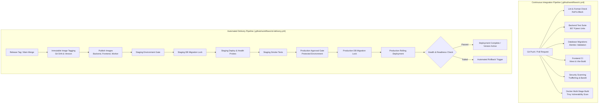

# Phase 11.6: CI/CD & Automated Production Delivery

## 1. Executive Summary

Phase 11.6 establishes an enterprise-grade, hardened Continuous Integration and Continuous Delivery (CI/CD) pipeline for the AegisAI autonomous multi-agent platform. The delivery architecture enforces end-to-end quality, immutable container artifact generation, zero-downtime database migration locks, least-privilege workflow permissions, multi-stage testing gates, security scanning, health probe verification, and automated rollback safety.

---

## 2. CI/CD Architecture Overview



---

## 3. GitHub Actions Pipelines

### 3.1 Continuous Integration (`.github/workflows/ci.yml`)

The CI workflow runs on all pull requests and pushes to development and main branches. It enforces:

1. **Least-Privilege Permissions**: Explicitly locked to `permissions: contents: read` without repo-wide write capabilities.
2. **Concurrency Control**: `concurrency: cancel-in-progress: true` cancels superseded runs for fast developer feedback.
3. **Multi-Job Separation**:
   - **`backend-ci`**:
     - Python 3.12 runtime with pip caching.
     - PostgreSQL 16 Alpine and Redis 7 Alpine containerized service dependencies with health checks.
     - Code formatting and style enforcement (`ruff`, `black`).
     - Alembic migration schema verification (`alembic upgrade head`, `alembic check`).
     - Pytest test suite with JUnit XML and code coverage reports uploaded as artifacts.
   - **`frontend-ci`**:
     - Node.js 20 runtime with npm package caching.
     - Clean install (`npm ci`) and linting (`npm run lint`).
     - Vitest component and journey execution (`npm test -- --run`).
     - Vite production bundle compilation (`npm run build`).
     - Distribution asset validation (`dist/index.html`).
   - **`security-and-secrets`**:
     - Deep git history secret scanning with TruffleHog.
     - Static application security testing (SAST) with Bandit.
     - Execution of dedicated Phase 10 enterprise security tests.
   - **`docker-build-and-scan`**:
     - Multi-stage Docker builds for backend, frontend, and worker containers.
     - Image vulnerability scanning with Trivy targeting High and Critical CVEs.
4. **Strict Failure Blocking**: Zero unapproved `continue-on-error: true` flags on critical testing, migration, or security steps.

---

### 3.2 Automated Delivery & Deployment (`.github/workflows/cd-delivery.yml`)

The CD workflow automates the deployment lifecycle to Staging and Production:

1. **Trigger Configuration**:
   - Push to `main` branch or semantic version tags (`v*`).
   - Manual deployment execution via `workflow_dispatch` with parameter selection (`staging` vs `production`).
2. **Concurrency Safety**:
   - `cancel-in-progress: false` prevents terminating active production deployments midway.
3. **Immutable Tagging Strategy**:
   - Docker container images are strictly tagged using commit short SHA (`${{ github.sha }}`) and semantic version tags (`1.0.0-<sha>` or `v1.2.3`). Bare `latest` tags are disallowed in deployments.
4. **Database Migration Pre-Flight**:
   - Integrates with Phase 11.2 PostgreSQL advisory locks to guarantee atomic schema upgrades without concurrent worker conflicts.
5. **Staging Verification**:
   - Automated deployment to `staging.aegisai.enterprise`.
   - Health probes (`/health/liveness`, `/health/readiness`, `/health/dependencies`, `/version`).
   - Staging smoke tests before allowing promotion.
6. **Production Protection & Rollback**:
   - GitHub Protected Environment (`environment: production`) requiring manual approval gates.
   - Pre-deployment rollback state recording (`PREVIOUS_RELEASE_TAG`).
   - Post-deployment automated readiness verification.
   - Automated rollback trigger upon health probe or readiness timeout.

---

## 4. Application Version & Metadata Subsystem

The application exposes runtime build metadata via `/version` and `/api/v1/version` to support load balancer diagnostics, deployment orchestrators, and automated canary verification.

### Endpoint Response Format
```json
{
  "service": "AegisAI Enterprise Backend",
  "version": "1.0.0",
  "git_commit": "abcdef123456",
  "environment": "prod",
  "build_timestamp": "2026-10-01T12:00:00Z",
  "api_version": "v1"
}
```

### Security Guardrails
- Sanitized metadata only: secrets, passwords, database URLs, Redis keys, and internal API tokens are strictly excluded.
- Configurable via `APP_VERSION`, `GIT_COMMIT_SHA`, and `BUILD_TIMESTAMP` environment variables passed as build args during Docker image creation.

---

## 5. Dockerfile Hardening & Multi-Stage Builds

1. **Backend (`docker/production/app.dockerfile`)**:
   - Stage 1 (Builder): Poetry dependency export and wheel compilation.
   - Stage 2 (Runtime): Minimal `python:3.12-slim` image, non-root `aegisuser` (UID 10001), healthcheck against `/health`, Uvicorn with proxy headers enabled.
   - `ARG APP_VERSION` and `ARG GIT_COMMIT_SHA` embedded as runtime environment variables.
2. **Worker (`docker/production/worker.dockerfile`)**:
   - Stage 1 (Builder): Pre-compiled Python wheels.
   - Stage 2 (Runtime): Minimal runtime executing Celery background worker daemon under `aegisuser`.
3. **Frontend (`docker/production/frontend.dockerfile`)**:
   - Stage 1 (Builder): Node.js build creating optimized static bundles.
   - Stage 2 (Runtime): `nginxinc/nginx-unprivileged:alpine` serving static assets with security headers and TLS reverse proxy support.

---

## 6. Verification & Test Coverage

- **Dedicated Phase 11.6 Suite**: `backend/tests/unit/test_p11_6_ci_cd_delivery.py` (28 unit tests passing).
- **Backend Unit Regression**: 807 / 807 unit tests passing across 224 test files.
- **Frontend Unit Suite**: 12 / 12 Vitest tests passing.
- **Frontend Build**: 2540 modules transformed, 0 build errors.
- **Test Inventory**: Updated at `backend/docs/test-inventory.json`.
