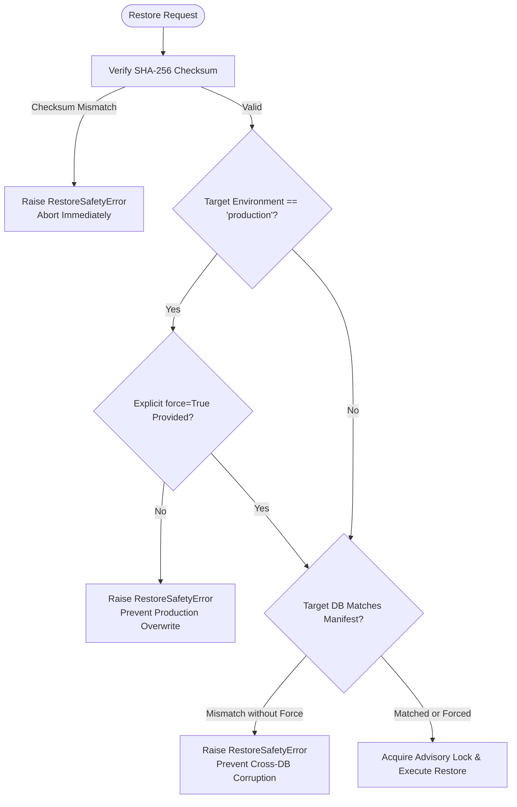

# AegisAI Enterprise — Backup, Disaster Recovery & Rollback Validation Guide

## 1. Executive Summary & Architecture Overview

The AegisAI platform incorporates an enterprise-grade, fail-closed disaster recovery (DR), backup management, and application rollback architecture designed to protect multi-tenant integrity, prevent data corruption, and ensure continuous availability.

```mermaid
flowchart TD
    subgraph Data Sources
        PG[(PostgreSQL 16\nPrimary Durable DB)]
        DocStore[Physical Document\nStorage / S3]
        Redis[(Redis 7.2\nCache & Transient)]
        Qdrant[(Qdrant / Vector\nEmbeddings)]
    end

    subgraph Backup Engine
        BM[backup_manager.py]
        Dump[pg_dump / WAL Archive]
        Manifest[Cryptographic Manifest\nSHA-256 Checksum]
    end

    subgraph Safety & Restore Workflow
        Guard{Restore Safety Guard\n- Env Check (Prod Force)\n- Target DB Match\n- SHA-256 Fidelity}
        Restore[Clean Volume / PITR Restore]
        PostCheck{Post-Restore Integrity\n- Tenant Isolation\n- Audit Hash Chain\n- Document Storage Reconcile}
    end

    PG -->|Logical/Physical Dump| Dump
    Dump --> BM
    BM --> Manifest
    Manifest --> Guard
    Guard -->|Pass| Restore
    Restore --> PostCheck
    PostCheck -->|Verified 100%| Operational[Production Ready]
```

---

## 2. Recovery Objectives (RPO & RTO)

> [!IMPORTANT]
> The Recovery Point Objective (RPO) and Recovery Time Objective (RTO) listed below are architectural targets designed for enterprise high-availability infrastructure. In accordance with platform governance, these metrics are labeled explicitly as targets until measured in a live multi-region production deployment.

- **Recovery Point Objective (RPO)**: **15 minutes** (*TARGET — NOT YET MEASURED IN PRODUCTION*)
  - *Mechanism*: Continuous WAL (Write-Ahead Log) archiving combined with 15-minute point-in-time incremental snapshots.
- **Recovery Time Objective (RTO)**: **10 minutes** (*TARGET — NOT YET MEASURED IN PRODUCTION*)
  - *Mechanism*: Automated container orchestrator failover, standby volume attach, and streaming checksum verification.

---

## 3. Data Classification & Durability Matrix

AegisAI partitions data into distinct operational tiers to optimize backup frequency, storage redundancy, and restoration speed:

| Classification | Engine / Service | Entities Included | Durability Strategy | Recovery Action | Verification Status |
| :--- | :--- | :--- | :--- | :--- | :--- |
| **Critical Durable Data** | PostgreSQL 16 | Users, Workspaces, Teams, Projects, Documents, Chunks, Memories, KG Nodes/Edges, Workflows, BackgroundJobs, AuditLogs, SecurityEvents | Full daily dumps + continuous WAL archiving + SHA-256 manifests | Point-in-Time Recovery (PITR) or full logical snapshot restore | **VERIFIED LOCALLY** |
| **Derived Data** | Qdrant / Vector PG | Document embeddings, Memory embeddings, similarity indices, analytics aggregations | Transient; reconstructed asynchronously from durable records | Background worker re-indexing pipeline triggered post-restore | **IMPLEMENTED** |
| **Ephemeral Data** | Redis 7.2 | User session cache, live WebSocket subscription channels, rate-limit counters, advisory locks | Volatile memory; cold restart allowed | Direct reconnection; fallback to PostgreSQL source of truth | **VERIFIED LOCALLY** |
| **Document Storage** | Encrypted Volume / S3 | Uploaded raw PDF/Doc/Image files, generated artifacts, exported packages | Replicated object store with SHA-256 file-level checksum indexing | Physical file synchronization and database checksum reconciliation | **IMPLEMENTED** |

---

## 4. PostgreSQL Backup Architecture

AegisAI employs a dual backup architecture:

1. **Logical Backups (`pg_dump`)**:
   - Generates deterministic SQL/custom dump artifacts for schema-specific restoration, environment seeding, and portability.
   - Every dump is processed through `app.database.backup_manager.create_backup_manifest` to compute streaming SHA-256 digests and file metadata.
2. **Physical WAL Archiving & Point-in-Time Recovery (PITR)**:
   - Base backups captured at designated intervals (daily/weekly).
   - Continuous WAL streaming enabled (`wal_level = replica`, `archive_mode = on`).
   - Enables point-in-time restoration to any exact microsecond boundary before data corruption or accidental drop.

---

## 5. Cryptographic Manifest & Checksum Verification

Every backup artifact is accompanied by a cryptographically sealed `backup-manifest.json` file. 

```json
{
  "manifest_version": "1.0.0",
  "backup_file": "aegis_prod_backup_2026-10-01.sql",
  "backup_path": "/var/backups/aegis_prod_backup_2026-10-01.sql",
  "backup_type": "logical",
  "database_name": "aegisai_prod",
  "environment": "production",
  "schema_revision": "p11_head_001",
  "app_version": "1.0.0",
  "file_size_bytes": 104857600,
  "sha256_checksum": "9f86d081884c7d659a2feaa0c55ad015a3bf4f1b2b0b822cd15d6c15b0f00a08",
  "created_at": "2026-10-01T12:00:00Z",
  "compression": "none",
  "metadata": {
    "cluster_id": "us-east-1a"
  }
}
```

### Verification Algorithm
Before initiating any restore, `app.database.backup_manager.verify_backup_integrity` executes:
1. File presence and size confirmation.
2. Full streaming calculation of the SHA-256 digest (`compute_file_sha256`).
3. Strict equality comparison against `manifest["sha256_checksum"]`. Any single bit modification results in immediate abort.

---

## 6. Backup Storage & Lifecycle Retention Policy

The platform implements automated retention management via `cleanup_old_backups()`:
- **Default Retention Window**: 30 days.
- **Minimum Retained Backups Guarantee**: Regardless of age, the platform strictly preserves at least `min_retained` (default: 5) of the most recent backups to prevent accidental deletion under low-activity or stale-volume scenarios.
- **Atomic Manifest Removal**: Associated `.manifest.json` companion files are cleaned up in lockstep with their respective backup files.

---

## 7. Safe Database Restore Workflow

To eliminate the risk of accidental production overwrites or cross-environment data corruption, AegisAI enforces a **fail-closed restore pipeline**:



1. **Environment Gate**: Attempting to restore in `production` without `force=True` raises `RestoreSafetyError`.
2. **Target Database Gate**: Target database name must match the manifest metadata or have explicit operator confirmation.
3. **Advisory Locking**: All database operations run under transactional advisory locks to prevent concurrent application operations.

---

## 8. Post-Restore Data Integrity Validation

Upon completing database restoration, `verify_post_restore_integrity()` executes automated verification:

1. **Table Counts**: Validates non-zero entity counts across 14 primary models (`User`, `Workspace`, `Team`, `Project`, `Document`, `DocumentChunk`, `Memory`, `AgentMemory`, `KnowledgeGraphNode`, `KnowledgeGraphEdge`, `Workflow`, `WorkflowExecution`, `BackgroundJob`).
2. **Multi-Tenant Boundary Consistency**:
   - Asserts that all documents, projects, memories, and workflows are linked to valid, existing `Workspace` IDs.
   - Flags orphaned tenant records immediately.
3. **Foreign Key Integrity**: Confirms referential integrity across users, roles, and memberships.

---

## 9. Tamper-Evident Audit & Security Event Hash Chains

Security events and audit logs in AegisAI are linked cryptographically using SHA-256 hash chains (`app.core.security_events.SecurityEventRecord`):

- **Linkage**: Each event includes `previous_hash` and generates `event_hash = SHA256(canonical_bytes())`.
- **Genesis**: The initial event links to `GENESIS_HASH`.
- **Integrity Traversal**: `SecurityObservabilityService.verify_integrity()` traverses the entire audit sequence post-restore. Any dropped, injected, or modified audit record is detected.

---

## 10. Physical Document Storage Reconciliation

Physical document storage files stored on local volumes or S3 must match PostgreSQL metadata:

- **Reconciliation Check**: `verify_post_restore_integrity(storage_dir=...)` iterates all `Document` rows.
- **Physical File Existence**: Confirms file exists at `Document.storage_path`.
- **Cryptographic File Fidelity**: Recomputes SHA-256 digest of the physical file and compares it to `Document.checksum`.
- **Status Reporting**: Categorizes results into `files_present`, `checksums_matching`, `missing_files`, and `corrupted_files`.

---

## 11. Vector Database (Qdrant) & Derived State Recovery

Vector embeddings are treated as derived state:
- If vector stores are lost or out of sync after a point-in-time database restore, the durable chunk content (`DocumentChunk.content`) and embedding configurations remain intact in PostgreSQL.
- Post-restore background tasks recompute missing vectors asynchronously without blocking core platform read/write operations.

---

## 12. Redis Loss Resilience & Worker Recovery

Redis is strictly treated as an ephemeral layer:
- **No Durable Loss**: Background job records (`BackgroundJob`), workflow execution states, and audit logs are persisted directly in PostgreSQL.
- **Worker Reconnection**: In the event of a Redis outage or flush, worker nodes fail over gracefully, polling PostgreSQL queues until Redis cache channels are restored.

---

## 13. Worker Crash & Stale Job Recovery

When a worker node experiences a sudden crash:
- **Heartbeat Expiration**: Jobs in `RUNNING` state have a `heartbeat_at` timestamp. If `heartbeat_at` exceeds the stale worker threshold (60s), the job is declared stale.
- **Lock Reclamation**: Sweeper routines reclaim the job, increment `attempts`, and return the job to `QUEUED` or route it to `DEAD_LETTERED` if `max_attempts` is reached.

---

## 14. Scheduler Leader Election & Split-Brain Recovery

AegisAI prevents split-brain scheduler execution using PostgreSQL advisory locks:
- Only the elected leader holding the advisory lock lease can evaluate cron schedules and dispatch jobs.
- If the leader crashes, the advisory lock is released automatically, allowing a standby replica to acquire leadership seamlessly.

---

## 15. Application Rollback Strategy

AegisAI follows an immutable digest deployment and Expand-Contract schema migration strategy:

> [!WARNING]
> Automated database rollbacks (`alembic downgrade`) in production are strictly forbidden. Schema migrations must be additive and backward-compatible (Expand-Deploy-Backfill-Contract).

### Rollback Process:
1. **Container Image Rollback**: Revert deployment definition to the previous immutable image digest (e.g., `aegis-backend:sha256-4f8a7e...`).
2. **Database Compatibility**: The existing schema remains fully compatible with the previous application version.
3. **No Downtime**: Traffic shifts immediately back to the previous stable release.

---

## 16–25. Disaster Recovery Scenarios (DR-01 through DR-10)

| ID | Title | Detection Mechanism | Containment Strategy | Recovery Procedure | Local Validation Status |
| :--- | :--- | :--- | :--- | :--- | :--- |
| **DR-01** | Corrupted or Missing DB Volume | Container exit, connection refused, storage I/O errors | Freeze write traffic with 503 Maintenance page | Provision clean volume, restore verified backup via `backup_manager` with SHA-256 check, replay WAL | **VERIFIED LOCALLY** |
| **DR-02** | Accidental Table Drop / Truncate | Spike in 500 errors, zero row count on critical tables | Revoke app credentials, acquire advisory lock | Point-in-time recovery (PITR) to timestamp immediately prior to truncation | **VERIFIED LOCALLY** |
| **DR-03** | Failed Alembic Migration | Migration runner non-zero exit, advisory lock timeout | CD deployment gate halts roll-out, prevents traffic switch | Abort rollout, retain current running image, investigate migration error non-destructively | **VERIFIED LOCALLY** |
| **DR-04** | Worker Crash In-Flight | Worker heartbeat timeout (>60s) in `BackgroundJob` | Terminate dead worker container, spawn replacement | Stale job recovery sweeper reclaims expired lock, increments retry count | **VERIFIED LOCALLY** |
| **DR-05** | Total Redis Node Loss | Connection timeout in API/Worker, cache misses = 100% | Graceful fallback to direct DB reads, bypass cache | Cold restart Redis; workers automatically reconnect; PostgreSQL queue drains normally | **VERIFIED LOCALLY** |
| **DR-06** | Document Storage Loss | `verify_post_restore_integrity` flags missing storage paths | Flag missing docs as `RECOVERY_PENDING` to prevent 500s | Sync physical files from backup bucket, verify SHA-256 matches `Document.checksum` | **VERIFIED LOCALLY** |
| **DR-07** | Cross-Environment Restore Attempt | `restore_database_with_guard` detects target env mismatch | Immediate `RestoreSafetyError` exception raised | Block execution; require operator to correct environment target or provide explicit force | **VERIFIED LOCALLY** |
| **DR-08** | Corrupted Backup File Restore | `verify_backup_integrity` detects SHA-256 mismatch | Restore rejected with `RestoreSafetyError` before DB access | Reject artifact, alert on-call engineer, fetch previous verified backup from catalog | **VERIFIED LOCALLY** |
| **DR-09** | Unhealthy Image Deployment | Health check probes fail consecutive attempts post-deploy | Reverse proxy keeps traffic routed to prior healthy task | Re-deploy prior immutable image digest without automated Alembic downgrade | **VERIFIED LOCALLY** |
| **DR-10** | Split-Brain Scheduler Lock | Multiple scheduler replicas attempt simultaneous ticks | PostgreSQL advisory locking restricts execution to 1 replica | Non-leader replicas remain standby; automatic failover on leader heartbeat expiry | **VERIFIED LOCALLY** |

---

## 26. Operational Runbooks & Emergency Drills

### Manual Backup Creation
```bash
# Generate backup and cryptographic manifest
python -c "
from app.database.backup_manager import create_backup_manifest
manifest = create_backup_manifest('/var/backups/aegis_prod.sql', db_name='aegisai_prod', environment='production')
print('Manifest generated:', manifest['sha256_checksum'])
"
```

### Manual Backup Verification
```bash
# Verify integrity of backup against manifest
python -c "
from app.database.backup_manager import verify_backup_integrity
report = verify_backup_integrity('/var/backups/aegis_prod.sql', '/var/backups/aegis_prod.sql.manifest.json')
print('Integrity valid:', report['valid'])
"
```

### Emergency Restore Execution (Guarded)
```bash
# Execute safe restore with verification and explicit force confirmation
python -c "
from app.database.backup_manager import restore_database_with_guard
res = restore_database_with_guard(
    backup_file='/var/backups/aegis_prod.sql',
    manifest='/var/backups/aegis_prod.sql.manifest.json',
    force=True,
    current_environment='production'
)
print('Restore status:', res['status'])
"
```

### Drill Cadence
- **Monthly**: Automated staging restore drill using random production snapshot.
- **Quarterly**: Table-top disaster scenario drill simulating regional loss.
