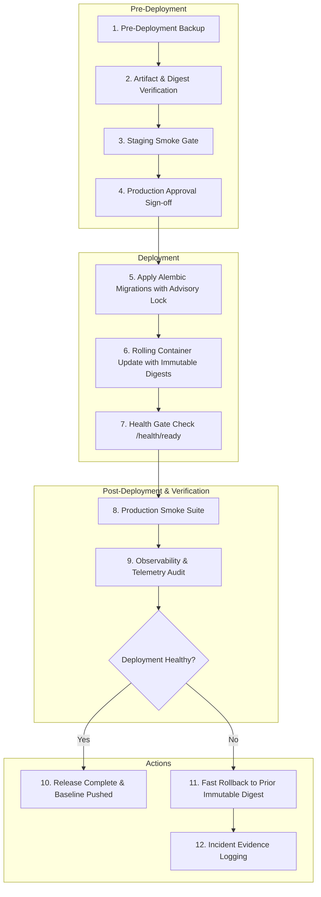

# AegisAI Enterprise — Production Release & Operational Runbook

## 1. Runbook Purpose & Scope

This runbook defines the mandatory step-by-step procedures for deploying, validating, rolling back, and recovering the AegisAI platform in staging and production environments.



---

## 2. Phase 1: Pre-Deployment Verification

### 1. Pre-Deployment Database Backup
Prior to releasing any new code or schema changes, generate an immutable logical/physical snapshot with a cryptographic manifest:

```bash
# On deployment host / database bastion:
python -c "
from app.database.backup_manager import create_backup_manifest
manifest = create_backup_manifest(
    backup_path='/var/backups/aegis_pre_release.sql',
    db_name='aegisai_prod',
    environment='production',
    extra_metadata={'release_tag': 'v1.0.0'}
)
print('Backup created with SHA-256:', manifest['sha256_checksum'])
"
```

### 2. Artifact & Image Digest Verification
Confirm that all deployment container images are built with multi-stage non-root profiles (UID 10001) and have valid cryptographic digests:

```bash
# Verify backend, frontend, and worker image digests
docker inspect --format='{{index .RepoDigests 0}}' aegisai-backend:production
docker inspect --format='{{index .RepoDigests 0}}' aegisai-frontend:production
docker inspect --format='{{index .RepoDigests 0}}' aegisai-worker:production
```

### 3. Staging Smoke Test Gate
Verify that the current release candidate has passed all automated tests in the production-like staging environment:

```bash
# Run staging smoke suite
pytest tests/staging/test_staging_smoke_suite.py -v
```

### 4. Production Approval Sign-off
Obtain formal authorized approval from the Release Lead and Security Lead before proceeding to live production updates.

---

## 3. Phase 2: Deployment Execution

### 5. Schema Migration with Advisory Lock
Apply database schema upgrades. The platform's migration manager acquires PostgreSQL advisory lock `7490001001` to prevent race conditions:

```bash
# Execute schema upgrade inside advisory lock
python -c "
from app.database.session import engine
from app.database.migration_manager import run_migrations_with_lock
result = run_migrations_with_lock(engine, target_revision='head')
print('Migration result:', result)
"
```

### 6. Container Rollout with Immutable Image Digests
Deploy new container definitions to the cluster using immutable digest references:

```bash
# Docker Compose / ECS / Kubernetes rolling update
docker compose -f docker/production/docker-compose.production.yml up -d --no-build
```

### 7. Health Gate & Readiness Verification
Poll readiness endpoints until all replicas report 200 OK:

```bash
# Probe backend readiness
curl -f -k https://localhost/health/ready || exit 1

# Probe API version endpoint
curl -f -k https://localhost/api/v1/version || exit 1
```

---

## 4. Phase 3: Post-Deployment Verification

### 8. Live Smoke Suite Execution
Execute key operational health checks against the live environment:
- Verify user authentication and token refresh.
- Check workspace creation and RBAC permissions.
- Validate background worker queue drainage.
- Confirm document upload and storage path persistence.

### 9. Observability & Telemetry Audit
Monitor Prometheus metrics and structured log streams for 15 minutes post-deployment:
- **Error Rate**: Must remain below 0.1% (`ALERT_ERROR_RATE_THRESHOLD = 0.05`).
- **Queue Depth**: Must remain under 50 items (`ALERT_QUEUE_DEPTH_THRESHOLD = 100`).
- **Stale Workers**: Must report 0 stale worker warnings (`ALERT_STALE_WORKER_THRESHOLD_SECONDS = 60`).

---

## 5. Phase 4: Emergency Rollback Procedure

> [!WARNING]
> In the event of critical application instability, perform an immediate container rollback. **DO NOT** run `alembic downgrade`. AegisAI adheres strictly to the Expand-Contract backward-compatible schema model.

### 1. Fast Container Rollback
Revert the container definitions to the prior immutable image digest:

```bash
# Deploy previous stable digest
export BACKEND_IMAGE="aegisai-backend@sha256:<PREVIOUS_STABLE_DIGEST>"
export FRONTEND_IMAGE="aegisai-frontend@sha256:<PREVIOUS_STABLE_DIGEST>"
export WORKER_IMAGE="aegisai-worker@sha256:<PREVIOUS_STABLE_DIGEST>"

docker compose -f docker/production/docker-compose.production.yml up -d
```

### 2. Verify Restored Stability
Confirm that previous stable containers successfully attach to the existing schema and pass readiness probes:

```bash
curl -f -k https://localhost/health/ready
```

### 3. Incident Evidence Preservation
Preserve log files, metrics snapshots, and failed execution traces for post-mortem analysis:

```bash
tar -czf /var/log/aegis_incident_$(date +%Y%m%d_%H%M%S).tar.gz /var/log/aegis/
```

---

## 6. Phase 5: Disaster Recovery & Database Restoration

In the event of catastrophic data corruption or storage volume failure:

### 1. Verify Backup Checksum & Manifest
```bash
python -c "
from app.database.backup_manager import verify_backup_integrity
report = verify_backup_integrity(
    '/var/backups/aegis_prod_backup.sql',
    '/var/backups/aegis_prod_backup.sql.manifest.json'
)
if not report['valid']:
    raise SystemExit(f'Corrupted backup: {report[\"errors\"]}')
print('Backup verified 100% valid.')
"
```

### 2. Execute Guarded Restore with Explicit Force Confirmation
```bash
python -c "
from app.database.backup_manager import restore_database_with_guard
res = restore_database_with_guard(
    backup_file='/var/backups/aegis_prod_backup.sql',
    manifest='/var/backups/aegis_prod_backup.sql.manifest.json',
    force=True,
    current_environment='production'
)
print('Restore status:', res['status'])
"
```

### 3. Run Post-Restore Multi-Tenant Integrity & Document Reconciliation
```bash
python -c "
from app.database.session import SessionLocal
from app.database.backup_manager import verify_post_restore_integrity
db = SessionLocal()
try:
    report = verify_post_restore_integrity(db, storage_dir='/var/storage')
    print('Integrity status:', report['status'])
    print('Table counts:', report['table_counts'])
    print('Tenant isolation intact:', report['tenant_isolation_intact'])
    print('Document reconciliation:', report['document_reconciliation'])
finally:
    db.close()
"
```
