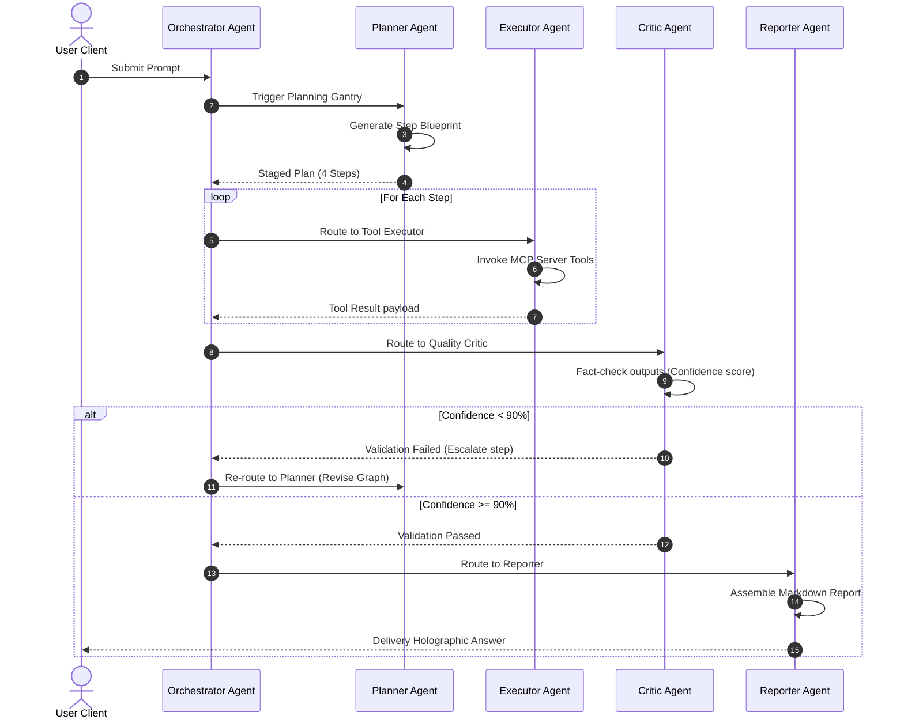

# AegisAI - Multi-Agent Architecture Specification

This document details the LangGraph agent state graph, node execution boundaries, shared context models, and decision flow charts for the **AegisAI** multi-agent cognitive processor.

---

## 1. System Pipeline Flow

The workflow utilizes a linear orchestration pipeline connected to LangGraph state loops:

```
[ User Request ]
       |
       v
+--------------+
| Orchestrator | <----------------------------------+
+--------------+                                    |
       |                                            |
       v                                            | (Escalation / Redirection)
+--------------+                                    |
|   Planner    |                                    |
+--------------+                                    |
       |                                            |
       v                                            |
+--------------+                                    |
|   Research   |                                    |
+--------------+                                    |
       |                                            |
       v                                            |
+--------------+                                    |
|    Memory    |                                    |
+--------------+                                    |
       |                                            |
       v                                            |
+--------------+                                    |
|  Executor    |                                    |
+--------------+                                    |
       |                                            |
       v                                            |
+--------------+                                    |
|    Critic    | -- (Quality Check Fail: Redo) ----+
+--------------+
       | (Quality Check Pass)
       v
+--------------+
|  Reporter    |
+--------------+
       |
       v
[ Final Output ]
```

---

## 2. Agent Node Responsibilities

| Agent Node | Core Responsibility | Input Parameters | Output Parameters |
| :--- | :--- | :--- | :--- |
| **Orchestrator** | Coordinates graph execution and handles system escalation routines. | User Prompt payload | Selected node state |
| **Planner** | Compiles task execution lists and assigns agent actions. | Prompt + Context parameters | Plan structure lists |
| **Research** | Queries local files and external web search APIs. | Selected search queries | Staged documents text |
| **Memory** | Fetches historical threads and stores new context embeds. | Task objectives | Semantic matching data |
| **Tool Executor** | Calls external MCP integration daemons (databases, API). | Tool inputs JSON-RPC | Tool execution outputs |
| **Critic** | Evaluates accuracy and validates safety thresholds. | Staged execution log output | Validation pass boolean |
| **Reporter** | Compiles findings, formatting markdown reports. | Staged outputs | Markdown reports payload |

---

## 3. LangGraph Shared State Schema

AegisAI utilizes a shared, thread-safe state container to exchange data between agent nodes.

### State Fields
- `user_prompt`: `str` (original query)
- `plan_steps`: `List[Dict[str, Any]]` (workflow blueprint list)
- `execution_logs`: `List[Dict[str, Any]]` (tool logs, status codes)
- `context_memories`: `List[str]` (historical context from Memory Vault)
- `search_results`: `List[Dict[str, Any]]` (web query hits)
- `critic_review`: `Dict[str, Any]` (score rating, verification passes)
- `final_markdown`: `str` (assembled response)
- `escalation_level`: `int` (default: `0`, incremented on failure loops)

---

## 4. Multi-Agent Sequence Diagram



---

## 5. Escalation & Error Recovery Rules

To prevent infinite loops within agent execution cycles, AegisAI enforces the following rules:

- **Loop Containment Policy**: If the **Critic** rejects the output of a specific zone more than **3 times**, the **Orchestrator** halts execution, sets `escalation_level = 1`, and generates a fallback response prompting the user to adjust the request schema.
- **MCP Connection Loss**: If an MCP daemon drops offline during execution, the **Executor** raises an exception, the state changes to `failover`, and the **Orchestrator** falls back to using cached results from the **Memory Vault**.
