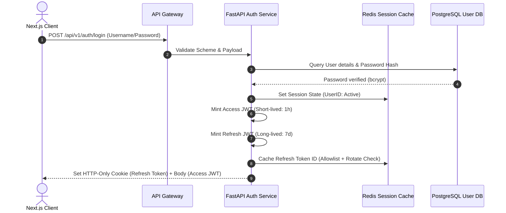

# AegisAI - Authentication & Authorization Architecture

This document specifies the authentication, authorization, token rotation, session management, and credential exchange schemas for **AegisAI**.

---

## 1. Authentication & Token Exchange Flow

AegisAI utilizes stateless **Access Tokens (JWT)** for API request validation, combined with stateful **Refresh Tokens** stored in Redis to enforce security parameters and allow instantaneous session revocation.



---

## 2. Refresh Token Rotation (RTR)

To mitigate token interception risks, AegisAI enforces strict **Refresh Token Rotation (RTR)**:

1. **Exchange**: When the Access JWT expires, the client sends the Refresh Token (from the HTTP-Only cookie) to `/api/v1/auth/refresh`.
2. **Evaluation**:
   - The Auth Service extracts the Refresh Token ID (`jti`) and queries Redis.
   - If the `jti` is valid and active, a new Access JWT and a new Refresh JWT are minted.
   - The old `jti` is marked as **Revoked** in Redis with a short TTL (10 seconds) to tolerate client race conditions.
3. **Replay Attack Detection**:
   - If a client attempts to use a **Revoked** Refresh Token, the Auth Service instantly invalidates **all** active sessions associated with that User ID in Redis. This locks out both the attacker and the victim, forcing a password reset or re-authentication.

---

## 3. JWT Claims Design

### Access Token Claims Schema
```json
{
  "iss": "https://aegisai.enterprise",
  "sub": "usr_90a312f0",
  "aud": "https://api.aegisai.enterprise",
  "exp": 1782800000,
  "nbf": 1782796400,
  "iat": 1782796400,
  "jti": "jwt_access_89f0a221",
  "roles": ["User"],
  "workspace_id": "ws_90f23b12",
  "permissions": ["chat:read", "chat:write", "workflows:run"]
}
```

### Refresh Token Claims Schema
```json
{
  "iss": "https://aegisai.enterprise",
  "sub": "usr_90a312f0",
  "aud": "https://api.aegisai.enterprise",
  "exp": 1783401200,
  "iat": 1782796400,
  "jti": "jwt_refresh_78d10b24"
}
```

---

## 4. Role-Based Access Control (RBAC) Hierarchy

AegisAI enforces a linear role privilege model. Permissions cascade downwards:

```
                  +--------------------------------+
                  |          SUPER ADMIN           |
                  |  - All permissions             |
                  |  - System parameter bypass     |
                  +--------------------------------+
                                  |
                                  v
                  +--------------------------------+
                  |             ADMIN              |
                  |  - Workspace configurations    |
                  |  - Member allocations          |
                  |  - MCP integration credentials  |
                  +--------------------------------+
                                  |
                                  v
                  +--------------------------------+
                  |              USER              |
                  |  - Standard read/write         |
                  |  - Workflow executions         |
                  +--------------------------------+
```

### Permissions Matrix Grid

| Permission Scope | User | Admin | Super Admin |
| :--- | :---: | :---: | :---: |
| `workspace:read` / `workspace:write` | Yes | Yes | Yes |
| `mcp:configure` / `mcp:delete` | No | Yes | Yes |
| `user:provision` / `user:suspend` | No | Yes | Yes |
| `system:bypass` / `system:audit` | No | No | Yes |

---

## 5. Redis Session Storage Structures

Redis functions as the stateful validator for session caches:

### Active User Session Key
- **Format**: `aegis:session:{user_id}:{session_id}`
- **Type**: Hash
- **Fields**:
  - `status`: `active` | `suspended`
  - `ip_address`: `192.168.1.1`
  - `user_agent`: `Mozilla/5.0...`
  - `last_activity`: `1782798200`
- **TTL**: 7 days (matches Refresh Token expiry)

### Revoked Refresh Tokens List
- **Format**: `aegis:revoked_refresh:{jti}`
- **Type**: String
- **Value**: `1`
- **TTL**: Remaining lifetime of the revoked token (up to 7 days)

---

## 6. Security Threat Mitigation Matrix

| Threat | Risk | AegisAI Mitigation Strategy |
| :--- | :--- | :--- |
| **CSRF** | Medium | Refresh Token is placed in a cookie configured with `SameSite=Strict`, `Secure=True`, and `HttpOnly=True`. Access Tokens are passed via the standard `Authorization: Bearer` header. |
| **XSS** | High | Access Tokens are stored in Next.js memory context (local state variables), preventing script access. The API Gateway enforces strict Content Security Policies (CSP). |
| **Replay Attacks** | High | Enforces **Refresh Token Rotation (RTR)**. Using a used refresh token triggers session termination for all active sessions of that user. |
| **Brute Force** | Medium | Redis-backed rate limiter limits login attempts to 5 per 15 minutes per IP/Username. Suspended login locks out the user. |
