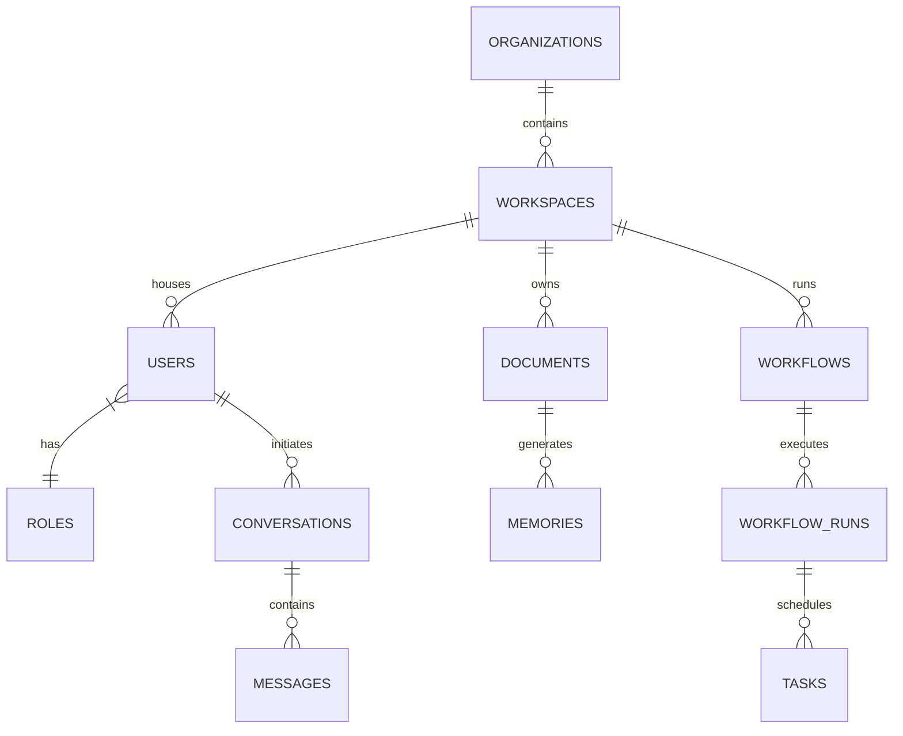

# AegisAI - Database Architecture Specification

This document details the database schema design, index structures, primary key strategies, and entity relationship diagrams for **AegisAI**.

---

## 1. Entity Relationship Diagram (ERD)

---

## 2. Table Specifications

All primary keys use **UUIDv4** to prevent sequential resource exposure and enable distributed ID generation.

### Users Table (`users`)
- **id**: `UUID` (Primary Key)
- **organization_id**: `UUID` (Foreign Key -> `organizations.id`)
- **role_id**: `UUID` (Foreign Key -> `roles.id`)
- **email**: `VARCHAR(255)` (Unique, Indexed)
- **username**: `VARCHAR(50)` (Unique, Indexed)
- **password_hash**: `VARCHAR(255)` (Not Null)
- **is_active**: `BOOLEAN` (Default: `True`)
- **is_deleted**: `BOOLEAN` (Default: `False`, Soft Delete indicator)
- **created_at**: `TIMESTAMP WITH TIME ZONE`
- **updated_at**: `TIMESTAMP WITH TIME ZONE`

### Workspaces Table (`workspaces`)
- **id**: `UUID` (Primary Key)
- **organization_id**: `UUID` (Foreign Key -> `organizations.id`)
- **name**: `VARCHAR(100)` (Not Null)
- **slug**: `VARCHAR(100)` (Unique, Indexed)
- **is_active**: `BOOLEAN` (Default: `True`)
- **created_at**: `TIMESTAMP WITH TIME ZONE`

### Conversations Table (`conversations`)
- **id**: `UUID` (Primary Key)
- **workspace_id**: `UUID` (Foreign Key -> `workspaces.id`)
- **user_id**: `UUID` (Foreign Key -> `users.id`)
- **title**: `VARCHAR(255)` (Default: `New Conversation`)
- **is_deleted**: `BOOLEAN` (Default: `False`)
- **created_at**: `TIMESTAMP WITH TIME ZONE`

### Messages Table (`messages`)
- **id**: `UUID` (Primary Key)
- **conversation_id**: `UUID` (Foreign Key -> `conversations.id`)
- **sender_type**: `VARCHAR(50)` (e.g., `user` | `agent` | `system`)
- **sender_id**: `UUID` (Nullable, user_id or agent_id)
- **content**: `TEXT` (Not Null)
- **tokens_used**: `INTEGER` (Default: `0`)
- **created_at**: `TIMESTAMP WITH TIME ZONE`

### Documents Table (`documents`)
- **id**: `UUID` (Primary Key)
- **workspace_id**: `UUID` (Foreign Key -> `workspaces.id`)
- **name**: `VARCHAR(255)` (Not Null)
- **file_path**: `VARCHAR(512)` (Not Null)
- **file_size**: `INTEGER`
- **mime_type**: `VARCHAR(100)`
- **created_at**: `TIMESTAMP WITH TIME ZONE`

### Memories Table (`memories`)
- **id**: `UUID` (Primary Key)
- **document_id**: `UUID` (Foreign Key -> `documents.id`, Nullable)
- **workspace_id**: `UUID` (Foreign Key -> `workspaces.id`)
- **content**: `TEXT` (Not Null)
- **embedding_id**: `UUID` (Linked to Qdrant vector index ID)
- **created_at**: `TIMESTAMP WITH TIME ZONE`

### Workflows Table (`workflows`)
- **id**: `UUID` (Primary Key)
- **workspace_id**: `UUID` (Foreign Key -> `workspaces.id`)
- **name**: `VARCHAR(100)` (Not Null)
- **description**: `TEXT`
- **definition**: `JSONB` (Stores nodes configuration graph)
- **created_at**: `TIMESTAMP WITH TIME ZONE`

### Workflow Runs Table (`workflow_runs`)
- **id**: `UUID` (Primary Key)
- **workflow_id**: `UUID` (Foreign Key -> `workflows.id`)
- **status**: `VARCHAR(50)` (e.g., `running` | `completed` | `failed`)
- **started_at**: `TIMESTAMP WITH TIME ZONE`
- **ended_at**: `TIMESTAMP WITH TIME ZONE`

### Audit Logs Table (`audit_logs`)
- **id**: `UUID` (Primary Key)
- **user_id**: `UUID` (Foreign Key -> `users.id`, Nullable)
- **action**: `VARCHAR(100)` (Indexed)
- **ip_address**: `VARCHAR(45)`
- **payload**: `JSONB` (Stores changes metadata diff)
- **created_at**: `TIMESTAMP WITH TIME ZONE`

---

## 3. Performance & Indexing Strategy

### B-Tree Indexes
- Standard lookup columns (`users.email`, `users.username`, `workspaces.slug`) use standard B-Tree indexes to optimize lookup speeds.
- Foreign keys (`messages.conversation_id`, `conversations.workspace_id`) are indexed to speed up join operations.

### Partial Indexes
- Enforced on soft-deleted tables to filter out deleted rows:
  - `CREATE INDEX idx_users_active ON users (email) WHERE is_deleted = FALSE;`

### JSONB Indexes
- GIN indexes are configured on JSONB definition parameters to allow fast nested queries inside configuration files:
  - `CREATE INDEX idx_workflows_def ON workflows USING gin (definition);`
