# AegisAI - Deployment & Operations Architecture

This document specifies the container layout, networking topologies, monitoring metrics, CI/CD blueprints, and recovery plans for **AegisAI** in a cloud production environment.

---

## 1. Network & Container Topology

AegisAI is deployed inside a VPC (Virtual Private Cloud) using isolated subnet policies. Direct access to data storage services is restricted to internal servers.

```mermaid
graph TD
    A[Client Traffic: HTTPS/WSS] -->|VPC Internet Ingress| B(Nginx Reverse Proxy)
    B -->|Route /api/* | C[FastAPI Server Cluster]
    B -->|Route /* | D[Next.js Static Server]
    C -->|gRPC/REST| E[Qdrant Cluster]
    C -->|SQL Queries| F[(PostgreSQL RDS)]
    C -->|Task Publish| G[Redis Message Broker]
    G -->|Worker Queue| H[Celery Agent Workers]
    H -->|MCP JSON-RPC| I[MCP Sandbox Containers]
    
    style B fill:#1e293b,stroke:#00f0ff,stroke-width:2px;
    style F fill:#0f172a,stroke:#10b981,stroke-width:2px;
```



---

## 2. Container Manifest Strategy

The deployment separates the system into independent container profiles:

| Container Profile | Base OS Image | Core Services Host | Scaling Rules |
| :--- | :--- | :--- | :--- |
| **`aegis-frontend`** | `node:20-alpine` | Serves Next.js statically compiled files. | Autoscaling triggered when CPU reaches 70%. |
| **`aegis-backend`** | `python:3.12-slim` | Runs Uvicorn worker threads to serve REST APIs. | Autoscaling triggered when CPU reaches 75%. |
| **`aegis-worker`** | `python:3.12-slim` | Runs LangGraph execution loops. | Scaled horizontally based on Celery queue length. |
| **`mcp-sandboxes`** | `docker:dind` | Houses external tool connectors in isolated execution runtimes. | Scale on-demand dynamically. |

---

## 3. CI/CD Release Pipeline

Continuous integration and delivery are orchestrated via GitHub Actions:

```
[ Git Push to main ]
         |
         v
[ Static Analysis ] -------> Lints Python code via Ruff/Black, and TypeScript via ESLint.
         |
         v
[ Unit & API Tests ] ------> Runs Pytest testing suites inside temporary database containers.
         |
         v
[ Container Build ] -------> Builds multi-stage Docker images and pushes to Amazon ECR.
         |
         v
[ Deployment Roll ] -------> Executes rolling updates to Kubernetes (EKS) pods
                             with a maximum surge parameter of 25%.
```

---

## 4. Monitoring & Telemetry

Production health metrics are gathered using the standard **Prometheus & Grafana** stack:

- **Metrics Scraped**:
  - API HTTP latency (99th percentile targeting < 200ms).
  - LangGraph task queue lag (Celery pending task latency).
  - Qdrant query response latencies and memory usage.
  - Active WebSocket count and thread connections.
- **Log Aggregation**: Application stdout/stderr are piped into ELK (Elasticsearch/Logstash/Kibana) or AWS CloudWatch containers for central search and alert warnings.

---

## 5. Backup & Disaster Recovery (DR)

- **PostgreSQL Database**: Configured in a Multi-AZ replica model. Daily snapshot backups are retained for 30 days with point-in-time recovery (PITR) up to 5 minutes.
- **Qdrant Vector Storage**: Snapshot files are captured hourly and copied to secure AWS S3 buckets.
- **RTO / RPO Targets**: Recovery Time Objective (RTO) is under 2 hours; Recovery Point Objective (RPO) is under 15 minutes.
