# AegisAI - Model Context Protocol (MCP) Architecture

This document details the Model Context Protocol (MCP v1) integration design, JSON-RPC communication channels, credential validation systems, and connection manager specs for **AegisAI**.

---

## 1. MCP Gateway Architecture

AegisAI communicates with local and external utility systems through a standardized **MCP Gateway Layer**. This layer translates LLM agent requests into JSON-RPC messages and routes them to target MCP daemons.

```mermaid
graph TD
    A[LangGraph Agent Engine] -->|Request Tool Call| B[MCP Gateway Engine]
    B -->|Check Access Control| C{Permission Model}
    C -->|Authorized| D[JSON-RPC Client Manager]
    C -->|Unauthorized| E[Raise Auth Exception]
    D -->|Local Host Socket| F[Local MCP Server: Filesystem]
    D -->|Secure HTTP / WS| G[External MCP Server: Slack, GitHub, Database]
    
    style C fill:#1e293b,stroke:#00f0ff,stroke-width:2px;
    style G fill:#0f172a,stroke:#10b981,stroke-width:2px;
```



---

## 2. Integrated MCP Server Specs

AegisAI connects to a preset suite of tools using the MCP schema structure:

| Server | Core Capabilities | Authentication Pattern | Security Isolation |
| :--- | :--- | :--- | :--- |
| **GitHub** | Read files, PR checkouts, repository scans. | OAuth Personal Token (OAuth2) | Restrained to target workspace repo scopes. |
| **Filesystem** | Local project directory reads & sandboxed compilations. | API Keys / Session Tokens | Isolated under Docker container workspaces. |
| **Google Drive / Gmail** | File imports, email notification dispatches. | OAuth2 user handshake | Limited read/write scopes. |
| **Slack / Discord** | Status alerts, team notifications. | Bot Token (OAuth2) | Allowed only inside configured workspace channels. |
| **Database** | PostgreSQL database audits, execution log searches. | Secure SSL Certificate DB User | Limited SQL permission scopes (Read-Only). |

---

## 3. Communication Protocol (JSON-RPC)

All interactions between the AegisAI Agent Engine and MCP servers use standard **JSON-RPC 2.0** over WebSockets or Stdio pipes:

### Tool Discovery (Client Request)
```json
{
  "jsonrpc": "2.0",
  "method": "tools/list",
  "params": {},
  "id": 1
}
```

### Tool Discovery (Server Response)
```json
{
  "jsonrpc": "2.0",
  "result": {
    "tools": [
      {
        "name": "filesystem_read",
        "description": "Reads raw contents of local files inside the sandbox.",
        "inputSchema": {
          "type": "object",
          "properties": {
            "path": {"type": "string"}
          },
          "required": ["path"]
        }
      }
    ]
  },
  "id": 1
}
```

---

## 4. Permission Model & Security Controls

To protect system integrity, the MCP gateway enforces a strict permission model:

- **Explicit User Approval**: Any tool execution involving data deletion or database write operations requires the Orchestrator Agent to pause execution, prompt the user for validation, and wait for confirmation.
- **Connection Sanitization**: Tool parameters undergo strict schema verification to prevent command execution bypasses (e.g., preventing directory traversal inside filesystem tools).
- **Graceful Failures**: If an MCP connection fails, the Connection Manager retries **3 times** with exponential backoff (e.g., 200ms, 400ms, 800ms). If it still fails, it falls back to a degraded state, logging the error and notifying the agent.
