# AegisAI - Memory Architecture Specification

This document details the multi-tiered memory engine, semantic chunking pipelines, vector indexing designs, and context ranking algorithms for **AegisAI**.

---

## 1. Multi-Tier Memory Layout

AegisAI divides memory into distinct logical and physical storage spaces to balance low latency retrieval with permanent semantic recall:

```
+---------------------------------------------------------------------------------+
|                                 USER INPUT                                      |
+---------------------------------------------------------------------------------+
                                         |
                                         v
+---------------------------------------------------------------------------------+
|                     WORKING MEMORY (LangGraph Thread State)                     |
|  - Retains local variables, steps, plans during execution.                     |
|  - Lifetime: Duration of a single query run.                                    |
+---------------------------------------------------------------------------------+
                                         |
                                         v
+---------------------------------------------------------------------------------+
|                      SESSION MEMORY (Redis Key-Value Cache)                     |
|  - Caches user preferences, current chat thread session state attributes.       |
|  - Lifetime: Active connection session (TTL: 24h).                              |
+---------------------------------------------------------------------------------+
                                         |
                                         v
+------------------------------------+   +----------------------------------------+
|   CONVERSATION HISTORY (PostgreSQL) |   |        SEMANTIC MEMORY (Qdrant)        |
|  - Stores exact message logs.      |   |  - Embeds chunks of documents, chats.  |
|  - Lifetime: Permanent.            |   |  - Lifetime: Permanent.                |
+------------------------------------+   +----------------------------------------+
```

---

## 2. Semantic Chunking & Embedding Generation

Documents and conversation logs are processed through a standardized pipeline before vector index write operations:

```
[ Raw Document Text ]
         |
         v
[ Semantic Chunking ] ------> Splits text by structural boundaries (e.g. Markdown headers)
         |                    with a maximum size of 512 tokens and 10% overlap.
         v
[ Embedding Model ] --------> Passes chunks to embedding models (e.g. text-embedding-3-small)
         |                    generating 1536-dimension vectors.
         v
[ Index Write ] ------------> Saves vectors to Qdrant, referencing original workspace IDs.
```

---

## 3. Retrieval & Ranking Pipeline

When a user submits a query, AegisAI uses a dual-engine retrieval pipeline to gather relevant context:

```mermaid
graph TD
    A[User Query] --> B[Qdrant Semantic Search]
    A --> C[PostgreSQL History Lookup]
    B -->|Cosine Similarity| D[Raw Semantic Chunks]
    C -->|Timestamp Sort| E[Raw History logs]
    D --> F[Reciprocal Rank Fusion - RRF]
    E --> F
    F -->|Filter Metadata| G[Context Builder]
    G -->|Limit Context Window| H[Agent Injection Prompt]
    
    style F fill:#1e293b,stroke:#00f0ff,stroke-width:2px;
    style H fill:#111827,stroke:#10b981,stroke-width:2px;
```



---

## 4. Memory Consolidation & Compression

To prevent context window bloat and reduce token usage, AegisAI runs background memory consolidation routines:

- **Memory Compression**: Conversations extending past **10 turns** are summarized by a background utility, creating a singular semantic "Memory Crystal" that replaces the raw chat text in Qdrant.
- **Memory Expiration**: Session parameters in Redis expire after **24 hours** of inactivity, forcing cache eviction. Relational databases in PostgreSQL retain full records for auditing, but are flagged in vector spaces to prevent redundant similarity lookups.
- **Memory Consolidation**: Runs automated cron tasks to cluster memory indexes, merging overlapping nodes into unified context blocks.
