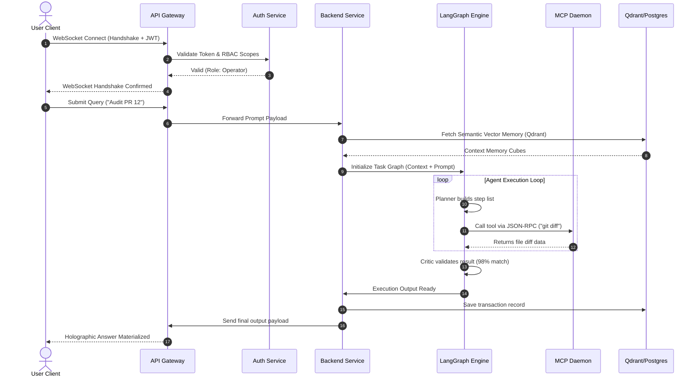

# AegisAI Enterprise System Architecture Specification

This document details the high-level system architecture for **AegisAI**, a multi-agent AI Operating System. This document serves as the architectural reference for deployment, service orchestration, security enforcement, and database schemas.

---

## 1. Overall System Architecture

The AegisAI system is organized into a layered, decoupling-first architecture. This design guarantees clear separations of concern, scalability of compute, and security containment.

```
                  +-----------------------------------------+
                  |               USER CLIENT               |
                  |     (React / Next.js / TypeScript)     |
                  +-----------------------------------------+
                                       |
                                       v  [HTTPS / WSS]
                  +-----------------------------------------+
                  |               API GATEWAY               |
                  |              (Nginx/Ingress)            |
                  +-----------------------------------------+
                                       |
                                       v
                  +-----------------------------------------+
                  |           AUTHENTICATION LAYER          |
                  |             (JWT / RBAC / Redis)        |
                  +-----------------------------------------+
                                       |
                                       v
                  +-----------------------------------------+
                  |            BUSINESS SERVICES            |
                  |       (FastAPI Core / Workflows)        |
                  +-----------------------------------------+
                                       |
                                       v  [Celery Task / gRPC]
                  +-----------------------------------------+
                  |             AI AGENT ENGINE             |
                  |         (LangGraph / Orchestrator)      |
                  +-----------------------------------------+
                                       |
                                       v  [MCP Spec v1]
                  +-----------------------------------------+
                  |         MODEL CONTEXT PROTOCOL (MCP)    |
                  |          (Local & External Daemons)     |
                  +-----------------------------------------+
                                       |
                                       v
                  +-----------------------------------------+
                  |                DATA LAYER               |
                  |    (PostgreSQL / Redis / Qdrant)        |
                  +-----------------------------------------+
```

### Layer Responsibilities

| Layer | Component | Core Responsibility |
| :--- | :--- | :--- |
| **Presentation** | Next.js Client | Serves the user interface, renders real-time workspace canvas updates, and maintains persistent WebSocket streams for console execution logs. |
| **Gateway** | Nginx / Ingress | Terminates TLS, rate-limits incoming connections, handles CORS policy headers, and routes traffic based on URL scopes. |
| **Security** | Authentication Service | Validates JWT signatures, parses RBAC claims, manages refresh tokens storage, and controls access policies. |
| **Business Logic** | FastAPI Services | Manages user document staging, analytics records compilation, workspace creation, and triggers execution workflows. |
| **Cognitive** | LangGraph Engine | Manages multi-agent execution loops, handles Planner/Critic state graphs, and triggers tool execution. |
| **Integrations** | MCP Gateway | Standardizes tool bindings, parses tool calls into JSON-RPC messages, and monitors external daemon status. |
| **Persistence** | Data Tier | PostgreSQL (transaction records), Redis (session cache, locks), Qdrant (semantic vector embeddings). |

---

## 2. Request Lifecycle

The request lifecycle represents the end-to-end execution pathway of a user query within AegisAI:

1. **Ingest**: The client submits a prompt over WebSocket. The API Gateway routes the payload, verifying TLS integrity.
2. **Authenticate & Authorize**: The request intercepts the authorization handler. JWT token validity is checked; RBAC parameters verify that the user's role has execution authority in the target workspace.
3. **Parse & Store**: The request payload is stored in PostgreSQL as an audit transaction. Concurrently, a message is published to Redis to lock the user session state.
4. **Context Enrichment**: The Memory Engine extracts semantic embeddings of the query, performs a vector search against Qdrant, retrieves historical context, and injects it into the query container.
5. **Planning & Graph Generation**: LangGraph starts the workflow loop. The **Planner Agent** breaks the prompt into sequential execution blocks and compiles a workflow blueprint.
6. **Integration Execution**: For each step in the blueprint, if external actions are needed, the **MCP Gateway** executes JSON-RPC calls to the appropriate MCP daemons (e.g., fetching a file via Git, updating Slack, query database).
7. **Execution**: The **Executor Agent** executes run routines inside safe sandboxed parameters.
8. **Quality Validation**: The output goes to the **Critic Agent** which runs hallucination detection and compares results against user guidelines.
9. **Dispatch**: The final response is saved in PostgreSQL, cached in Redis, and pushed to the Next.js client over WebSocket.

---

## 3. Component Responsibilities

### Frontend
- **State Management**: Controls local UI updates and buffers WebSocket lines.
- **Security Storage**: Retains access tokens in local memory space (avoiding storage inside vulnerable localStorage parameters) and uses Secure/HttpOnly cookies for refresh keys.

### Backend (FastAPI Core)
- **Route Handlers**: Exposes REST interfaces and orchestrates workflow execution.
- **Resource Management**: Integrates SQLAlchemy connection pools to database configurations.

### Agent Engine (LangGraph)
- **State Management**: Restores execution checkpoints, coordinates multi-agent graphs, and implements loop breakers.

### Memory Engine (Qdrant & ChromaDB)
- **Index Management**: Handles metadata filters, similarity metrics, and index updates.

### MCP Integration Layer
- **JSON-RPC Engine**: Implements the Model Context Protocol v1 specifications, standardizing tool capabilities.

---

## 4. Communication Flow



---

## 5. Security Architecture

### Authentication & Authorization
- **Refresh Token Rotation**: Uses HTTP-Only cookies with rotation limits to prevent replay hijacks.
- **Role-Based Access Control (RBAC)**: Validates permissions at the router layer using custom decorators:
  - `User`: Standard read/write operations.
  - `Admin`: Configures MCP credentials and coordinates workspace members.
  - `Super Admin`: Controls system environment limits and bypass registers.

### Secrets Management
- All database credentials, LLM API keys, and MCP integration keys are stored in Vault configurations and resolved at runtime as environment parameters.

### Rate Limiting & Input Validation
- Nginx blocks brute force requests.
- Pydantic validates input schemas, protecting the system from SQL and code injection.

---

## 6. Scalability Architecture

### Horizontal Scaling
- **Stateless Application Servers**: FastAPI and LangGraph nodes maintain no local session state.
- **Celery Tasks Queue**: Distributes long-running agent loops to concurrent worker pools.

### Caching Strategy
- **Session Cache**: Session attributes are stored in Redis.
- **Model Result Cache**: LLM queries and semantic responses are cached to reduce latency and token usage.

---

## 7. Reliability & Resilience

```mermaid
graph TD
    A[Client Request] --> B{API Gateway}
    B -->|Route| C[FastAPI Core]
    C -->|Orchestrate| D{Circuit Breaker}
    D -->|Closed| E[LangGraph Workers]
    D -->|Open / Fallback| F[Degraded Response Engine]
    E -->|Execute Tool| G[MCP Daemon]
    E -->|Write Transaction| H[(PostgreSQL)]
    
    style D fill:#1e293b,stroke:#00f0ff,stroke-width:2px;
    style F fill:#3b1e1e,stroke:#ff3b30,stroke-width:2px;
```



- **Retry Policies**: Backed by exponential jitter rates.
- **Circuit Breakers**: Disconnects slow/downstream integrations, falling back gracefully to offline state modes.
- **Health Indicators**: Real-time endpoints (`/health/live`, `/health/ready`) track performance and connectivity.

---

## 8. Design Decisions

| Decision | Selected Approach | Alternatives Considered | Trade-offs & Rationale |
| :--- | :--- | :--- | :--- |
| **Agent Framework** | LangGraph | LangChain / AutoGen | LangGraph is chosen for its capability to design custom, cyclical graphs, which are necessary for complex multi-agent execution loops. |
| **Vector Indexing** | Qdrant | pgvector | Qdrant provides advanced filtering capabilities and scales independently of the relational database layer. |
| **Agent Tool Sync** | MCP Spec v1 | Custom REST APIs | The Model Context Protocol standardizes tool definitions and allows the system to easily connect to new integrations. |
