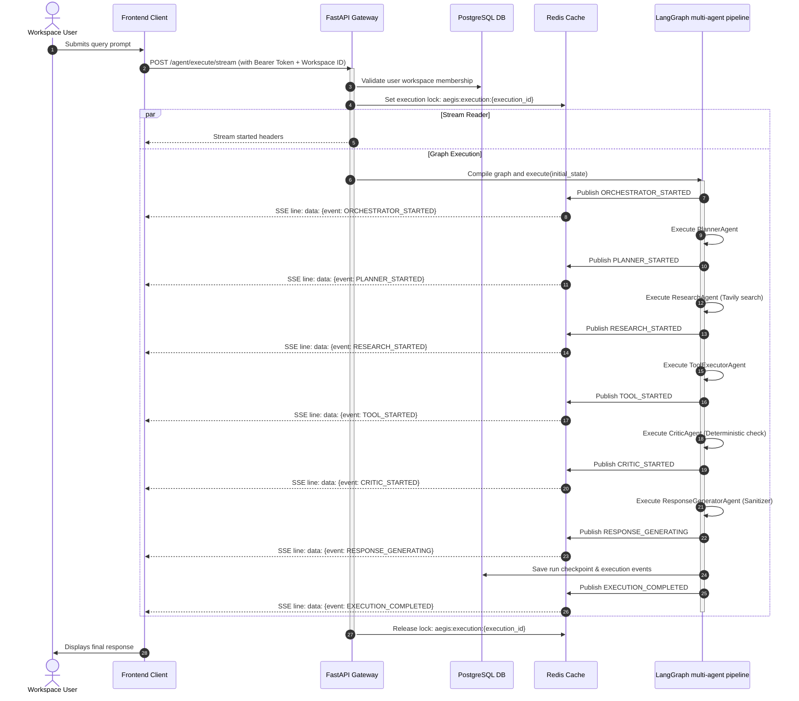

# End-to-End Execution Flow

This document maps out the sequence trace of a user query submitted from the workspace chat through backend orchestration nodes down to streaming SSE results.

---

## 1. Trace Diagram

---

## 2. Cancellation Event Flow
1. User presses **STOP** in the UI.
2. Frontend dispatches `POST /agent/executions/{id}/cancel`.
3. Backend registers signal `aegis:cancel:{id}` inside Redis.
4. Next node evaluates the lock. If cancelled, it halts executions and publishes `EXECUTION_CANCELLED` to the client.

---

## 3. Human Confirmation Flow
1. Tool Executor requires confirmation for a high-risk tool execution.
2. Backend returns `WAITING_FOR_CONFIRMATION` event with a one-time token.
3. Frontend shows confirmation overlay (Approve/Deny).
4. User clicks **Approve**, sending `POST /agent/executions/{id}/confirm` containing the token.
5. Backend verifies token, executes tool, and resumes.
