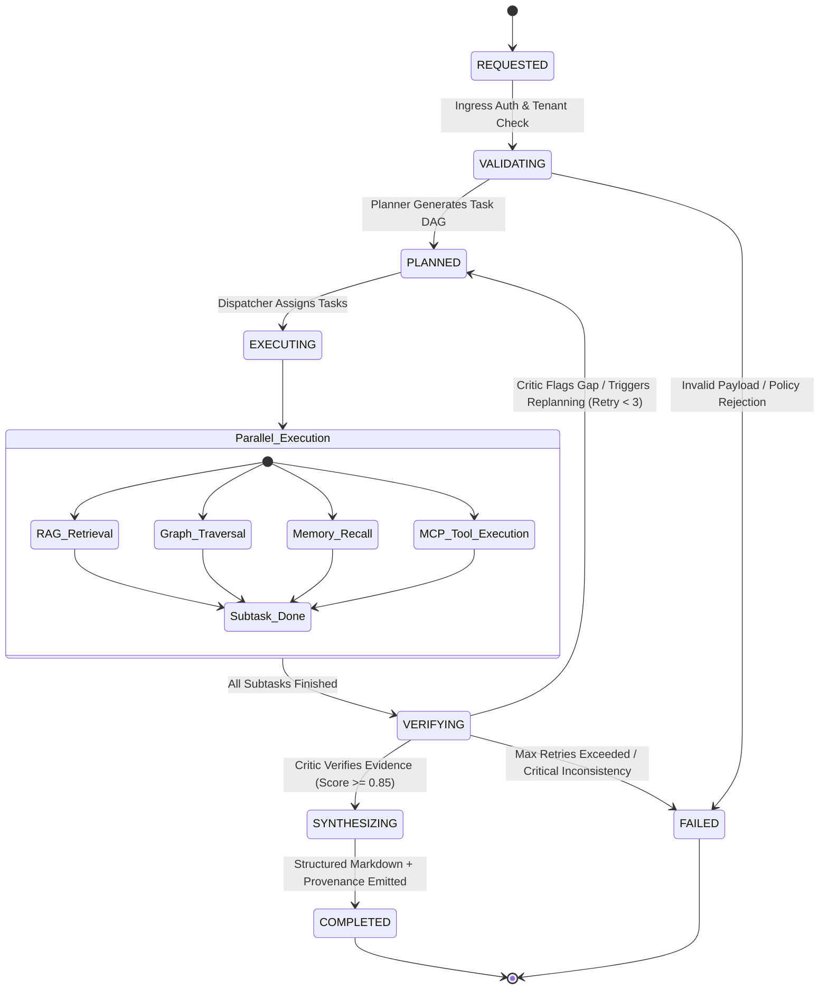

# Multi-Agent Architecture & Coordination Engine

## 1. Overview

AegisAI employs a modular, state-driven multi-agent architecture where complex enterprise requests are decomposed into discrete, verified tasks executed by specialized autonomous agents. The coordination engine guarantees deterministic state progression, cyclic evidence validation, and comprehensive execution provenance.

---

## 2. Canonical 9-Agent Workforce

| Agent | Module Path | Primary Role | Inputs | Outputs |
| :--- | :--- | :--- | :--- | :--- |
| **1. Orchestrator** | `app.core.platform.intelligence.engine` | Root supervisor, lifecycle state manager, and agent-to-agent dispatcher. | User Query, Session State, Tenant Policy | Coordinated Execution Stream, Final Response Payload |
| **2. Planner** | `app.core.platform.intelligence.planner` | Deconstructs unstructured queries into structured Directed Acyclic Graphs (DAGs) of subtasks. | Query, Available Agents, Registered MCP Tools | Ordered Task Plan with Dependencies & Routing Rules |
| **3. Research** | `app.core.agents.research` | Gathers external and contextual information across configured endpoints. | Query, Research Criteria | Raw Information Synthesis & Fact Candidates |
| **4. Memory** | `app.services.memory.memory_service` | Manages working memory recall and long-term vector semantic embeddings. | Session ID, Query Vector, Workspace ID | Ranked Historical Memory Context & Entity Facts |
| **5. Enterprise RAG** | `app.services.rag_service` | Executes dense vector search across ingested tenant documents (PDF, DOCX, TXT, MD). | Query Vector, Top-K, Workspace ID | Ranked Document Chunks with Line Numbers & Page Offsets |
| **6. Graph Reasoning** | `app.services.knowledge_graph.graph_service` | Traverses entity-relation triples to resolve multi-hop relational dependencies. | Target Entity, Relationship Types, Max Hops (1-3) | Subgraph Triples & BFS Shortest Path Proofs |
| **7. Tool Executor** | `app.services.mcp.mcp_tool_service` | Dispatches validated tool calls to external Model Context Protocol (MCP) servers. | Tool Name, Validated JSON Arguments, Sandbox Constraints | Raw Tool Response & Normalized Execution Artifacts |
| **8. Critic** | `app.core.agents.critic` | Performs semantic fact-checking and hallucination detection against retrieved sources. | Candidate Answers, Evidence Chunks, Graph Triples | Factuality Score (0.0–1.0), Consistency Report, Critique |
| **9. Synthesizer** | `app.core.agents.response_generator` | Combines verified evidence into clean, formatted markdown with interactive citation footnotes. | Verified Findings, Citations List, User Format Preferences | Final Markdown Document with Footnote References |

---

## 3. Agent Coordination & Execution Lifecycle

### 3.1 Step 1: Ingress & Validation (`REQUESTED` → `VALIDATING`)
When a request arrives at `/api/v1/platform/execute`:
1. Tenant context is extracted from the verified JWT claim (`workspace_id`).
2. Dual-tier RBAC rules ensure the user has sufficient permissions for multi-agent execution (`workspace:read` / `agent:execute`).
3. Payload parameters (e.g., `model_preference`, `confidence_threshold`, `temperature`) are validated against platform boundaries.

### 3.2 Step 2: Planning & Task Decomposition (`VALIDATING` → `PLANNED`)
The **Planner Agent** parses the intent:
- Determines if the request is a single-step factual lookup, a multi-step analytical reasoning task, an MCP tool execution, or a workflow trigger.
- Generates a task plan containing:
  - `task_id`: Unique identifier.
  - `agent_target`: Name of the specialized agent responsible.
  - `dependencies`: List of prerequisites (e.g., Task 3 depends on Task 1 and Task 2).
  - `parameters`: Formatted arguments for the subtask.

### 3.3 Step 3: Parallel Execution & Dispatch (`PLANNED` → `EXECUTING`)
The **Orchestrator** schedules independent tasks concurrently via Python `asyncio.gather()`:
- RAG searches run in parallel with Knowledge Graph traversals.
- Long-term memory embeddings are queried concurrently with MCP tool checks.
- Execution steps emit real-time SSE events (`step_started`, `step_progress`, `step_completed`) to the connected frontend client.

### 3.4 Step 4: Verification & Critic Loop (`EXECUTING` → `VERIFYING`)
Once all parallel subtasks complete:
- The **Critic Agent** evaluates the collective findings against the original query:
  - Verifies that claims made in intermediate notes correspond to extracted RAG chunks or Graph triples.
  - Computes a factuality confidence score.
- **Decision Logic**:
  - If `confidence_score >= 0.85`: Proceed to Synthesis.
  - If `confidence_score < 0.85` and `retry_count < 3`: Formulate a critique and re-dispatch targeted research tasks to fill identified gaps.
  - If `retry_count >= 3`: Fall back to a conservative synthesis acknowledging partial evidence.

### 3.5 Step 5: Synthesis & Citation Delivery (`VERIFYING` → `COMPLETED`)
The **Response Synthesizer**:
- Formats the final answer into structured Markdown with headings, tables, and bullet points.
- Attaches verbatim citation markers referencing original document sources (e.g., `[Doc: Security_Policy.pdf, Page 4]`).
- Appends execution provenance metadata detailing the execution duration, agent chain, and token utilization.

---

## 4. Fault Tolerance & Recovery Mechanisms

1. **Subprocess Sandboxing**: If an MCP tool execution fails or times out (default: 30s), the Tool Executor captures the error without terminating the entire agent pipeline.
2. **Circuit Breaking**: If an external LLM provider returns a 429 or 503 error, the platform automatically fails over to the configured secondary provider (e.g., from primary cloud model to local Ollama fallback).
3. **Deadlock Prevention**: The Planner validates all generated task DAGs for circular dependencies using Kahn's algorithm before dispatch.
4. **State Persistence**: Execution states and intermediate artifacts are periodically flushed to Redis, allowing resumes in the event of worker restarts.

---

## 5. Verification & Test Coverage

The multi-agent architecture is verified by **245 dedicated backend unit and integration tests** located in:
- `backend/tests/unit/test_platform_execution.py`
- `backend/tests/unit/test_platform_intelligence_integration.py`
- `backend/tests/unit/test_platform_e2e_hardening.py`
- `backend/tests/unit/test_agent_*.py`
