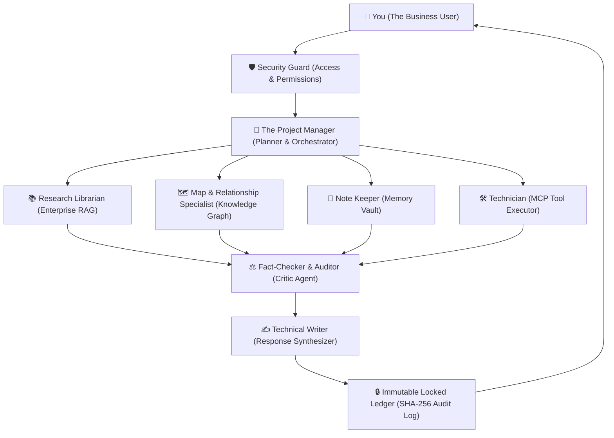

# AegisAI — Simple Architecture Guide for Non-Technical Stakeholders

## 💡 What is AegisAI in Simple Terms?

Think of **AegisAI** as a high-security, intelligent digital operating system for businesses. 

Most AI systems today are like isolated chatbots—you type a question, and they guess an answer based only on what they remember from their training data. They cannot securely look up your company's private documents, remember past interactions, safely operate external software tools, or prove where they got their answers.

**AegisAI works like a coordinated, professional team inside a secure company:**

---

## 🏢 The Team Analogy

---

## 🧩 The Core Components Explained Simply

| Component | Analogy | What It Does for the Business |
| :--- | :--- | :--- |
| **Multi-Agent Engine** | **The Project Team** | Instead of one person trying to do everything, a team of 9 specialists works together to plan, research, verify, and write. |
| **Contextual Memory** | **The Company Notebook** | Remembers user preferences, project background, and past discussions so you never have to repeat yourself. |
| **Enterprise RAG** | **The Research Library** | Securely reads private company PDFs, Word documents, and policies to extract exact facts with page numbers. |
| **Knowledge Graph** | **The Relationship Map** | Understands how people, departments, systems, and rules connect to each other across the entire organization. |
| **Model Context Protocol (MCP)**| **The Tool Handlers** | Allows the AI to safely interact with databases and enterprise APIs through standardized, sandboxed adapters. |
| **Human Approval Gates** | **The Manager's Signature** | If the AI needs to make a high-risk action (like updating a database or making a payment), it pauses and asks a human manager to approve first. |
| **Visual Workflow Studio** | **The Automated Assembly Line** | A visual drag-and-drop tool that allows non-programmers to build automated multi-step AI processes. |
| **Cryptographic Audit Ledger** | **The Tamper-Proof Black Box** | Records every single decision, agent action, and data access in a permanent, cryptographically sealed record that cannot be secretly altered. |

---

## 🔒 Why Is It Safe for Enterprise Use?

1. **Your Data Stays Isolated**: Tenant boundaries ensure Company A can never see or search Company B's information.
2. **No Blind Trust / No Hallucinations**: Every fact is cross-checked by our Critic Agent before you see the final answer.
3. **Full Auditability**: If someone asks *"Why did the AI make this decision last Tuesday?"*, you can inspect the exact source documents, agent steps, and timestamps in the audit trail.
