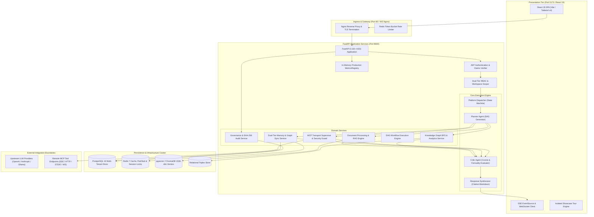

# AegisAI — Technical Architecture & Runtime Subsystem Specification

## 1. System Topology & Process Boundaries

---

## 2. Component Responsibility & Communication Protocols

### 2.1 Ingress & Security Boundary
- **Transport**: HTTPS (TLS 1.3), WSS, and HTTP Server-Sent Events (SSE).
- **Authentication Protocol**: Bearer JWT signed via `HS256` with 30-minute expiration. Refresh tokens stored hashed in PostgreSQL with 7-day expiration.
- **Tenant Scoping**: All service calls pass an immutable `tenant_context` object populated by `AuthMiddleware`.

### 2.2 Execution Engine & Multi-Agent Dispatcher
- **State Machine Transitions**:
  $$\text{REQUESTED} \longrightarrow \text{VALIDATING} \longrightarrow \text{PLANNED} \longrightarrow \text{EXECUTING} \longrightarrow \text{VERIFYING} \longrightarrow \text{COMPLETED}$$
- **Concurrency**: Parallel subtasks are dispatched asynchronously using `asyncio.gather(*tasks, return_exceptions=True)`.
- **Fault Handling**: Unhandled task exceptions return typed error structures to the Critic Agent, which determines whether synthesis can proceed or requires fallback routing.

### 2.3 Memory Vault Subsystem
- **Working Buffer**: In-memory Redis sliding window storing conversational turns with a 24-hour TTL (`ws:{workspace_id}:{session_id}`).
- **Long-Term Vector Storage**: Dense 1536-dimensional float arrays indexed with cosine distance.
- **Relevance Function**:
  $$\text{Relevance}(\vec{q}, \vec{m}, \Delta t) = 0.75 \cdot \frac{\vec{q} \cdot \vec{m}}{\|\vec{q}\|\|\vec{m}\|} + 0.25 \cdot e^{-0.05 \Delta t}$$

### 2.4 Knowledge Graph Subsystem
- **Data Model**: Relational triples $\langle S, P, O \rangle$ indexed on `(workspace_id, subject)`.
- **Reasoning**: Breadth-First Search (BFS) shortest-path pathfinding constrained to a maximum depth of 3 hops to maintain $O(V + E)$ complexity and sub-50ms latency.
- **MemoryGraphSync**: Entity extraction worker triggered upon memory insertion that parses triples and upserts them into the graph store.

### 2.5 Model Context Protocol (MCP) Subsystem
- **Transports**:
  1. `SSE`: Long-polling HTTP streaming via `httpx.AsyncClient`.
  2. `HTTP`: Standard REST JSON-RPC 2.0.
  3. `STDIO`: Isolated subprocesses via `asyncio.create_subprocess_exec` with non-root UID and 45s hard timeout.
  4. `WebSocket`: Persistent bidirectional duplex stream.
- **SSRF Defense**: Target hostnames resolve to IP addresses before socket creation; requests targeting RFC 1918 subnets, `127.0.0.1`, or `169.254.169.254` are immediately aborted.

### 2.6 Cryptographic Audit Ledger Subsystem
- **Data Structure**: Append-only hash chain.
- **Hash Algorithm**:
  $$H_n = \text{SHA256}(H_{n-1} \,\|\, \text{ISO\_Timestamp} \,\|\, \text{WorkspaceID} \,\|\, \text{UserID} \,\|\, \text{Action} \,\|\, \text{PayloadJSON})$$
- **Verification**: `AdminService.verify_chain_integrity()` iterates sequentially from root block ($H_0$) to head block ($H_N$), confirming zero bit flips or deletions.
