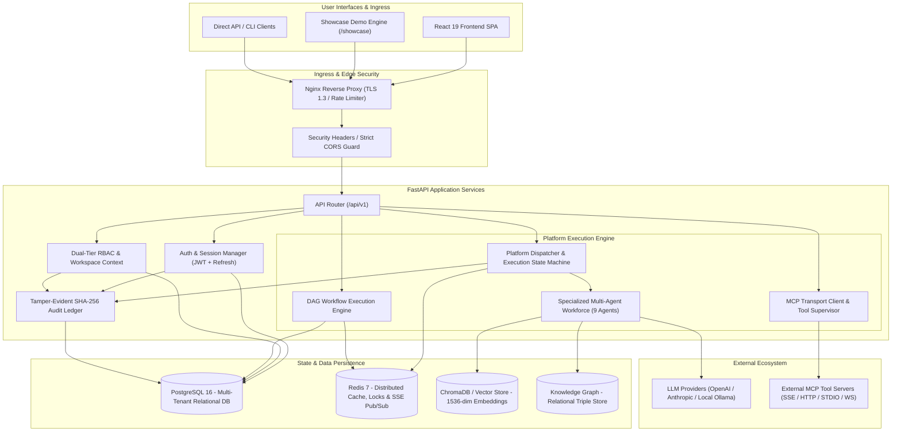
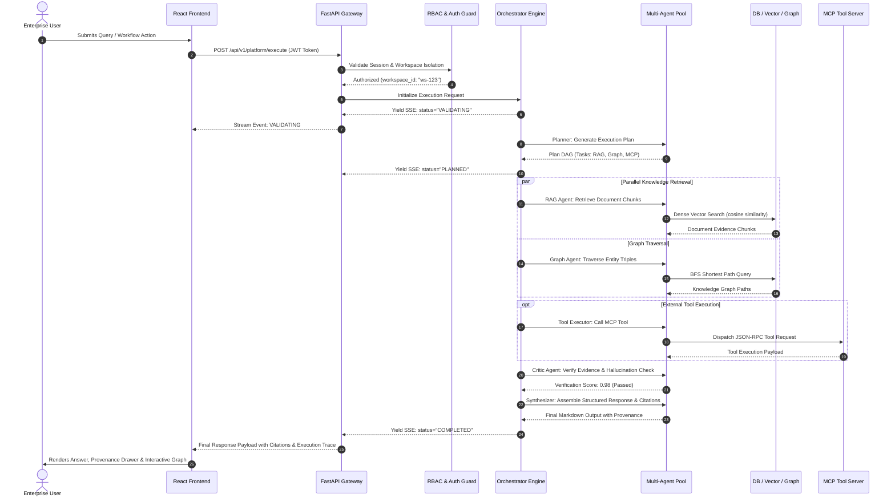

# AegisAI — Comprehensive System Architecture

## 1. Executive Overview

**AegisAI** is an enterprise-grade autonomous multi-agent platform designed to orchestrate specialized AI agents, manage persistent contextual memory, execute external tools via the Model Context Protocol (MCP), perform hybrid retrieval-augmented generation (RAG) over corporate documents, query relational knowledge graphs, and automate visual DAG workflows under strict cryptographic governance.

---

## 2. Platform Subsystems & Responsibilities

### 2.1 API Gateway & Application Framework (`backend/app/main.py`)
- Built on **FastAPI 0.110+** utilizing asynchronous non-blocking I/O (`async`/`await`).
- Enforces strict CORS headers, request payload validation via **Pydantic v2**, and global exception handling.
- Implements dual-channel communication:
  - **RESTful Endpoints**: Synchronous mutations, CRUD management, configuration updates, and query dispatch.
  - **Server-Sent Events (SSE) & WebSockets**: Low-latency event streaming for multi-agent execution steps, workflow progress, and live workspace notifications.

### 2.2 Security & Access Control (`backend/app/core/auth.py`, `backend/app/core/rbac.py`)
- **Authentication**: JWT access tokens (short-lived, 30-minute expiry) paired with cryptographically randomized refresh tokens stored with workspace binding.
- **Tenant Isolation**: Every database query, vector collection lookup, and workflow state mutation strictly checks the authenticated `workspace_id`.
- **Dual-Tier Role Hierarchy**:
  - System Roles: `super_admin`, `admin`, `user`.
  - Team Roles: `owner`, `maintainer`, `editor`, `viewer`.

### 2.3 Multi-Agent Intelligence Engine (`backend/app/core/platform/intelligence/engine.py`)
- Coordinates a canonical suite of 9 specialized agents executing a stateful DAG:
  1. **Orchestrator Agent**: Manages lifecycle, determines strategy, handles agent-to-agent delegation.
  2. **Planner Agent**: Decomposes complex user queries into structured execution DAGs.
  3. **Research Agent**: Conducts exploratory multi-source information gathering.
  4. **Memory Agent**: Retrieves contextual facts, past interactions, and episodic memory.
  5. **Enterprise RAG Agent**: Executes semantic search against ingested workspace documentation.
  6. **Graph Reasoning Agent**: Performs shortest-path graph traversal across entity-relation triples.
  7. **Tool Executor Agent**: Executes external MCP tools with schema validation and parameter sandboxing.
  8. **Critic Agent**: Validates intermediate outputs against ground-truth source chunks to eliminate hallucinations.
  9. **Response Synthesizer**: Formats verified evidence into structured markdown with verbatim citation chips.

### 2.4 Knowledge & Memory Fabric
- **Memory Vault (`backend/app/services/memory/`)**:
  - Ephemeral Working Memory: Fast in-memory / Redis cache for conversational context.
  - Vector Semantic Memory: Long-term dense embeddings stored for semantic cosine similarity search.
- **Enterprise Document Processing (`backend/app/services/document_processing.py`)**:
  - Ingestion pipeline supporting PDF, DOCX, TXT, and Markdown files.
  - Semantic sliding-window chunking (default: 500 characters, 100 character overlap) and dense vector indexing.
- **Knowledge Graph (`backend/app/services/knowledge_graph/`)**:
  - Triples representation (`subject`, `predicate`, `object`) with entity property bags.
  - Graph pathfinding algorithms (Breadth-First Search shortest path) and automated synchronization with memory records (`MemoryGraphSync`).

### 2.5 Model Context Protocol (MCP) Hub (`backend/app/services/mcp/`)
- Compliant with Anthropic's Model Context Protocol specification.
- Supports 4 protocol transports:
  - **SSE (Server-Sent Events)**: Long-polling HTTP streaming transport.
  - **Streamable HTTP**: Asynchronous REST-based tool execution.
  - **STDIO**: Process pipe execution with subprocess containment and timeout bounds.
  - **WebSocket**: Full-duplex persistent bidirectional connection.
- Implements strict SSRF protection, private IP blocking, argument schema enforcement, and Human-in-the-Loop (HITL) approval gates.

### 2.6 Visual DAG Workflow Studio (`backend/app/services/workflow.py`)
- Visual drag-and-drop workflow canvas powered by `@xyflow/react`.
- Supports 8 node primitives: `Trigger`, `Agent`, `Tool (MCP)`, `Condition`, `Router`, `Transform`, `Approval`, and `Webhook`.
- Features cycle detection (Kahn's algorithm), atomic versioning, variable scoping, and automated cron scheduling.

### 2.7 Frontend AI OS & Design System (`frontend/src/`)
- Built on **React 19** and **Tailwind CSS v4** with zero heavy UI framework lock-in.
- Implements comprehensive code splitting:
  - Base entry bundle: ~100 kB (23 kB gzip).
  - Lazy-loaded route chunks for Workflows, Knowledge Graph, Admin Security, and Showcase.
- Fully accessible keyboard navigation, focus trapping, screen-reader friendly live regions, and dark/light color tokens.

---

## 3. Request Execution Lifecycle

---

## 4. Architectural Boundaries & Data Isolation

| Data Entity | Storage Engine | Isolation Key | Access Mechanism |
| :--- | :--- | :--- | :--- |
| **Users & Tenants** | PostgreSQL | `tenant_id`, `id` | SQLAlchemy ORM with scoped queries |
| **Workspaces & Teams** | PostgreSQL | `workspace_id` | Foreign key constraints and RBAC middle tiers |
| **Audit Logs** | PostgreSQL | `workspace_id` | Immutable append-only ledger with SHA-256 hash chains |
| **Vector Chunks** | ChromaDB / pgvector | `workspace_id` in metadata | Filtered similarity queries (`$and: [{workspace_id: ...}]`) |
| **Knowledge Triples** | PostgreSQL / JSONB | `workspace_id` | Indexed compound keys on `(workspace_id, subject)` |
| **Workflow Definitions** | PostgreSQL | `workspace_id` | Versioned schema models with atomic transactions |
| **Working Sessions** | Redis / Memory | `workspace_id:session_id` | Key prefixing with automated TTL eviction |

---

## 5. Summary Architecture Verification

The system architecture defined above is verified by:
- **955 backend pytest test suites** verifying isolated tenant queries, multi-agent state transitions, MCP transport drivers, and cryptographic audit hashing.
- **223 frontend vitest test suites** validating responsive layouts, route permissions, state persistence, and SSE stream decoders.
