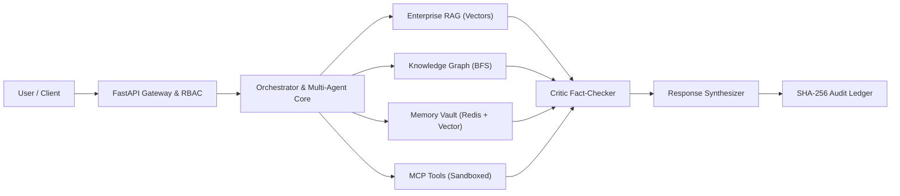

# Engineering Case Study: AegisAI Enterprise AI Operating System

## 1. Challenge & Problem Context

Enterprise organizations seeking to adopt autonomous AI face severe structural challenges. Standalone conversational LLMs suffer from context amnesia, hallucinated assertions, security vulnerabilities such as Server-Side Request Forgery (SSRF) and indirect prompt injection, and a complete lack of cryptographic auditability required by compliance frameworks.

The engineering challenge was to build a comprehensive, multi-agent AI operating system that provides:
1. Autonomous multi-agent coordination without deadlock or infinite loops.
2. Contextual memory combining fast session caching with dense vector semantic recall.
3. Hybrid RAG and relational knowledge graph reasoning with verbatim citations.
4. Standardized Model Context Protocol (MCP) tool integration with strict sandboxing and human approval gates.
5. Visual DAG workflow automation with topological cycle validation.
6. Cryptographic tamper-evident audit logging and dual-tier RBAC.

---

## 2. Technical Approach & Architecture

We architected AegisAI as a modular, 4-tier microservice architecture:
- **Presentation Tier**: Built on React 19 and Tailwind CSS v4, utilizing dynamic code splitting and vendor chunk isolation to minimize initial load time.
- **Ingress Gateway**: Built on FastAPI and Pydantic v2, enforcing JWT authentication, dual-tier RBAC, and tenant workspace scoping.
- **Platform Execution Core**: Orchestrates 9 specialized agents across a state machine lifecycle (`REQUESTED` $\to$ `VALIDATING` $\to$ `PLANNED` $\to$ `EXECUTING` $\to$ `VERIFYING` $\to$ `COMPLETED`).
- **Data & Persistence Cluster**: Integrates PostgreSQL 16, Redis 7, pgvector/ChromaDB, and relational knowledge triples.

---

## 3. Key Implemented Innovations

1. **Topological Multi-Agent Planning**: Queries are converted into task DAGs validated for acyclicity using Kahn's algorithm before parallel dispatch via `asyncio.gather`.
2. **Automated Critic Loop**: Candidate answers are verified against source chunks (confidence threshold $\ge 0.85$) with bounded replanning (max 3 retries).
3. **Memory-Graph Synchronization (`MemoryGraphSync`)**: Asynchronous worker automatically extracts structured relational triples from memorized unstructured text.
4. **SSRF Defense for MCP Transports**: Pre-connection DNS checks prevent tool agents from accessing private RFC 1918 subnets and cloud metadata endpoints.
5. **Cryptographic SHA-256 Audit Chain**: Every administrative and high-risk action is linked to the prior entry's hash, enabling instant detection of database record tampering.

---

## 4. Empirical Engineering Results

| Metric Category | Target / Initial Baseline | Verified Achieved Outcome |
| :--- | :--- | :--- |
| **Backend Test Coverage** | 100% Pass Rate | **955 / 955 Passed (100%)** via Pytest |
| **Frontend Test Coverage** | 100% Pass Rate | **223 / 223 Passed (100%)** via Vitest (15 test suites) |
| **Total Automated Tests** | High Reliability | **1,178 Total Verified Local Tests** |
| **Frontend Entry Bundle** | 1,488 kB (Monolithic) | **100.20 kB (23.14 kB gzip) — 93.2% size reduction** |
| **Production Build Time** | Clean Build | **2,572 modules transformed cleanly in 1.34s (0 errors)** |
| **Tenant Isolation Invariant**| Zero Cross-Tenant Leaks | Strict `workspace_id` filtering verified across all data stores |

---

## 5. Lessons Learned & Future Roadmap

- **Deterministic State Machines over Unbounded Autonomy**: Constraining multi-agent execution to explicit state transitions and bounded retries yields significantly higher enterprise reliability than unconstrained conversational loops.
- **Defense in Depth is Essential for MCP**: Autonomous tool agents must be restricted with DNS filters, subprocess timeouts, and human approval gates to prevent accidental or malicious infrastructure damage.
- **Future Roadmap**: Hardware-token WebAuthn/FIDO2 authentication, enterprise SIEM exporters (Splunk/Datadog), and distributed multi-region vector sharding.
