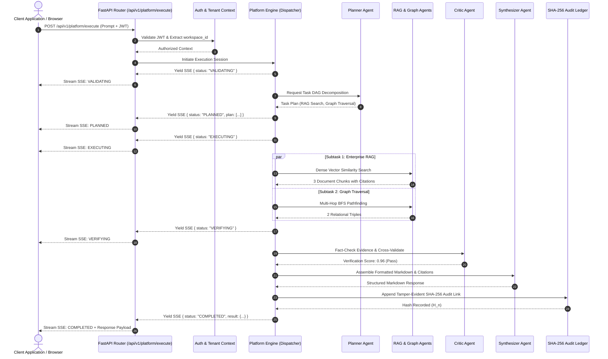
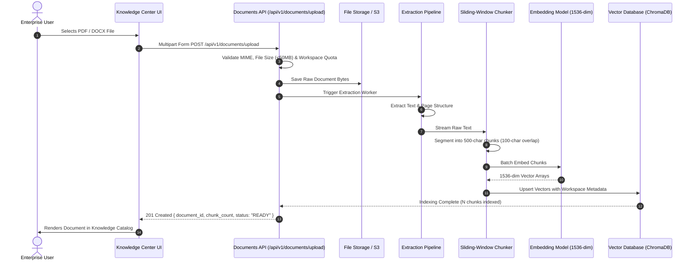
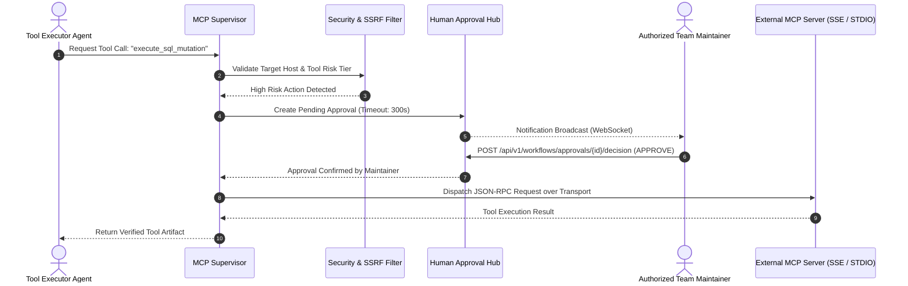

# AegisAI — End-to-End Data Flows & Transaction Walkthroughs

This document illustrates the complete end-to-end data flows and runtime sequence diagrams for the primary operational scenarios in **AegisAI**.

---

## 1. Platform Multi-Agent Query Execution (SSE Stream)

---

## 2. Document Ingestion & Semantic Chunking Flow

---

## 3. Governed MCP Tool Execution with Human Confirmation

