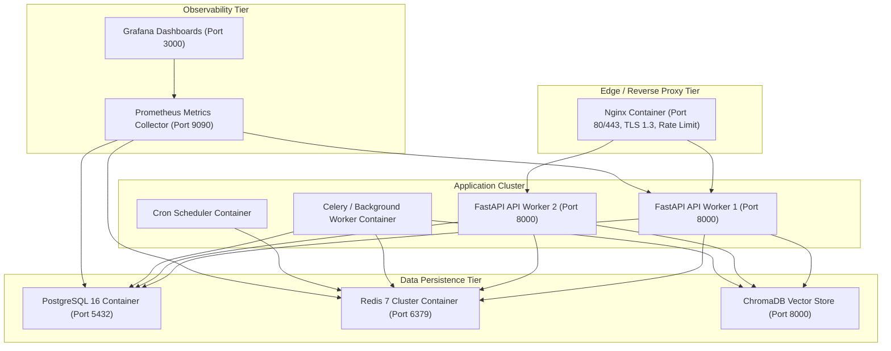

# Production Deployment, Environments & Disaster Recovery

## 1. Overview

AegisAI is packaged as a containerized microservice suite with deployment profiles for Local Development, Staging, and Production.



---

## 2. Docker Compose Profiles

| Profile | Compose File | Target Environment | Key Features |
| :--- | :--- | :--- | :--- |
| **Development** | `docker-compose.dev.yml` | Local Developer Machine | Hot reloading for React and FastAPI, in-memory mock services, open ports. |
| **Staging** | `docker-compose.staging.yml` | Integration & Pre-Release QA | Full containerization, synthetic test data seeding, mock LLM mode. |
| **Production** | `docker-compose.prod.yml` | High-Availability Production | Multi-worker Gunicorn/Uvicorn, Nginx TLS termination, persistent volume mounts, strict secret injection. |

---

## 3. Production Deployment Procedure

### Step 1: Clone Repository & Configure Environment
```bash
git clone https://github.com/KrishPatel/AegisAI.git
cd AegisAI

# Copy production environment template
cp .env.example .env.prod
# Secure permissions and populate secrets
chmod 600 .env.prod
```

### Step 2: Build Multi-Stage Docker Images
```bash
docker compose -f docker-compose.prod.yml --env-file .env.prod build
```

### Step 3: Run Database Migrations
```bash
docker compose -f docker-compose.prod.yml --env-file .env.prod run --rm backend alembic upgrade head
```

### Step 4: Launch Production Stack
```bash
docker compose -f docker-compose.prod.yml --env-file .env.prod up -d
```

### Step 5: Verify Cluster Health
```bash
curl -f http://localhost:8000/api/v1/health
```

---

## 4. Health Checks & Probes

| Endpoint | Probe Type | Checked Components | Success Response |
| :--- | :--- | :--- | :--- |
| `/api/v1/health` | Liveness | Basic HTTP responsiveness | `{"status": "ok"}` |
| `/api/v1/health/readiness` | Readiness | PostgreSQL connectivity, Redis ping, Vector DB read | `{"status": "ready", "database": "up", "redis": "up"}` |
| `/api/v1/metrics` | Telemetry | Prometheus scraped metrics | Prometheus format text |

---

## 5. Backup & Disaster Recovery (DR)

### 5.1 Automated Database Backup Script
```bash
#!/bin/bash
# Backup PostgreSQL database to encrypted tarball
TIMESTAMP=$(date +%Y%m%d_%H%M%S)
BACKUP_DIR="/var/backups/aegisai"
mkdir -p $BACKUP_DIR

docker exec -t aegisai-postgres-1 pg_dump -U postgres aegisai_db | gzip > "$BACKUP_DIR/db_backup_$TIMESTAMP.sql.gz"
echo "Backup saved to $BACKUP_DIR/db_backup_$TIMESTAMP.sql.gz"
```

### 5.2 Restore Procedure
```bash
gunzip < /var/backups/aegisai/db_backup_20261006.sql.gz | docker exec -i aegisai-postgres-1 psql -U postgres -d aegisai_db
```
