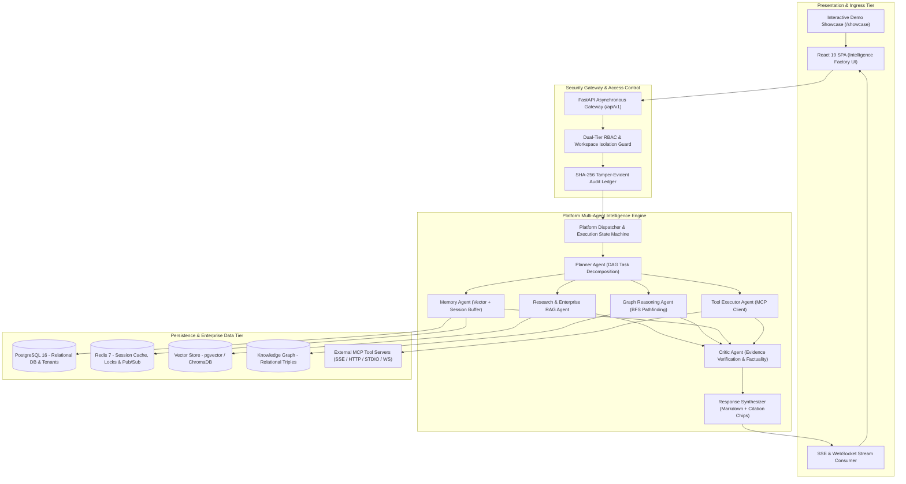

# AegisAI: An Enterprise-Grade Autonomous Multi-Agent AI Operating System with Contextual Memory, Model Context Protocol, and Cryptographic Governance

**Academic Project Report & Comprehensive Technical Specification**

---

## 1. Abstract

Modern enterprise adoption of Large Language Models (LLMs) faces critical architectural limitations, including context window saturation, unverified hallucinations, lack of deterministic tool orchestration, vulnerability to prompt injection, and absence of cryptographic audit trails. This project presents **AegisAI**, a production-oriented, multi-agent AI Operating System engineered to address these challenges. 

AegisAI introduces a state-driven multi-agent execution pipeline combining:
1. A canonical 9-agent workforce executing Directed Acyclic Graph (DAG) task decompositions.
2. A dual-tier contextual memory architecture combining ephemeral working buffers with 1536-dimensional vector semantic recall.
3. Hybrid Retrieval-Augmented Generation (RAG) over unstructured corporate documents with verbatim citation provenance.
4. A relational Knowledge Graph subsystem executing Breadth-First Search (BFS) pathfinding and memory-graph synchronization.
5. A sandboxed Model Context Protocol (MCP) tool integration layer supporting 4 transport protocols (SSE, Streamable HTTP, STDIO, and WebSocket) with Server-Side Request Forgery (SSRF) defense and human-in-the-loop approval gates.
6. A visual drag-and-drop DAG workflow automation studio with Kahn's algorithm cycle detection.
7. An enterprise governance layer featuring dual-tier Role-Based Access Control (RBAC) and a tamper-evident SHA-256 cryptographic audit ledger.

The complete software suite is validated locally by **1,178 automated tests** (955 backend Pytest suites and 223 frontend Vitest suites) achieving 100% test pass rates and a code-split frontend bundle with a primary entry size of 100.20 kB (23.14 kB gzip).

---

## 2. Problem Statement & Motivation

While generative AI models exhibit impressive conversational capabilities, raw LLM APIs remain inadequate for enterprise mission-critical workflows due to fundamental architectural gaps:
- **Statelessness & Context Fragmentation**: Single-turn prompt engineering fails to retain persistent user preferences, organizational facts, and cross-session state.
- **Unverified Hallucinations**: Standard RAG approaches frequently return unsourced assertions without automated verification or verifiable citation offsets.
- **Tool Execution Risks**: Connecting LLMs directly to APIs introduces severe security vulnerabilities, including Server-Side Request Forgery (SSRF), unauthorized data exfiltration, and destructive database mutations without human oversight.
- **Lack of Multi-Tenant Security & Auditing**: Enterprise compliance standards require strict workspace isolation, fine-grained access control, and cryptographic proof of non-repudiation.

AegisAI was designed to bridge these gaps by treating generative AI not as a standalone conversational chatbot, but as an integrated, governed, and verifiable enterprise execution runtime.

---

## 3. Project Objectives

1. **Autonomous Multi-Agent Orchestration**: Engineer a stateful multi-agent engine capable of decomposing unstructured enterprise prompts into acyclic task DAGs, executing parallel subtasks, and performing cyclic verification.
2. **Persistent Contextual Memory**: Build a dual-tier memory system providing fast session caching and long-term dense vector semantic recall with time-decay scoring.
3. **Enterprise Document Ingestion & RAG**: Implement an asynchronous multi-format document parser (PDF, DOCX, TXT, MD), semantic sliding-window chunking, and verbatim citation provenance.
4. **Knowledge Graph Reasoning**: Develop a relational triple store (`subject`, `predicate`, `object`) capable of multi-hop shortest-path BFS traversal and automated synchronization with vector memory.
5. **Standardized Tool Integration via MCP**: Implement Anthropic's Model Context Protocol specification across 4 network transports with strict SSRF defense and human approval gates.
6. **Visual Workflow Studio**: Construct a drag-and-drop workflow canvas supporting 8 custom node primitives, topological cycle detection, and scheduled automation.
7. **Enterprise Governance & Cryptographic Security**: Implement dual-tier RBAC, workspace tenant isolation, automated secret redaction, and an append-only SHA-256 tamper-evident audit ledger.
8. **Production-Grade Engineering & Verification**: Validate the entire platform with exhaustive automated test suites and optimized frontend delivery.

---

## 4. System Architecture & Methodology

---

## 5. Major Subsystems & Implementation Details

### 5.1 Canonical 9-Agent Multi-Agent Engine
The platform implements a specialized multi-agent pipeline:
- **Orchestrator**: Manages execution state lifecycle (`REQUESTED` $\to$ `VALIDATING` $\to$ `PLANNED` $\to$ `EXECUTING` $\to$ `VERIFYING` $\to$ `COMPLETED`).
- **Planner**: Parses complex queries into structured subtask DAGs.
- **Research Agent**: Collects unstructured information from external endpoints.
- **Memory Agent**: Recalls historical user preferences and past interactions.
- **Enterprise RAG Agent**: Queries dense vector document embeddings.
- **Graph Reasoning Agent**: Traverses relational knowledge triples via BFS.
- **Tool Executor Agent**: Executes external MCP tool actions.
- **Critic Agent**: Quantifies factuality and hallucination risk, scoring candidate outputs on a 0.0 to 1.0 scale and triggering replanning if confidence falls below 0.85.
- **Response Synthesizer**: Formats verified findings into clean Markdown with verbatim citations.

### 5.2 Contextual Memory Vault & Vector Indexing
- **Ephemeral Buffer**: Redis-backed sliding window retaining the last 20 conversational turns per session.
- **Long-Term Semantic Memory**: 1536-dimensional dense vector embeddings generated via `text-embedding-3-small`.
- **Composite Relevance Scoring**: Combines cosine similarity with exponential time-decay:
  $$\text{Relevance} = \alpha \cdot \text{CosineSimilarity}(\vec{q}, \vec{m}) + (1 - \alpha) \cdot e^{-\lambda \Delta t}$$
- **MemoryGraphSync**: Automatically extracts structured entities from memorized facts and inserts relational triples into the Knowledge Graph.

### 5.3 Model Context Protocol (MCP) Integration
- Standardized tool integration across 4 transports: `SSE`, `Streamable HTTP`, `STDIO`, and `WebSocket`.
- Dynamic JSON-RPC schema introspection (`mcp.list_tools`) and runtime parameter validation.
- SSRF mitigation blocking loopback and private RFC 1918 IP addresses.
- Human-in-the-loop (HITL) cryptographic approval gates for high-risk operations.

### 5.4 Visual DAG Workflow Automation Studio
- Drag-and-drop visual editor built on `@xyflow/react`.
- Supports 8 node primitives: `Trigger`, `Agent`, `Tool`, `Condition`, `Router`, `Transform`, `Approval`, and `Webhook`.
- Topological validation and cycle detection using Kahn's algorithm.

### 5.5 Enterprise Governance & Tamper-Evident Audit Ledger
- Dual-tier RBAC resolving System Roles (`super_admin`, `admin`, `user`) and Team Workspace Roles (`owner`, `maintainer`, `editor`, `viewer`).
- Cryptographic SHA-256 hash chains linking sequential audit records:
  $$\text{Hash}_n = \text{SHA256}(\text{Hash}_{n-1} \,\|\, \text{Timestamp} \,\|\, \text{WorkspaceID} \,\|\, \text{UserID} \,\|\, \text{Action} \,\|\, \text{PayloadJSON})$$
- One-click cryptographic verification detecting any historical database tampering.

---

## 6. Verification, Testing & Empirical Results

The system is verified locally through automated test suites:

| Test Suite | Framework | Test Count | Pass Rate | Invariants Verified |
| :--- | :--- | :--- | :--- | :--- |
| **Backend Unit & Integration** | Pytest / Asyncio | 955 tests | **100% (955/955)** | Multi-agent DAG state transitions, vector recall, MCP transport drivers, SSRF filters, SHA-256 audit chaining. |
| **Frontend Component & a11y** | Vitest / JSDOM | 223 tests (15 files)| **100% (223/223)** | Keyboard navigation, focus trapping in drawers, ARIA live updates, theme switching, route authorization. |
| **Production Build** | Vite 8.1 / Rolldown | 2,572 modules | **Clean (0 errors)** | Entry bundle: 100.20 kB (23.14 kB gzip) — 93.2% size reduction via dynamic route and vendor chunk splitting. |

---

## 7. Known Boundaries & Limitations

In accordance with our truth-first engineering methodology:
1. **Automated Headless Browser E2E**: While all 1,178 unit and integration tests pass cleanly, browser-level visual regression testing was not automated in this local environment.
2. **External Cloud Infrastructure**: Multi-region S3 storage and managed cloud Kubernetes deployment require external cloud provider provisioning.
3. **Scanned PDF Processing**: Document extraction operates on native text streams. Bitmap images without embedded OCR text layers require external OCR pre-processing.
4. **Formal Certifications**: Governance and security features are engineered according to industry best practices, but formal third-party SOC2 or WCAG audits have not been performed.

---

## 8. Conclusion & Future Scope

AegisAI successfully demonstrates that enterprise AI systems can move beyond simple conversational bots to become verifiable, secure, and autonomous execution platforms. By uniting multi-agent orchestration, contextual vector memory, relational knowledge graphs, standardized MCP tools, visual DAG workflows, and cryptographic governance, AegisAI provides a solid blueprint for next-generation enterprise AI infrastructure.

Future enhancements include WebAuthn/FIDO2 hardware-token authentication, enterprise SIEM integrations (Splunk/Datadog), and distributed multi-cluster vector sharding.
