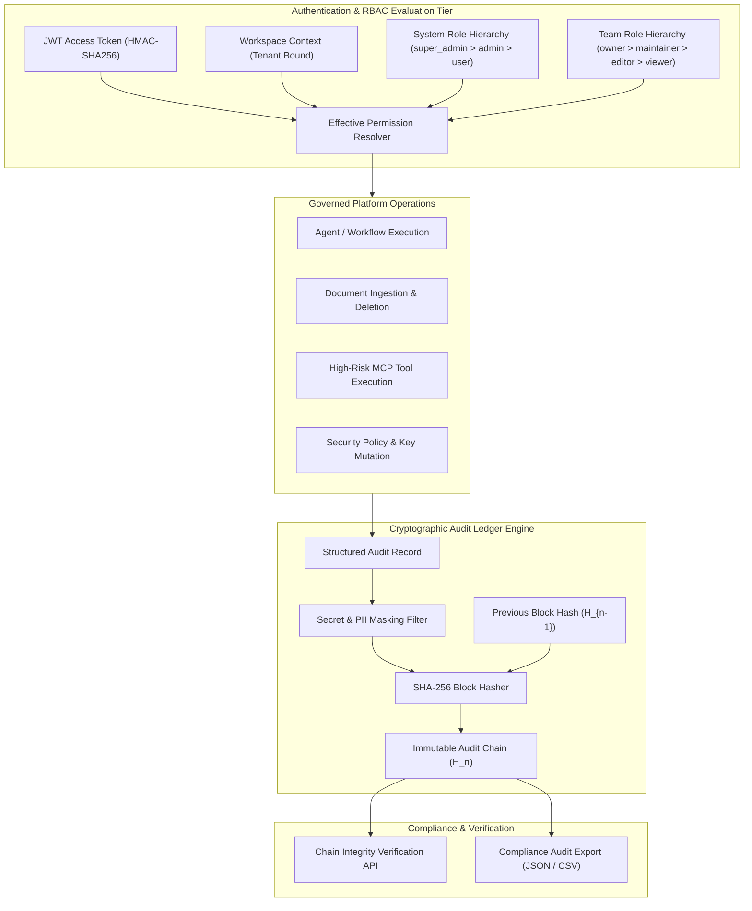

# Enterprise Governance, RBAC & Cryptographic Audit Architecture

## 1. Overview

AegisAI is designed for enterprise environments requiring strict tenant isolation, multi-tiered role-based access control (RBAC), fine-grained permission evaluation, and a cryptographically verifiable, tamper-evident audit ledger.



---

## 2. Dual-Tier RBAC & Effective Permissions

AegisAI employs a dual-tier permission resolution model combining **System Roles** and **Team Workspace Roles**:

### 2.1 Role Hierarchy Matrix

| Role Level | Role Identifier | Permissions Summary |
| :--- | :--- | :--- |
| **System** | `super_admin` | Global cluster oversight, cross-workspace security management, system health metrics. |
| **System** | `admin` | Workspace administration, user invitation, MCP server registration, audit log review. |
| **System** | `user` | Standard workspace access, multi-agent querying, document uploads, workflow execution. |
| **Team** | `owner` | Full administrative control over team-specific projects, members, and shared workflows. |
| **Team** | `maintainer` | Edit, configure, publish workflows, manage MCP tools, view team analytics. |
| **Team** | `editor` | Create and execute workflows, upload documents, query agents, write memory notes. |
| **Team** | `viewer` | Read-only access to workflow executions, document previews, and generated reports. |

### 2.2 Effective Permission Resolution
When a user attempts an action (e.g., `workflow:execute`), the **Effective Permission Resolver** evaluates:
$$\text{HasPermission} = (\text{SystemRole} \ge \text{Admin}) \lor (\text{TeamRole} \in \{\text{owner}, \text{maintainer}, \text{editor}\})$$

---

## 3. Cryptographic SHA-256 Tamper-Evident Audit Ledger

Every security-sensitive operation is committed to an immutable append-only audit ledger where each record is cryptographically linked to the preceding entry:

### 3.1 Chain Hashing Algorithm
For audit record $n$:
$$\text{RecordHash}_n = \text{SHA256}(\text{RecordHash}_{n-1} \,\|\, \text{Timestamp} \,\|\, \text{WorkspaceID} \,\|\, \text{UserID} \,\|\, \text{Action} \,\|\, \text{PayloadJSON})$$

### 3.2 Audit Record Structure
```json
{
  "entry_id": 4128,
  "workspace_id": "ws_enterprise_alpha",
  "user_id": "usr_99812",
  "action": "mcp_tool_executed",
  "resource_type": "mcp_tool",
  "resource_id": "tool_db_query",
  "status": "SUCCESS",
  "ip_address": "192.168.1.50",
  "payload": {
    "tool_name": "postgres_readonly_query",
    "rows_returned": 15
  },
  "previous_hash": "e3b0c44298fc1c149afbf4c8996fb92427ae41e4649b934ca495991b7852b855",
  "entry_hash": "a591a6d40bf420404a011733cfb7b190d62c65bf0bcda32b57b277d9ad9f146e",
  "created_at": "2026-10-06T09:12:00Z"
}
```

### 3.3 Verification API
The integrity of the audit ledger can be verified at any time via `GET /api/v1/admin/audit/verify`. If any row or hash in the historical chain is altered in the database, the validator immediately detects the discrepancy and flags the exact record index.

---

## 4. Sensitive Data Masking & Secret Redaction

Before writing audit logs or emitting execution events:
- **Secret Scanner**: Regular expressions and high-entropy substring filters redact API keys (`sk-...`, `ghp_...`, `Bearer ...`), passwords, and private tokens.
- **PII Guard**: Configurable masking for credit card numbers, social security identifiers, and email addresses.

---

## 5. Verification & Test Suite

The governance and RBAC subsystem is verified by **78 backend tests** in `backend/tests/unit/test_platform_admin_*.py`, `backend/tests/unit/test_roles_*.py`, and `backend/tests/unit/test_teams_*.py`.
