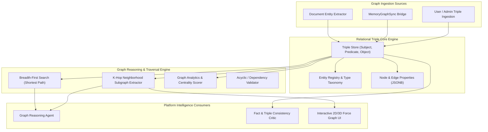

# Knowledge Graph Architecture & Relational Reasoning

## 1. Overview

AegisAI's Knowledge Graph subsystem provides a structured relational representation of enterprise knowledge, models inter-entity relationships, executes multi-hop graph pathfinding queries, and synchronizes dynamically with unstructured vector memory and document chunks.



---

## 2. Graph Data Model & Triples Schema

### 2.1 Relational Triples
The core atomic unit of knowledge in AegisAI is the **Knowledge Triple**:
$$\langle \text{Subject}, \text{Predicate}, \text{Object} \rangle$$

- **Subject**: Origin entity (e.g., `AegisAI Core Engine`, `Tenant_Alpha`).
- **Predicate**: Relationship verb/label (e.g., `implements`, `depends_on`, `governs`, `accesses`).
- **Object**: Target entity or literal value (e.g., `Dual-Tier RBAC`, `SHA-256 Audit Ledger`).

### 2.2 Schema Specification (`backend/app/services/knowledge_graph/graph_service.py`)
```json
{
  "triple_id": "trp_8901a_3",
  "workspace_id": "ws_enterprise_alpha",
  "subject": "Platform Orchestrator",
  "predicate": "delegates_to",
  "object": "Planner Agent",
  "weight": 1.0,
  "confidence": 0.98,
  "properties": {
    "protocol": "internal_async",
    "timeout_ms": 5000,
    "source_doc": "agent_architecture.md"
  },
  "created_at": "2026-09-28T14:20:00Z"
}
```

---

## 3. Graph Reasoning & Traversal Capabilities

### 3.1 Shortest Path Traversal (BFS)
- Employs a bidirectional Breadth-First Search algorithm to find the optimal relational explanation between two entities up to $N$ hops (default: 3 hops).
- Used by the **Graph Reasoning Agent** to explain complex dependencies (e.g., "Why does Agent X require Permission Y?").

### 3.2 Neighborhood Subgraph Extraction
- Extracts all connected nodes and edges within a radial hop distance $k \in [1, 3]$ for a target entity.
- Generates JSON node/link payloads consumed by the frontend force-directed visualizer (`UserGraph.jsx`).

### 3.3 Graph Analytics & Health Metrics
- Calculates graph density, node degree centrality, and isolated node counts.
- Flags orphan entities and dangling references to maintain enterprise graph hygiene.

---

## 4. Memory-Graph Synchronization (`MemoryGraphSync`)

Whenever a high-confidence fact is memorized in the Memory Vault:
1. The `MemoryGraphSync` pipeline triggers an asynchronous background worker.
2. Structured entities and actions are extracted and inserted as active triples.
3. If an existing triple with the same `(workspace_id, subject, predicate)` exists, the system updates edge confidence and timestamp without duplicating graph nodes.

---

## 5. Verification & Test Suite

The Knowledge Graph subsystem is verified by **68 backend test cases** in `backend/tests/unit/test_knowledge_graph_*.py`, verifying:
- Triple CRUD operations and workspace tenant isolation.
- Multi-hop BFS pathfinding correctness and cycle avoidance.
- Subgraph extraction and JSON serialization.
- `MemoryGraphSync` entity propagation and conflict resolution.
